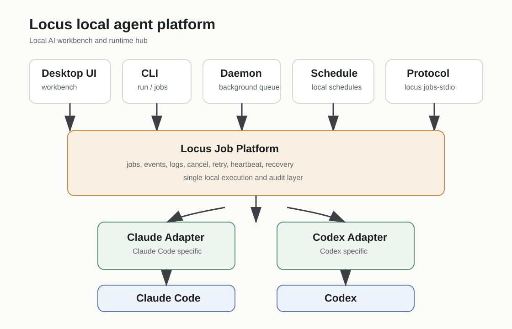

# Locus

Languages: English | [Simplified Chinese](README.zh-CN.md)

Locus is a local-first workbench and embeddable interoperability layer for
operating mature coding Harnesses on local projects. It gives Claude Code and
Codex a shared Locus-owned execution, session, capability, audit, and handoff
boundary without replacing their native Agent loops.

Locus is a fork of [1Code](https://github.com/21st-dev/1code). Its desktop app is
the visible control plane; CLI, daemon, schedules, and versioned local APIs let
other applications consume the same Runtime boundary. Domain applications keep
their own Goal/Task models, while Locus owns Runtime execution and provenance.



## Why Locus

Locus is useful when you want agent work to stay tied to a local project instead
of disappearing into separate runtime CLIs or hosted queues.

It provides:

- a desktop workbench for local project, file, terminal, git, and worktree flows
- Claude Code and Codex runtime integration with runtime-specific capability truth
- durable local jobs with status, event logs, cancellation, retry, heartbeat, and recovery
- headless CLI, daemon, schedules, and protocol surfaces for automation
- a machine-readable Local Job API v1 for downstream local tools
- explicit, user-controlled Engine selection; Locus never silently swaps Engines
- local-first provider/profile handling and hosted upstream surfaces removed or isolated by default

## Current Status

| Area | Status |
| --- | --- |
| Desktop local workbench | Implemented |
| Claude Code and Codex desktop runs | Implemented with runtime-specific limits |
| Local job store and job events | Implemented |
| `locus run` and `locus jobs` | Implemented and smoked locally on macOS |
| Local daemon queue | Implemented and smoked locally on macOS |
| Local schedules | Implemented and smoked locally on macOS |
| `locus api` Local Job API v1 | Implemented and smoked locally on macOS |
| Runtime execution core convergence | In progress under OpenSpec; the durable job/API core is shared, while selector/event/policy convergence remains tracked work |
| `locus jobs-stdio` Locus-owned stdio job surface | Experimental; not ACP |
| Windows packaged real-machine smoke | Deferred; non-blocking for current local platform work |
| Full ACP parity | Not implemented |
| Hosted/cloud agents or hosted scheduler | Not implemented |
| Full Codex parity with Claude Code | Not implemented |

For the ratified direction, read the
[product and Harness strategy](docs/ideas/locus-product-direction-harness-strategy.zh-CN.md)
and [interoperability contract](docs/ideas/locus-interoperability-contract-v1.zh-CN.md).
The documentation index separates current truth, future direction, and historical snapshots.

## Get Started From Source

Prerequisites:

- Bun
- Python
- Xcode Command Line Tools on macOS

Install and run:

```bash
bun install
bun run claude:download
bun run codex:download
bun run dev
```

Useful checks:

```bash
bun run ts:check
bun run check:full
```

## Use Locus

### Desktop Workbench

Run the desktop app, select a local repository, and use the workbench to inspect
agent work, project files, terminal/git flows, worktrees, and job history.

### Headless CLI

Use the CLI for one-shot local runs and job inspection:

```bash
locus run --runtime codex --mode plan --prompt "Inspect this project"
locus jobs list
locus jobs show <job-id>
locus jobs logs <job-id>
```

In development, the launcher is available at:

```bash
resources/cli/locus
```

Packaged apps include the launcher under their resources directory.

### Local Job API v1

Downstream local apps should use `locus api` instead of importing Locus source
or reading `agents.db` directly:

```bash
locus api runtimes list --json
locus api runs create --request request.json --json
locus api runs status <job-id> --json
locus api runs events <job-id> --after 0 --jsonl
locus api runs result <job-id> --json
locus api runs cancel <job-id> --json
locus api runs retry <job-id> --json
```

Read the consumer guides:

- [Local Job API v1 Consumer Guide](docs/local-job-api-v1-consumer-guide.md)
- [Local Job API v1 Consumer Guide, Simplified Chinese](docs/local-job-api-v1-consumer-guide.zh-CN.md)

## Local-Only Mode

Local-only mode is enabled by default. It prevents the desktop app from
contacting upstream hosted services if a dormant compatibility path is
accidentally reached. Hosted auth, subscription checks, remote sandbox/import,
hosted voice/TTS fallback, automations, inbox, telemetry, and updater UI are
not part of the default local-first product.

To intentionally test hosted or internal services, disable it explicitly:

```bash
LOCUS_LOCAL_ONLY=false bun run dev
# or
MAIN_VITE_LOCAL_ONLY=false bun run dev
```

User-configured AI provider endpoints, Ollama, local projects, Git, GitHub
operations initiated by local workflows, and external links that are not
upstream hosted services remain available.

Local-first does not mean offline-only or "no data leaves your machine." When
you run Claude Code, Codex, configured providers, voice transcription, MCP
tools, or GitHub workflows, prompts, selected file content, diffs, audio, tool
context, or metadata may be sent to the user-selected service or runtime.

Locus is not an OS sandbox. Terminal, git, filesystem, MCP, runtime tools, and
future computer-control flows can affect the local machine when authorized or
invoked. Supported safeguards are project/worktree-aware controls, not complete
filesystem isolation.

## Documentation

- [Ratified product and Harness strategy](docs/ideas/locus-product-direction-harness-strategy.zh-CN.md)
- [Ratified interoperability contract](docs/ideas/locus-interoperability-contract-v1.zh-CN.md)
- [AI collaboration workflow](docs/ideas/locus-ai-collaboration-workflow.zh-CN.md)
- [Local Job API v1 Consumer Guide](docs/local-job-api-v1-consumer-guide.md)
- [Documentation index](docs/README.md)
- [Security policy](SECURITY.md)
- [Contributing](CONTRIBUTING.md)
- [License](LICENSE)

## Packaging

```bash
bun run build
bun run package:mac
# or
bun run package:win
bun run package:linux
```

For a local release pass:

```bash
bun run release:manifest
bun run release:smoke:mac
```

Open-source distribution and desktop installer distribution are separate.
Publishing the source repository is supported before signing infrastructure is
ready. Contributors can clone, inspect, run, and build the app locally without a
code-signing certificate.

Current repo config does not define a macOS notarization step. Local/internal
macOS and Windows packages may be unsigned or ad-hoc signed. Any GitHub Release
desktop artifacts published before signing is configured should be treated as
unsigned pre-release/test builds and clearly labeled as such. Broad public
installer distribution should wait until macOS Developer ID signing plus
notarization/stapling and Windows code signing are configured.

## Contributing and Help

Read [CONTRIBUTING.md](CONTRIBUTING.md) before opening changes. New
capabilities, breaking changes, architecture shifts, or security-sensitive work
should go through OpenSpec first.

Use this repository's issues or pull requests for bugs, integration questions,
and proposed changes. Locus is maintained in this fork; upstream project credit
goes to [21st-dev/1code](https://github.com/21st-dev/1code).

## Known Boundaries

- Voice transcription uses a user-configured Helper API provider. The upstream
  hosted subscription fallback and legacy renderer/env API-key paths are removed
  from the default build; credentials are stored through the main-process
  provider configuration and secure storage path.
- New worktree setup config is saved to `.locus/worktree.json`. Legacy
  `.1code/worktree.json` remains readable so existing projects keep working.
- Some compatibility names and paths such as the legacy `1code` CLI,
  `~/Library/Application Support/Agent Code for Me`, and `~/.21st/worktrees`
  may still exist to avoid breaking existing local project data.
- Hosted product surfaces should not be reintroduced without an OpenSpec
  proposal.

## License

Apache License 2.0. See [LICENSE](LICENSE).
