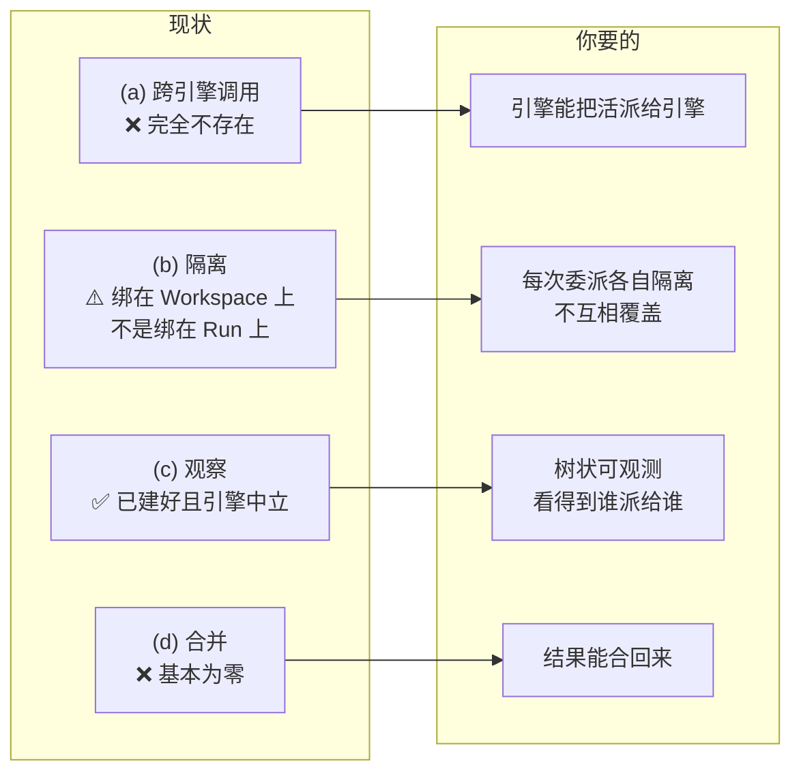

# 跨引擎委派（Cross-Engine Delegation）方案

## 状态：**已推迟 — 不要现在实施**（截至 2026-08-12）

> **2026-08-12 运行时状态更新：** 本文调研时存在的两个实验性桌面运行时现已从产品和契约中移除。下文相关段落保留为当时分析记录，并仅做去陈旧化措辞；当前可用引擎与 Local Job API 契约都只覆盖 Claude Code 和 Codex，任何后续方案都应按这两个运行时重新评估。

本方案**已研究完毕但零代码**，且**已被显式排到隔离 + 裁决之后**。

推迟的理由不是它不可行（可行性已验证，见 §0），而是**排序错了**：

- **委派没有隔离和裁决，就是个危险的玩具**（会同时制造 plan 模式逃逸和审批绕过，见 P0-1 / P0-2）
- **隔离和裁决没有委派，仍然是个好产品**——而且隔离那一半正在修一条**已批准却未做到**的需求（`openspec/specs/agent-scope-contracts` 的 "Checkpoint And Rollback Safety"）

**解封条件（需同时满足）：**

1. 回滚安全修复已落地（`git/stash.ts` 加锁 + 兄弟运行检查），且 P0-5 不再是活跃的数据丢失路径
2. worktree-per-run + cwd 租约已落地，即本文 Phase 2 已完成
3. 跨 worktree diff 聚合 + 同文件冲突检测已可用，即"裁决"层存在
4. 有一个真实的、想派活的使用场景在推动它——而不是因为技术上可行就做

在此之前，本文的价值是**已完成的调研和踩坑记录**（尤其 P1-1 里 Codex 协议那段实测结论），不是待办清单。

---

> **调研基线：** `codex/add-remote-model-catalog` 分支 HEAD `67541e51`，2026-08-12。
> 目标读者：项目所有者。目标：回答「有哪些问题、怎么解、先后顺序」。

---

## 0. 一句话结论

你想要的东西——**顶层引擎自己规划，需要时把活派给另一个引擎，Locus 负责隔离/观察/合并**——在这套代码上**是可行的，而且赌对了方向**：最难的两块（可等待的引擎执行器、运行时中立的事件观测）已经建好了。

但它**不是"接根线"的工作量**。缺的是四个互相独立的子系统，其中一个（隔离）正好是你唯一提出的硬约束，而**它今天由零机制保障**。

还有一个必须先说的事实：

> **今天任何一个 agent 已经可以通过 `Bash` 直接调 `locus api runs create` 去启动另一个引擎。**
> 这条路存在、无审批、无隔离、无父子追溯。
>
> 所以真正的问题不是"能不能做跨引擎调用"，而是——**能不能在有人发现那条野路子之前，先把有管控的那条路做出来。**

这个视角会改变整件事的性质：**委派工具的首要价值是「控制面」，而不是「能力」。** 能力已经泄漏了。

---

## 1. 先统一术语（这是这次误会的根源）

### 1.1 发生了什么

之前那份架构审查把 "Agent" 理解成 `app_agents`（prompt persona），而你说的 "Agent" 是**引擎**（Claude Code / Codex / 当时仍存在的两个实验性引擎）。两边各说各的，所以结论对不上。

**审查方没有用错词。** 仓库里有一份已批准的术语表：

- [docs/ideas/canonical-vocabulary.md](canonical-vocabulary.md) — **RATIFIED 2026-06-18**
- 已提升为正式 spec：[openspec/specs/canonical-entity-vocabulary/spec.md](../../openspec/specs/canonical-entity-vocabulary/spec.md)
- 有 CI 守卫：`scripts/check-architecture-guards.mjs:1730`

官方六词：**Project · Workspace · Chat · Quick chat · Agent · Run**
其中 `chats`→Workspace、`sub_chats`→Chat、`app_agents`→**Agent**、`agent_jobs`→Run。

**问题在于：这份词表里没有「引擎」这一格。** 你脑子里最重要的那个概念，当年定词表时根本不在范围内。你只能借 "Agent" 这个词来说它，于是撞车。

### 1.2 好消息：你要的词已经在产品里跑了

UI 里早就有 **Engine / 引擎**（`src/renderer/lib/i18n/dictionaries.ts:3292`，中文 `:6993`），就是你选 Claude Code / Codex 的那个下拉框，组件是 `AgentEngineSelector`。

**代码层则一直叫 `runtime`**（7,347 处引用，232 个文件），并且已经被冻结进 Local Job API v1 对外契约（`docs/local-job-api-v1.schema.json:74-77`）。

所以修法很轻：**把 Engine 正式补进 canonical 词表，代码继续用 runtime，两层各用各的词。** 歧义即刻消失。

### 1.3 实际是六义，不是四义

| 含义 | 指什么 | 代码文件数 | 用户可见文案数 |
|---|---|---|---|
| (a) **引擎** | Claude Code / Codex / 当时仍存在的两个实验性引擎 | 99 | 10 |
| (b) **Persona** | `app_agents` prompt 档案 | 16 | 29 |
| (c) **会话** | `chats` 和 `sub_chats` 两张表都叫这个 | 140 | 29 |
| (d) **原生子代理** | Claude 的 Task 工具 / `.claude/agents` | 5 | 12 |
| (e) **模式** | `"plan" \| "agent"` 写权限模式 | 29 | 30 |
| (f) **无意义前缀** | 老产品名残留（`agents-about-tab.tsx` 之类） | 165 | — |

**同一个输入框里同时挂着 4 个不同的 "Agent"**：模式药丸 "Agent"、引擎选择器、`@` 菜单 "Agents"(persona)、侧栏 tab "Agents"(会话)。其中模式药丸和引擎选择器在同一文件里**只隔 88 行**。

### 1.4 中文更糟：5 种含义全塌缩成「智能体」

查了 100 条中文串，**100 条都用"智能体"**，零区分。最要命的一对：

- `"新建智能体"` → 建的是一个**会话**
- `"创建智能体"` → 建的是一个 **persona**

**这就是你用中文思考时格外容易觉得"哪里不对"的原因**——英文至少有 Engine 把引擎分出去了。

### 1.5 术语建议

| 含义 | 用户可见 | 代码 | 对外契约 |
|---|---|---|---|
| 引擎 | **Engine / 引擎** | `runtime` | `runtime`（已冻结） |
| API 端点+凭证 | **Provider** | `providerProfile` | `provider` |
| `app_agents` | **Agent**（词表已定） | `appAgent` | `appAgents`（已冻结） |
| `.claude/agents` | **Subagent / 子智能体** | `claudeNativeAgent` | — |
| `chats` 行 | **Workspace**（词表已定） | `chat` | — |
| `sub_chats` 行 | **Chat**（词表已定） | `subChat` | — |
| `plan`/`agent` 模式 | **Plan / Build**（建议改名） | `AgentMode` | `"agent"`（已冻结） |

> 检验句：*"在一个 Project 里你打开一个 Workspace，里面有若干 Chat。每个 Chat 跑在一个 Engine 上（Claude Code、Codex…），由某个 Provider 供能，处于 Plan 或 Build 模式。你可以 @ 一个 Agent，Engine 自己可能派生 Subagent。后台执行的是 Run。"*
> 每个词只有一个意思。

**⚠️ 落地陷阱：** 如果把这个方案写成"agent 委派给 agent"，会**同时违反已批准的 spec 和撞上 CI 守卫**。必须写成 **engine / runtime delegation**。

---

## 2. 你要的四根支柱 vs 现状

**(c) 观察 — 已经建好了，这是最大的好消息。**
桌面运行和 headless 运行**写的是同一套** `agent_jobs` + `agent_job_events` 表，有单调序号、脱敏、心跳、协作式取消。四个引擎全部经过同一个事件规范化器。被委派的子运行**当天就是可观测的**——只要给它一个父子链接。

**(a) 跨引擎调用 — 零。但两个接口都现成。**
- **Claude 侧**：`@anthropic-ai/claude-agent-sdk@0.3.177` 导出了 `createSdkMcpServer`（`sdk.d.ts:485`），可以在进程内注册 Locus 自己的工具给正在跑的 Claude。**`src/` 里零使用**——能力买了没拆封。
- **Codex 侧**：已有先例 `locus_edit` / `propose_file_edit`（`src/main/lib/codex/app-server-controlled-edit.ts:63-64`），证明"Locus 声明工具 → Codex 调用 → Locus 审批执行 → 返回结果"这条回路是通的。
- **执行器**：`runPersistedAgentJob()`（`src/main/lib/headless/job-runner.ts:260`）是一个**真正可 await 的进程内函数**，跑完一个完整引擎运行并落库。不需要队列、不需要调度器。

  > 这条最重要：**你可以在正在跑的应用里直接 `await` 一次完整的引擎运行**，不需要另起 Electron 进程。

**(b) 隔离 — 你唯一的硬约束，今天由零机制保障。**
`chats.worktreePath` 是**每个 Workspace 一个** worktree（`db/schema/index.ts:57`），所有 sub-chat 都解析到同一个 cwd（`agent-runtime/preflight.ts:158`）。Claude 会话按 `subChatId` 隔离（`claude/active-sessions.ts:13`），所以**同一个 Workspace 下多个 Chat 今天就能并发跑在同一个目录里**。全仓库没有任何 per-cwd 的锁/租约/互斥。

**(d) 合并 — 基本为零。**
唯一的 worktree→base 合并函数 `mergeWorktreeToMain`（`git/worktree.ts:1270`）**零调用点**。没有 cherry-pick、没有 format-patch、没有跨 worktree diff、没有冲突预检。产品实际的"合并"是：推分支 → 从模型聊天文本里刮出 PR 链接 → 调 `gh pr merge`。

---

## 3. 问题总清单

| # | 问题 | 级别 | 现在就有？ |
|---|---|---|---|
| **P0-1** | Plan 模式逃逸：plan 会话可通过委派启动可写子运行 | 🔴 致命 | 加了工具才有 |
| **P0-2** | 审批绕过：委派把「受管控的运行」洗成「无管控的运行」 | 🔴 致命 | 加了工具才有 |
| **P0-3** | 无限递归 / 扇出爆炸，且**成本完全不可见** | 🔴 致命 | 加了工具才有 |
| **P0-4** | 工作区互相覆盖（你的硬约束） | 🔴 致命 | **今天就有** |
| **P0-5** | 回滚会摧毁并行会话的未提交成果 | 🔴 致命 | **今天就有** |
| **P1-1** | 无调用原语（Claude 侧 SDK MCP 未用、Codex 侧 resume 掉工具） | 🟠 阻塞 | — |
| **P1-2** | headless 任务**无法指向 worktree**（路径校验拒绝） | 🟠 阻塞 | — |
| **P1-3** | 数据模型无父子血缘（`agent_jobs` 无 `parentJobId`） | 🟠 阻塞 | — |
| **P1-4** | 无主进程「启动运行」服务（只能从渲染进程发起） | 🟠 阻塞 | — |
| **P2-1** | 结果只是文本块，编排方是瞎的 | 🟡 质量 | — |
| **P2-2** | 引擎覆盖不对称（其中一个实验引擎派不出去也接不了） | 🟡 质量 | — |
| **P2-3** | 无合并原语 | 🟡 质量 | — |
| **P2-4** | worktree 模式下 GitWatcher 和 rebase 检测静默失效 | 🟡 质量 | **今天就有** |
| **P2-5** | 观测是 3 秒轮询，树状并发会放大成性能瓶颈 | 🟡 质量 | — |

---

## 4. 逐个问题：是什么、为什么危险、怎么解

### 🔴 P0-1 Plan 模式逃逸 —— 最严重

**是什么。** Locus 所有 plan 门禁都是**工具名黑名单**（`agent-sdk-tool-permission.ts:66-72`、`codex/tool-permission.ts:384-391`），而 `mcp__*` 前缀的工具被分类为 `unknown`，**落到 allow**。

同时，被委派的 Claude 子运行是用 `--permission-mode acceptEdits` 拉起来的（`headless/adapters/claude-code.ts:39-53`），Codex 子运行是 `--sandbox workspace-write`（`adapters/codex.ts:33-58`），**都没有 canUseTool、没有 guard、没有审批桥**。

**为什么危险。** 一个处于 plan（只读）模式的会话，调一下委派工具，就能启动一个可写磁盘的子运行。**这是对 Locus 头牌安全契约的完整绕过。**

**怎么解。** 必须**和引入工具的同一个提交一起落地**，不能事后补：
1. 在 `agent-guard/decision.ts:105-112` 给委派工具一个**一等分类**，不要让它走 `startsWith("mcp__") → unknown` 的默认路径。
2. 硬拒：`controlLevel !== "observe"` 时一律拒绝。
3. 把 plan 门禁从**黑名单改成白名单**。

### 🔴 P0-2 审批绕过

**是什么。** 父运行的每个 Bash/Write 都过 `decideClaudeToolUse` + 审批 UI（`agent-sdk-tool-permission.ts:295-347`）。子运行的**根本不存在**。

**为什么危险。** 引擎撞到审批墙时，**有机械性的动机绕道走委派**。这不是理论——这是它会自己发现的最短路径。而且这个不对称今天可以容忍（headless 是人主动发起的），**一旦有了委派，最弱的执法路径就变成了最常用的路径**。

**怎么解。** 二选一（或都做）：
- 子运行继承父运行的权限策略（需要把 guard 接进 headless 适配器）
- 每次委派本身走一次现有的 `askUser` 审批（至少每会话一次）

> 这正是被搁置的 `add-policy-grant-scope-enforcement` 提案在等的东西。它自己写的触发条件是"有真实的一方消费者需要有界的非交互执行"——**跨引擎委派就是那个消费者**。这是整个方案里最大的单项成本，应该明说，而不是假装它只是接线。

### 🔴 P0-3 无限递归 + 成本盲区

**是什么。** 没有任何东西约束递归深度。被委派的子运行可以通过普通 `Bash` 调 `locus api runs create`（`resources/cli/locus:20-26`），而 headless 启动**故意绕过单实例锁**（`src/main/index.ts:444-460`）。Claude→Codex→Claude→… 扇出无界。

更糟：**委派运行完全没有 token/用量数据回来**。批处理适配器只把原始 stdout 当 `assistant_delta` 发（`headless/process-runner.ts:166-170`），Claude 用 `--output-format text`、Codex 用 `exec --color never`——没有任何 usage 元数据。

**怎么解。** `agent_jobs` 加 `delegationDepth` 字段 + 环境变量标记，在 `createAgentJob` 里检查；深度 ≥2 拒绝；硬性扇出上限。

### 🔴 P0-4 工作区互相覆盖（你的硬约束，今天就已被违反）

**是什么。** 前面 §2(b) 说过：一个 Workspace 一个 worktree，所有 Chat 共享，无锁。而且**逃生口两边都堵死了**：
- 桌面运行不能传 cwd（`preflight.ts:177-187` 硬拒任何不匹配）
- headless 任务不能指向 Locus 的 worktree（见 P1-2）

**"Codex 写后端、Claude Code 写前端"在今天的代码里 = 两个引擎对同一个 checkout 有写权限。**

**关键结构性判断（这条决定整个设计）：**

> **隔离单位必须和会话单位解耦。**
> 你的设想是「一个会话里挂着 N 个并行委派」。代码是「一个会话恰好一个 worktree，被它所有 Chat 共享」。

而且要认清一件事：**没有任何进程内的锁能管住引擎子进程**——它们自己写文件、自己跑 git。所以在**同一个 worktree 内**，Locus 根本无法保证并发安全。安全只能来自 **worktree 彼此不相交**。

**这反过来简化了问题**：把「每次委派分配独立 worktree」做对，锁的问题基本自动消失；做错（多引擎共享一个目录），再多互斥也救不回来。

**怎么解。** 需要四层一起动（都是"注册表就是 chats 表"这一个根因）：新增 worktree 创建 API、放开未注册 worktree 路径的授权、preflight 支持 per-run cwd、schema 有地方存第二个 cwd。注意 `assertRegisteredWorktree` 是**安全承重墙**（挡住渲染进程读任意文件），放松它不是随手改。

### 🔴 P0-5 回滚摧毁并行成果（今天就有）

`applyRollbackStash`（`git/stash.ts:113-168`）跑 `checkout-index -a -f` + `clean -fd`，**完全没加锁**——连仓库里现成的 `withGitLock`（`git-factory.ts:18-96`）都没用。而 UI 支持最多 4 个 Chat 分屏 + 后台保活并发跑在同一 worktree。

**这是当前就能复现的数据丢失。** 已单独立项，不必等这个方案。

> 附带发现：`withGitLock` 这个互斥本身在 **3 个以上等待者**时行为是错的（`git-factory.ts:70-96`）——恰好就是跨引擎场景。而且整个暂存/丢弃面和所有 worktree 增删操作**都绕过了它**。

### 🟠 P1-1 无调用原语

| 引擎 | 能否**当指挥官**（承载委派工具） | 可用传输 |
|---|---|---|
| Claude Code | ✅ 可以 | **进程内 SDK MCP**（`createSdkMcpServer` 现成未用） |
| Codex | ✅ 可以，但**必须走 MCP** | **stdio MCP**（`runtime-mcp-config/codex.ts` + `app-server-plugin-home.ts:263` 已在写 `[mcp_servers.*]`）。`dynamicTools` 这条路**已证实走不通**，见下 |
| 当时的实验引擎（现已移除） | ❌ | 一个已接 MCP 管道但传空列表且无会话恢复；另一个**零工具面**，只有 createThread/startTurn/interrupt/decideApproval |

#### ⚠️ 已证实：Codex 的 `dynamicTools` 不能用于委派

用打包的 Codex 二进制（**codex-cli 0.139.0**，`resources/bin/darwin-arm64/codex`）跑它自带的一方协议代码生成（`codex app-server generate-ts` / `generate-json-schema`），得到确定结论：

- `ThreadStartParams` 有 **21 个字段**，含 `dynamicTools`
- `ThreadResumeParams` 有 **18 个字段**，**没有 `dynamicTools`**
- 二进制里的 serde derive 字符串（`struct ThreadStartParams with 21 elements` / `struct ThreadResumeParams with 18 elements`）与代码生成结果**精确吻合**，证明这就是真实反序列化器的形状
- 全协议 88 个类型里，`dynamicTools` **只出现在 `ThreadStartParams` 一处**；`thread/fork`、`turn/start`、`thread/settings/update` 都没有
- 而且它是 **experimental 专属**——稳定版代码生成里连 `ThreadStartParams` 都没有这个字段

**最危险的一点：所有 271 个 v2 schema 都没有 `additionalProperties: false`，所以 resume 上多带一个 `dynamicTools` 会被静默丢弃，不报错。** 也就是说"顺手加一行"这个改法会**看起来生效、实际无声失败**。而且现有测试 `tests/codex-app-server-adapter.test.ts:414-442` 用的是 `toMatchObject`，**抓不住这种"加了但被忽略"的字段**。

**注意：`developerInstructions` 在 resume 上是接受的**——所以受控编辑那套设置里，"指令"那一半可以在 resume 时重发，**只有工具声明这一半不行**。

#### 由此得出的架构判断：**MCP 是两个引擎的共同传输层**

| 引擎 | MCP 形态 | 是否跨轮存活 |
|---|---|---|
| Claude Code | 进程内（SDK 实例） | ✅ |
| Codex | 进程外 stdio（写进 Locus 托管的 `config.toml`） | ✅ **因为 MCP 是进程/配置级而非线程级**，而 Locus 每轮重建配置并重启 Codex，所以工具每轮都在 |

**这解决了两个问题**：Codex 的 resume 缺陷绕过去了，而且**不需要 `experimentalApi`**，也不受 `controlledEditToolEnabled` 那串门禁约束。

代价：每轮多一个 Locus 自己的 stdio 进程（启动延迟）；调用**离开适配器**而不是像 `locus_edit` 那样在 `item/tool/call` 里内联应答，**丢掉了 guarded contract 那条桥**；且受 `mcp-command-trust.ts` / `app-server-plugin-allowlist.ts` 约束。

#### 仍然存在的反直觉的坑

Claude 的 `mcp__*` 工具在 **guarded 模式被拒、只有 observe 模式放行**。所以即便统一走 MCP，**仍然必须在 `agent-guard` 里把「委派」做成一等分类**——否则它只能在管控最松的模式下工作，正好是你最不想要的那个。这件事本来就在 Phase 1（为了堵 plan 逃逸），只是它**同时也是双向的前提**。

#### 附带发现：Codex 的动态工具在默认配置下完全没启用

`controlledEditToolEnabled` 要求 `controlledEditEnabled && experimentalApi && mode==="agent" && controlLevel==="guarded" && guardedContract`（`app-server-adapter.ts:425-430`），而有效总开关是单个环境变量 `LOCUS_CODEX_APP_SERVER_CONTROLLED_EDIT_EXECUTOR=1`。**默认桌面 Codex 运行里，这个动态工具连第一轮都不声明**，`initialize` 还会发 `capabilities.experimentalApi: false`。

所以那个 resume 缺陷是**二阶问题，坐在一个默认完全关闭的特性后面**。

### 🟠 P1-2 headless 任务无法指向 worktree

`getProjectRegistrationForCwd` 要求 `isPathInside(projectReal, cwdReal)`（`projects/registry.ts:329-341`），而 worktree 建在 `~/.21st/worktrees/<slug>/<name>`（`git/worktree.ts:996-1000`）——**在项目路径之外**。所以今天**你根本没法要求"Codex 在 worktree A 里跑"**。

而且 daemon 最多并发 16 个任务（`daemon.ts:172`）且无 per-cwd 冲突检查——**照现状把委派路由到 headless，会得到全系统最差的隔离**：N 个引擎同时在项目主 checkout 里。

### 🟠 P1-3 无父子血缘

`agent_jobs` 有 `retryOfJobId`（`schema/index.ts:296`），**没有 `parentJobId`**。委派树会渲染成一堆互不相关的平铺行——**恰好在最需要看清楚的时候，Locus 唯一号称提供的能力（观察）变成误导。**

> 建议**不要**复用 Claude 的 sidechain 嵌套机制来表达跨引擎子运行。那是 `parentId:childId` 的字符串前缀、客户端重建、依赖同一条 assistant 消息里有 `tool-Task` 锚点。Codex 子运行在 Claude 父运行下没有这个锚点，会渲染成 "unknown-agent / Incomplete task"。**视觉组件值得复用，管道不值得。**

### 🟠 P1-4 无主进程运行服务

每个运行入口都是**渲染进程发起的 tRPC 订阅**，一个引擎一个（`claude.ts:98-322`、`codex.ts:~1050`、`agent-runtime.ts:791-835`）。tRPC 只走 Electron IPC，没有 HTTP 适配器。**跨引擎工具的处理函数跑在主进程，无处可调。**

`DesktopRuntimeAdapterFactory`（`agent-runtime/desktop-runner.ts:80-134`）看起来就是为此而写的，且**已针对四个引擎写好并测过**，但生产代码里只用一个适配器构造了它（`claude/agent-sdk-adapter-runner.ts:135`）。

### 🟡 P2-1 结果是文本块，编排方是瞎的

`runProcessAgentTask` 返回 `finalMessage = stdout.trim()`（`process-runner.ts:214-226`）。没有结构化产物清单、没有子会话 id、没有 diff 句柄。Claude 批处理用 `--no-session-persistence`，**每次委派都是一次性的 prompt 进 / 文本出**。

**所以："Claude Code 跑测试并回报"能work；"Claude 和 Codex 互相迭代收敛一个设计"不能。**

### 🟡 P2-2 引擎覆盖不对称

**能当被调方**（有 headless 适配器）：只有 `claude-code` 和 `codex`。`CONTRACT_RUNTIME_IDS = ["claude-code", "codex"]` 是**刻意的冻结**，`job-store.ts:115-119` 在任务创建时就拒。

**结论：你举的实验引擎审查这一环在当时派不出去**——该实验引擎既不能当指挥官（零工具面），也不能当被调方（无 headless 适配器）。v1 现实形态是 **Claude Code → Codex**。

### 🟡 P2-4 worktree 模式下两个静默失效（今天就有）

同一个根因：**linked worktree 里 `.git` 是文件不是目录**（本机已实测确认）。
- `GitWatcher` 监听不存在的路径（`watcher/git-watcher.ts:109-118`）→ 实时 git 事件从不触发
- `getRepositoryState` 永远报「无 rebase / 无 merge」（`git-factory.ts:256-266`）→ 那些"rebase 进行中就拒绝 pull/sync/merge"的守卫**在隔离模式下静默失效**

修法大概是一行（`git rev-parse --git-dir`）。**应该在任何并行 worktree 工作之前修掉**——并行会成倍放大爆炸半径。

---

## 5. 被调形态：我的建议

你问的是"被调用方应该静默执行还是自动开一个可见会话"。

**建议：v1 用「静默执行 + 全程可观测」，把「可见会话」放到 Phase 3 之后。**

理由：

1. **静默那条路今天就通** —— `await runPersistedAgentJob()` 现成。
2. **"可见会话"贵得多** —— 需要先抽出主进程运行服务（P1-4），还要解决审批跨进程回传（子运行在**独立进程**里，桌面的审批注册表在内存里，`interactive-user` 策略分支点了名字但**没有任何实现**）。
3. **最关键：你其实不会损失什么。** 观测脊柱已经是引擎中立的——委派子运行**天然就写进 `agent_jobs` / `agent_job_events`**。只要补上父子链接（P1-3），你就能在 Workbench 里展开看到它的完整事件流。**"静默但可展开观察"拿到了"可见会话"80% 的价值，成本是零头。**

换句话说：先做**可观测的静默委派**，等你真的被"想插手接管子运行的对话"卡住了，再做可见会话——那时候 P1-4 也已经因为别的原因做完了。

---

## 6. 实施顺序

**排序原则：先用最小代价证明机制可行 → 立刻堵住两个致命安全洞 → 让它诚实（隔离+血缘）→ 再谈保真度和覆盖面。**
**合并放最后**——合并是隔离做成之后的奖励，在那之前它没有意义。

### Phase 0 — 走通骨架（天级，不是周级）

Claude Code 承载一个 SDK MCP 工具 `delegate_to_engine`，唯一合法目标是 Codex，执行走进程内 `createAgentJob` + `await runPersistedAgentJob`，cwd 是新建的独立 worktree，返回文本。仅 observe 模式，藏在环境变量开关后面（照抄 `trpc/routers/codex.ts:1092-1095` 的现有模式）。

**为什么第一个做：** 约 5 个文件、无需改 schema，而且它**唯一地回答了那个未知的技术问题**——进程内 SDK MCP 工具，究竟能不能穿透 `pathToClaudeCodeExecutable` 的子进程传输到达 Claude（`agent-sdk-query-options.ts:280`）。**这一步失败，后面全是白做。**

> 实现要点：`sdkMcpServers` 必须在 `ensureTokensFresh`（`agent-sdk-query-options.ts:230-233`）**之后**合并，否则会被丢给 OAuth 刷新器。
> 用 `source: "desktop"` 可以暂时绕开 P1-2 的路径校验（那个校验在 CLI/API/ACP 调用方，不在 `createAgentJob` 里）。

**验收：** Claude 会话在 agent 模式下被要求"让 Codex 在草稿 worktree 加一个失败测试"，产生 (a) 一条 runtime=codex 且 cwd 不同的 `agent_jobs` 行、(b) Workbench 里可见的事件流、(c) 文本结果回到父轮次、(d) `git -C <父 worktree> status` 干净。约 300 行，证明整个架构。

### Phase 1 — 安全（在任何人用它之前必须落地）

三件事，都不大，都不可省：
- **(a) plan 模式硬阻断** —— `controlLevel !== "observe"` 一律拒；在 `agent-guard/decision.ts` 给它独立分类，让"允许"成为**刻意决定**而不是 `unknown` 分类的副作用
- **(b) 深度 + 扇出上限**
- **(c) 每次委派至少走一次 `askUser`**，让用户**知情同意**这个无管控的子运行

**为什么在这：** Phase 0 一旦跑通，plan 逃逸和审批绕过**同时诞生**。**只发 Phase 0 不发 Phase 1，比不发还糟。**

### Phase 2 — 隔离做实（你的硬约束）

- 每次委派分配独立 worktree，做成一等概念而不是临时调用
- cwd 租约表 + 原子占用，在 `createAgentJob` 和桌面 `preflight.ts:158` 两边检查 —— **这同时修掉「一个 Workspace 的 N 个 Chat 共享 worktree」这个既有 bug**
- 决定 cwd 注册问题：建议**放松** `getProjectRegistrationForCwd`，允许 cwd 位于某个已注册项目的 `chats.worktreePath` 内。（另一个选择是给每个 worktree 跑 `locus api projects register`，那会把 Projects 侧栏搞脏，是错的长期形态。）

**顺带先修：** P2-4 那两个 worktree 模式静默失效，应该在这之前解决。

### Phase 3 — 观察诚实化

`agent_jobs` 加 `parentJobId` + `delegationDepth`（需要 Drizzle 迁移），委派处理函数填充，Workbench 和 trace 面板渲染成树。

**为什么不更早：** 需要迁移，而且 Phase 2 之前没什么值得看的。**但必须早于合并**——合并决策依赖"看清哪个子运行产生了哪些改动"。

> 附带一个小而高价值的修复：`guard-audit` 事件目前被发出、脱敏，然后**扔进一个刷新即死的渲染进程 Jotai atom**——因为 `eventPayloadForChunk` 有 `guard-event` 的分支却没有 `guard-audit` 的。**并行引擎工作场景下，这是整个 trace 子系统里性价比最高的一处修改**：没有持久的每运行审计，就没有证据链去裁决"这个文件是谁写的"，合并也就无所依凭。

### Phase 4 — 结果保真度

把文本块换成结构化信封：子 jobId、状态、退出码、改动文件列表、diff 统计、产物清单路径。**产物契约已经存在**（`local-job-api.ts:675-742` 已经在写 `request.json` / `events.jsonl` / `result.json` + sha256 清单），复用它而不是另发明一个。

### Phase 5 — 合并

worktree→worktree / 子分支→父分支合并，显式暴露冲突，建在 `mergeWorktreeToMain`（`git/worktree.ts:1270`）旁边。**做成第二个工具** `merge_delegated_work`，让编排引擎决定何时合并，而不是子运行结束时隐式合并。

> **更现实的近期形态可能不是本地 git merge，而是：每个委派 worktree 产出一个分支 + 一份 diff，把合并后的 diff 交给顶层引擎，由它决定怎么调和。** 那么最高杠杆的可建部件是**跨 worktree diff 聚合器**（`getWorktreeDiff`、`splitUnifiedDiffByFile`、`gitCache` 这些单 worktree 部件都已存在，只差一个 fan-out）+ 同文件触碰冲突检测。这更贴合你"站在巨人肩膀上"的思路：**Locus 提供证据，引擎做判断。**

### Phase 6 — 覆盖面（可选，按真实需要驱动）

- **(a) Codex 当指挥官（→ 双向）** —— **走 stdio MCP，不要走 `dynamicTools`**（后者已证实在 resume 上不存在，且会静默失败）。MCP 管道 Locus 已经在写，主要工作是把委派工具做成一个 Locus 自己的 stdio MCP server，并接受"每轮多一个进程"的代价。**前置条件是 Phase 1 的 agent-guard 委派分类**，否则它在 Claude 侧只能在 observe 模式工作
- **(b) 当时的两个实验运行时当被调方** —— 需要新 headless 适配器并放宽 `AgentRuntimeContractId`。顺带：它们当时各自的 `desktop-run-request.ts` 是**只差 3 个字符串字面量的 78 行近似重复**，原本会是合并它们的好时机

> **关于双向的结论：** 「接活」这一侧本来就对称（Claude 和 Codex 都有 headless 适配器）。不对称只在「派活」侧，且**不是原理性的**——统一走 MCP 之后，Codex 当指挥官是可行的，前提是 Phase 1 的 guard 分类先落地。
> 但要认清代价：Claude 侧是**进程内**注册（近乎免费），Codex 侧是**每轮起一个进程**。所以先做 Claude→Codex 不是"砍需求"，是"先走成本为零的那一半"。

### 贯穿所有阶段的一条结构性建议

**把委派执行器放进一个运行时中立的主进程服务**，天然的家就是 `DesktopRuntimeAdapterFactory`（`agent-runtime/desktop-runner.ts:80-134`）——它已经为四个引擎写好并测过，只是目前被用单个适配器构造。**每个引擎的委派工具都调这一个服务。**

否则每个引擎各长一条委派路径，就会重建这个代码库已经付出代价的那个问题：**约 23k 行引擎专属主进程代码 vs 约 2.8k 行共享层。**

---

## 7. 与现有路线图对齐

### 7.1 应该先落地的（都快完成了，且正好压在委派需要的代码上）

| 提案 | 进度 | 关系 |
|---|---|---|
| `add-headless-provider-binding` | 20/22 | 每个 headless 运行的 provider/model 绑定——委派的必经之路。**先落它，委派这个变更会明显变小** |
| `add-local-job-api-runtime-readiness` | 9/10 | `features[]` 发现数组，同上 |

> **一条记忆需要更正：** 之前记录的"headless 未接线（providerBinding 为 null）"**在这个 HEAD 上已经过时**。它已经完全接通、被适配器消费、单测 10/10 通过，只剩两项手工冒烟（tasks 7.1 / 7.3）未勾。应视为**待冒烟的已完成**，不是阻塞项。
> 但注意：它**从未跑过真实上游的端到端验证**，而委派会让这条路径**第一次成为承重结构**。

### 7.2 会正面冲突、必须显式处理的

**(1) `add-policy-grant-scope-enforcement`（已搁置）**
`openspec/specs/agent-runtime-core/spec.md:458` 是**生效中的 spec 正文**（不是草稿）：没有可见用户交互通道的运行，只有在声明了有界作用域时才能解析为 `policy-grant`，否则对需要交互的副作用**必须 fail-closed**。

**被委派的运行没有用户。所以它今天做不了任何需要审批的工作。**

这个被搁置的提案自己写的解封条件是"有真实的一方消费者需要有界的非交互执行"——**跨引擎委派就是那个消费者，条件已经满足**。这是整个方案**最大的单项成本**，方案里必须明说，不能假装委派"只是接线"。

**(2) `docs/locus-workbench-focus.md`**
它 park 掉了 "generic workflow engines" 和 "durable workflow management"，并禁止 "workflow orchestrator" 措辞；`docs/README.md:32` 仍称它是**生效中的取景框**。

**我的判断：你的方案并不违反它的实质**——你恰恰**不是**在建 workflow engine，你是在建一个调用原语然后让引擎自己规划。这一点和该文档的精神一致。

**但必须在新提案里写显式的 Status / Supersedes 说明，而不是默默绕过。** 另外值得知道：**这份文档在本次调研时已经可证明地过时了**——它那条"不要加第三、第四个引擎"的规则，当时早已被两个后来移除的实验引擎落地覆盖。

**(3) `add-claude-dynamic-workflows-adapter`（已归档）**
它的"先适配器、后平台集成"决定，明确拒绝把某个引擎自己的编排能力平台化，理由是**那会让一个引擎专属特性看起来像一个稳定的 Locus 契约**。这条顾虑对本方案同样适用，需要正面回应。

**(4) `openspec/specs/canonical-entity-vocabulary/spec.md`**
见 §1.5 —— 用"agent 委派 agent"的措辞会同时违反已批准 spec 和撞 CI 守卫。**写成 engine / runtime delegation。**

### 7.3 与本方案同向的

| 提案 | 关系 |
|---|---|
| `update-trpc-capability-boundary` Phase 3 | 0/5。这是一个危险的委派过程**应该声明进去的治理框架**，它的缺席是真实缺口，不是形式主义 |
| `add-agent-native-projection-writes`（已搁置） | **直接在这条路径上**——它能让 Locus 把 agent 定义写进 Locus 托管的隔离运行时家目录，也就是定义一个 "codex-backend-implementer" 子代理，由 Claude 自己的 Task 工具派发。它的解封前提正是本特性会建立的东西，**应该作为这条线的一部分重新考虑，而不是独立评估** |

### 7.4 已经同意你的

`add-agent-workbench`（已归档）的**非目标**原文就写着：*"Do not create a broad multi-agent scheduler until the task visibility and review workflow are verified."*

**你"不自建调度器"的直觉，和仓库里已有的决定是一致的，不是冲突。**
同时 `agent-runtime-capabilities/spec.md:102` 明确**不要求跨引擎能力对等**，所以委派能力可以 Claude 优先，其他引擎诚实标注为 `degraded`。

---

## 8. 明确不建议做的事

| 不做 | 原因 |
|---|---|
| 重命名数据库表（`app_agents`、`agent_jobs` …） | 契约上允许、drizzle 也能做（`0016` 有先例），但意味着在 `foreign_keys=OFF` 下跨 17 个索引做全表重建，**换来零用户可见收益** |
| 重命名对外契约值 `mode:"agent"`、`kind:"agent"`、`appAgents` | 破坏性变更；而且 UI 一旦改叫 "Build 模式"，没人读的线上枚举值无害 |
| 重命名 `subChatId`（1,405 处） | 词表已明确划为范围外，仍然正确 |
| 改 `agent:` mention 前缀 | 它被序列化进 `sub_chats.messages`，是**持久化用户数据**，改了会静默破坏所有历史会话里的 persona |
| 清理 `agent.*` i18n 命名空间和 `agents-*` 文件名 | 611 个 key、165 个文件的纯粹翻搅；key 稳定性是已批准政策 |
| 用 Claude sidechain 机制表达跨引擎子运行 | 见 P1-3，会渲染成 "unknown-agent / Incomplete task" |
| 在 `kind: "completion"` 上建委派 | 那是裸 HTTP LLM 调用（`completion-runner.ts`），**不是引擎调用** |
| 现在就做合并 | 隔离没做成之前，合并语义无法定义 |
| 为这个方案等「渲染层 manifest 重构」 | 那 285 处硬编码引擎字面量是真问题，但**与委派正交**——委派完全活在主进程 |

---

## 9. 决策记录 / 待决策

### 已决定（2026-08-12）

| # | 决定 | 结论 |
|---|---|---|
| 1 | **Phase 0 是否启动** | ✅ **做**。约 300 行、5 个文件、藏在环境变量后，唯一目的是验证 SDK MCP 工具能否穿透子进程传输 |
| 2 | **回滚数据丢失 bug（P0-5）** | 并入 **Phase 2** 的 cwd 租约机制一起解决，不单独修。⚠️ 在此之前风险持续暴露：**并发使用同一 Workspace 下多个 Chat 时不要用回滚** |
| 3 | **术语统一档位** | 做 **P0 档**：Engine 正式补进 canonical 词表 + 修约 20 条 i18n 文案 + 把 CI 守卫从白名单改成全面禁用。单文件 diff，不动数据库、不碰对外契约 |
| 4 | **v1 是否只做单方向** | 双向**不是原理性限制**（见 P1-1 的 MCP 结论）。**先做 Claude→Codex**，因为 Claude 侧是进程内注册近乎免费，Codex 侧每轮要起进程。Codex 当指挥官放 Phase 6(a) |

### 仍待决策（都不阻塞 Phase 0，建议等 Phase 0 结果再定）

5. **`add-policy-grant-scope-enforcement` 是否随本方案解封？** 最大成本项，阻塞 Phase 1 收尾。**建议等 Phase 0 跑通再定**——若 SDK MCP 那条路走不通，整个路线换形态，这个决定就白做了。
6. **cwd 注册那题**（P1-2）：放松路径校验，还是接受委派永远只用 `source: "desktop"`？Phase 2 才需要。**我倾向放松**——给每个 worktree 跑 `projects register` 会把 Projects 侧栏搞脏，是错的长期形态。

---

## 附：本文档的证据基础

调研于 2026-08-12 在 HEAD `67541e51` 上执行，11 个并行只读调研 agent + 1 轮对抗式可行性复核，约 186 万 token、900 次工具调用。所有 file:line 引用均来自实际读取的文件内容而非文件名推断；核心承重结论（SDK 导出、job-runner 签名、schema 字段、Codex resume 参数、Codex MCP 配置写入路径、适配器进程生命周期）由本人二次复核。

Codex 协议结论（§P1-1）不是推断，是用打包二进制自带的一方代码生成器（`codex app-server generate-ts` / `generate-json-schema`，含 `--experimental`）导出全部 88 个类型 / 271 个 schema 后比对得出，并与二进制内嵌的 serde derive 字符串交叉验证。**仅适用于 codex-cli 0.139.0**（`package.json` 的 `codex:download` 固定版本）——升级 Codex 后需要重新验证。

未做的事：未修改任何文件；未运行完整测试套件；`add-headless-provider-binding` 的真实上游端到端验证仍缺失（该缺口本身已在 §7.1 记录）。
