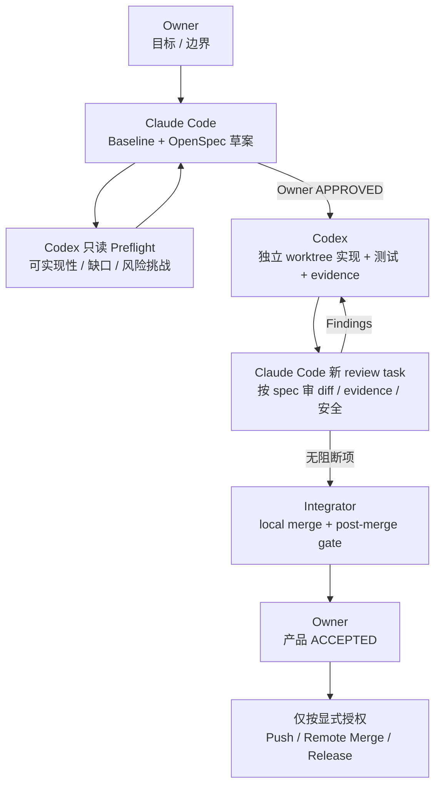

# Locus AI 协作开发工作流与开工门禁

> **状态：RATIFIED — 2026-08-25。**
>
> 本文定义仓库 Owner 与 Codex、Claude Code 等 AI coding agent 如何共同完成调研、决策、
> OpenSpec、实现、验证、审查、验收和归档。它不是产品实现授权，也不代表下文列出的
> OpenSpec 已经获批。
>
> 产品方向以 [Locus 产品方向与 Harness 战略](locus-product-direction-harness-strategy.zh-CN.md)
> 为准；当前代码 owner 以 [Ownership Map](../OWNERSHIP_MAP.md) 为准。

## 0. 一页结论

正规的 AI 协作不是“写一份大计划，然后让 AI 一次做完”，而是让每一阶段都有：

```text
明确输入 → 单一产物 → 明确 Owner → 可检查证据 → 显式 Gate
```

Locus 采用三个彼此分开的批准点：

1. **方向批准：** 决定为什么做、边界是什么；不授权写代码。
2. **Change 批准：** 批准某一个 OpenSpec proposal/design/spec/tasks；才允许实施该切片。
3. **产品验收：** 实现与验证完成后，Owner 接受实际结果；AI 不能代替 Owner 自我验收。

现在已经完成方向批准、本文协作规则和跨 change interoperability contract 的 ratify。
开始新的架构实现切片前，仍需要按每个 change 完成：

- 对受影响公共边界发布 consumer-neutral 接入手册、Schema、示例与 contract conformance fixtures；
- 使用已落地的 PR template 与仓库入口；远程 merge protection 仍须 Owner 单独授权后配置；
- 保持 worktree、active/deferred/archive OpenSpec 队列清楚；
- 为每个新切片建立独立、可验证且经 Owner 批准的 OpenSpec change。

## 1. Source of truth 层级

不同文件回答不同问题，不能相互替代：

| 层级 | 回答的问题 | Canonical source | 不应该承担 |
| --- | --- | --- | --- |
| 产品方向 | 为什么做、长期做什么、不做什么 | ratified Harness strategy | 当前代码已经支持什么 |
| 跨 change 契约 | 核心对象、状态机、长期 invariant | ratified [Interoperability Contract v1](locus-interoperability-contract-v1.zh-CN.md) | 具体表名、类名、迁移 SQL |
| 当前事实 | 现在已经实现什么 | `openspec/specs/**` + 当前代码 | 未来愿景 |
| 当前 ownership | 某项规则现在由谁拥有 | `docs/OWNERSHIP_MAP.md` | 尚不存在模块的虚构 owner |
| 单次变更 | 这一次为什么改、改什么、怎么迁移 | `openspec/changes/<id>/**` | 整个 12 个月路线 |
| 执行状态 | 哪个 change active/blocked/done | delivery/readiness ledger | 产品方向 |
| 验证证据 | 实际跑过什么、在哪个平台、结果如何 | change 内 verification/evidence | 未执行的推测 |
| 外部合同 | consumer 可以稳定依赖什么 | schema + consumer guide + fixtures | Locus 内部实现细节 |

事实冲突时采用：

```text
当前 checkout 的代码
  > 已归档到 openspec/specs 的 current truth
  > 当前 worktree 的未提交实现
  > active OpenSpec proposal
  > strategy / idea / research 文档
```

上面的顺序只用于判断“当前是否已实现”。决定“未来应该做什么”时，以 ratified strategy
和 Owner 决策为准。

## 2. 风险等级

| 等级 | 典型工作 | 开工要求 | 完成证据 |
| --- | --- | --- | --- |
| R0 | 文档、格式、注释、恢复既定行为的小修 | 明确范围；通常不需要 OpenSpec | targeted check + diff check |
| R1 | 局部 UI/行为、单模块非敏感改动 | acceptance criteria；必要时小 proposal | unit/component test、typecheck/build；交互改动要 smoke |
| R2 | API、DB schema、Runtime、跨层状态或架构 owner | OpenSpec + design + public consumer impact / data lifecycle decision | integration、reset/migration、architecture guard、真实 smoke |
| R3 | auth/secret、命令/文件执行、Runtime 下载更新、发布链 | R2 全部 + threat model + 独立安全审查 | provenance、OS/package、失败/回退与对抗证据 |

`F1` 的 Runtime 独立分发属于 **R3**。它不能从战略确认直接跳到实现。

## 3. 标准状态机

```mermaid
flowchart LR
  I["0 Intake\n问题与成功指标"] --> B["1 Baseline\n事实与未知"]
  B --> C["2 Contract / Decision\n跨 change 不变量"]
  C --> S["3 OpenSpec\nproposal + design + deltas + tasks"]
  S -->|Owner APPROVED| O["4 Isolation\nbranch/worktree + file ownership"]
  O --> M["5 Implement\n小批次实现"]
  M --> V["6 Verify\n自动 + 真实 smoke"]
  V --> R["7 Independent Review\n代码 / 架构 / 安全"]
  R --> T["8 Two-AI Technical Gate\nCodex VERIFIED + Claude APPROVED"]
  T --> L["9 Local Integration\nmerge + post-merge verify"]
  L --> A["10 Owner Acceptance\n产品与风险验收"]
  A --> X["11 Archive locally\nspec 成为 current truth"]
  A -->|Owner authorizes exact remote write| G["Optional Push / PR / Release\nCI + rollback"]
  G --> O2["Observe remote release"]
  M -->|Red scope change| S
  V -->|失败| M
  R -->|需修复| M
  A -->|不接受| S
```



### 3.1 Intake：需求收敛

- 输入：用户问题、bug、产品想法或外部 consumer 需求。
- 产物：problem statement、goals、non-goals、成功指标、风险等级。
- AI 可以：举例、澄清、只读调研、暴露隐含取舍。
- AI 不可以：把讨论自动升级为实现授权。
- Gate：Product Owner 明确确认范围。

### 3.2 Baseline：事实审计

- 输入：代码、current specs、active changes、git 状态、真实 consumer 证据。
- 产物：current/target gap、canonical owners、依赖图、未知项、冲突文件。
- AI 可以：读代码、运行非破坏性诊断、核对官方资料。
- AI 不可以：把 proposal 或测试 seam 写成“已经交付”。
- Gate：事实、推断和未知被明确分开。

### 3.3 Contract / Decision：只锁定跨 change 不变量

- 输入：产品方向、baseline、consumer 约束、conformance 证据。
- 产物：术语、对象关系、状态机、安全默认值、API 版本原则、Owner decisions。
- 现在应该确定：`Chat/Conversation`、`Run/Job`、SessionBinding、Interaction、Handoff、
  Runtime version binding 等语义。
- 现在不应该确定：SQLite 列名、类名、目录布局、TTL 数字、签名算法或 DSH 最终协议。
- Gate：Owner ratify；没有阻断性的 open question。

### 3.4 OpenSpec：批准一个最小 change

- 必需产物：`proposal.md`、`tasks.md`、必要时 `design.md`、受影响 capability 的 spec delta。
- R2/R3 必须写出：canonical owner、旧路径删除点、当前 data lifecycle stage、采用 reset
  或 migration、public consumer impact、由 Owner 决定的兼容策略、适用的 rollback、
  threat model/安全边界、测试与真实 smoke。
- AI 可以：起草、审计冲突、严格校验 proposal。
- AI 不可以：proposal 未批准就实现；用一个“大 change”吞掉整条路线。
- Gate：Owner 显式标记 `APPROVED`。

### 3.5 Isolation：分支、worktree 与文件所有权

- 一项 approved OpenSpec 对应一个 branch/worktree/PR。
- 开始前记录 base SHA、`git status`、active-change overlap 和受影响 canonical owners。
- 每个写 Agent 必须声明负责文件/模块；同一文件同时只有一个 writer。
- Drizzle schema/migration、lockfile、i18n dictionary、ownership map、同一 spec delta 是串行热点。
- Gate：没有未解决的 writer overlap；Integrator 明确。

### 3.6 Implement：小批次、单路径

- AI 只修改被分配范围，并同时补相关测试。
- 新 owner 落地的同一个 change 删除或替换旧 helper/call sites。
- 内部 API/owner 的 old/new 双业务实现不允许；所有内部调用在同一个 change 原子迁移并删除
  旧定义。只有 public contract 或独立版本组件边界经 Owner 明确选择兼容后，才允许一个
  指向同一 canonical core 的 compatibility facade；它不能保留旧业务 core。
- 发现计划偏差时按 W7 的 Green/Yellow/Red autonomy envelope 分类；Green 可自主处理，
  Yellow 暂停受影响部分并批量汇报，Red 立即返回 OpenSpec Gate。
- Gate：当前 task 的代码与 targeted tests 通过。

### 3.7 Verify：证据，不是口头保证

按风险选择：

- targeted unit/component/integration tests；
- architecture guards、typecheck、build、full suite；
- DB disposable reset/reseed proof，或进入 durable-data 阶段后的 migration/rollback proof；
- Runtime protocol/schema/conformance；
- macOS/Windows packaged smoke；
- 公共 API/Session contract 的 consumer-neutral conformance fixtures；
- fail-closed、cancel、process cleanup、redaction、rollback negative cases。

AI 可以记录真实输出；不能把“理论上会通过”写成 smoke evidence。

### 3.8 Independent Review：对抗式审查

- R2/R3 的实现 Agent 不得成为唯一 reviewer。
- Reviewer 默认只读，并从 spec、diff 和 evidence 独立重建结论。
- Findings 使用 P0/P1/P2/P3 严重度；P0/P1 必须解决，P2 必须明确接受或建立 follow-up。
- Runtime/provider/auth/secret/command/filesystem 变化额外进行 security review。
- Codex 对准确 source SHA 记录 `IMPLEMENTATION_VERIFIED`，Claude Code 的 fresh review task
  对同一个 SHA 记录 `REVIEW_APPROVED`；任一代码变化都会使两个标记失效并重新验证/审查。

### 3.9 Local Integration 与 Owner Acceptance

- 两个 AI 技术标记都存在、没有阻断 finding、target/base 符合记录且 worktree 干净时，
  AI 可以执行本地 merge，并在 merge SHA 上重新运行完整门禁。
- 本地 merge 冲突、unexpected target movement 或无关用户改动不得静默处理；修改 merge
  结果后必须重新经过 Codex verification 与 Claude review。
- 本地 merge 只是技术集成，不等于 push、远程 PR merge、产品验收或发布。

- AI 可以准备演示、跑自动浏览器或 smoke、整理差异。
- Owner 负责确认主观体验、产品边界、风险接受和 consumer 承诺。
- “测试通过”不等于“产品被接受”。
- Gate：Owner 显式记录 `ACCEPTED`。

### 3.10 Archive 与可选 Remote Integration / Release

- 已完成本地集成、post-merge gates 和 Owner `ACCEPTED` 的 change 可以在本地 archive；archive
  不等于部署，也不要求先 push。`verification.md` 必须明确 remote action 是 `not authorized /
  not performed`，并保留准确 local merge SHA。
- 只有 Integrator 汇总 change，跑完整门禁并准备任何获授权的远程 PR/发布。
- 未获 Owner 明确授权，AI 不 push、remote merge、tag、publish 或发送外部消息。
- Owner 对某个已记录 source/merge SHA 授权 push 后，AI 可以完成该 SHA 对应的 push/PR
  流程；SHA 或 remote target 变化时授权失效，必须重新报告。
- 本地合入/归档时同步 living specs、ownership、consumer docs 与 known limitations；真正发布时再同步 release notes。
- 完成的 OpenSpec 及时 archive；parked proposal 不应混在 active 实施队列。
- 发布后观察真实失败，并保留可执行 rollback。

## 4. 角色与职责

一个人可以兼任多个 human role，但 Gate 仍必须分开记录。

| 角色 | 负责 | 不负责 |
| --- | --- | --- |
| Product Owner | 方向、优先级、成功标准、产品验收 | 由 AI 替代主观取舍 |
| Architecture Owner | canonical owner、依赖方向、迁移/删除 | 用“先留着”制造长期双路径 |
| Security Owner | R3 threat model、secret/trust/command/download 边界 | 把 happy-path tests 当安全证明 |
| Change Owner | 单个 OpenSpec 的范围与交付 | 同时偷偷推进其他 change |
| Implementer AI | 已批准范围内的代码与测试 | 自批 spec、自我最终验收、静默扩 scope |
| Explorer AI | 只读事实、影响图、官方资料 | 修改产品代码 |
| Reviewer AI | 独立审查 diff/spec/evidence | 为了“帮忙完成”而掩盖问题 |
| Test Runner AI | 执行和记录验证 | 修改实现来让测试勉强通过 |
| Integrator | 解决交叉依赖、完整门禁、PR 汇总 | 接受未归属的混杂 diff |
| Release Owner | 制品、签名、发布、回退 | 未经授权自动发布 |

### 4.1 默认双 AI 协作拓扑

默认角色映射采用：

| 实际参与者 | 默认角色 | 边界 |
| --- | --- | --- |
| Repository Owner | Product/Approval/Release Owner | 唯一总指挥；确认方向、批准 OpenSpec、接受产品、授权 merge/release |
| Claude Code | Planner + Architecture/Change Coordinator + Reviewer | 起草计划、分解任务、检查架构与最终 diff；不能批准自己的计划，也不能代替 Owner 验收 |
| Codex | Feasibility Challenger + Implementer + Test/Evidence Producer | 开工前挑战计划可实现性；批准后实现代码、测试和 evidence；不能静默改 contract 或自我最终审查 |



这是默认配置，不是对供应商的硬编码。Canonical 角色名仍是 Planner、Implementer、Reviewer
和 Integrator；未来可以交换 Codex/Claude Code，工作流和 evidence 格式不变。

为了保持真正独立：

1. Claude Code 规划完成后，Codex 在实现前做一次只读 feasibility challenge；不能让一个
   AI 的计划未经质疑直接变成代码。
2. Codex 实现期间，Claude Code 不同时修改同一批产品文件。
3. Claude Code 的正式 review 使用新的 task/context，只读取 ratified spec、准确的 review
   snapshot（commit SHA 或记录摘要的 diff）和 verification evidence，不依赖规划聊天记忆。
4. Reviewer 先输出 findings，不顺手改代码；由 Codex 修复后再复审。
5. R3 额外使用 fresh security-review context，专门挑战 threat model、trust boundary、
   fail-closed 和 rollback，即使它仍由 Claude Code 承载也不能复用实现上下文。
6. AI 之间通过 OpenSpec、diff、tests 和 evidence 交接，不把聊天记录当 source of truth。

## 5. 多 AI 并行规则

并行只用于可以独立完成的工作，不以“更多 Agent”替代清晰 ownership。

1. Explorer、reviewer、test runner 默认只读。
2. Writer 必须声明 owned files/responsibility，并知道仓库中还有其他 Agent。
3. 同一 canonical owner 或热点文件只有一个 writer。
4. 两个 change 需要同一热点文件时，串行实施或先拆出共同前置 change。
5. Agent 发现他人修改时不得 revert、覆盖或用旧版本重写。
6. 发现重叠立即停写，由 Integrator 决定 rebase、拆分或顺序。
7. 每个 Agent 只报告自己实际检查/修改/运行的内容。
8. 最终验证在合并后的完整 diff 上重新执行，不能拼接各 Agent 的局部“都通过”。

## 6. Definition of Ready（允许开工）

一个 R2/R3 change 只有全部满足才可进入实现：

- [ ] problem、goals、non-goals、成功指标明确；
- [ ] 风险等级明确；
- [ ] current facts 与 target 分开；
- [ ] 受影响 current specs 和 active changes 已检查；
- [ ] canonical owner、受影响的公共 consumer surface、旧路径和删除点明确；
- [ ] proposal/design/spec delta/tasks 已完成并严格校验；
- [ ] surface 已分类为 internal API、durable data、public consumer contract 或独立版本组件；
- [ ] 受影响 public contract 已提交 Consumer Impact，且 compatibility/version 决策已由
      Owner 确认；data lifecycle stage、reset/migration 与适用的 rollback/fail-closed 规则明确；
- [ ] 公共 contract 的 acceptance scenarios 和所需 conformance fixtures 明确；
- [ ] R3 threat model 与 security reviewer 明确；
- [ ] branch/worktree、base SHA、writer ownership 和 Integrator 明确；
- [ ] Owner 已显式标记 `APPROVED`；
- [ ] 没有阻断性的 open question。

## 7. Definition of Done（可以收尾）

- [ ] 所有 tasks 与 spec scenarios 有真实实现；
- [ ] 没有未经批准的 scope expansion；
- [ ] 没有 internal old/new 双业务路径；获批的 public compatibility facade 只翻译到同一个
      canonical core，并有版本与删除策略；
- [ ] targeted tests、architecture check、typecheck、build、full suite 通过；
- [ ] 风险矩阵要求的 reset/reseed 或 migration/rollback、negative、OS/package smoke 完成；
- [ ] verification evidence 记录实际 commit、环境、命令、结果和限制；
- [ ] 同一 source SHA 具有 Codex `IMPLEMENTATION_VERIFIED` 与 Claude Code
      `REVIEW_APPROVED`；local merge SHA 的 post-merge gates 通过；
- [ ] independent review 无未解决 P0/P1；P2 有 disposition；
- [ ] 受影响的公共 contract conformance fixture 通过；
- [ ] current specs、Ownership Map、consumer docs、README/CONTRIBUTING 已同步；
- [ ] Owner 完成产品验收并记录 `ACCEPTED`；
- [ ] change 已合入并 archive，active list 不再残留完成项；
- [ ] release/rollback/known limitations 可追溯。

## 8. Verification evidence 最小模板

每个 R2/R3 change 的 evidence 至少记录：

```markdown
# Verification

- Change ID:
- Commit / base SHA:
- Reviewed source SHA / local merge SHA:
- Codex implementation verdict:
- Claude Code review verdict:
- Date / operator:
- OS / arch:
- App version:
- Runtime source / actual version / digest:
- Provider/auth mode（脱敏）:

## Automated
- Command:
- Result:
- Relevant output/artifact:

## Manual / packaged smoke
- Steps actually performed:
- Expected:
- Observed:
- Evidence path:

## Negative / rollback
- Failure injected:
- Fail-closed behavior:
- Rollback result:

## Consumer acceptance
- Fixture/version:
- Result:

## Known limitations
- ...
```

Evidence 默认保存在对应 `openspec/changes/<id>/`，随 change 一起 review 和 archive。

## 9. 最小文档集

### 9.1 已经足够，不应重写

- ratified product direction / Harness strategy；
- current `openspec/specs/**`；
- `docs/OWNERSHIP_MAP.md`；
- Local Job API v1 schema 和中英文 consumer guide；
- architecture handoff 作为有日期的事实底稿。

### 9.2 Ratification 后的文档交付边界

| 文件 | 目的 | 状态 |
| --- | --- | --- |
| 本文 | AI 状态机、Gate、DoR/DoD、证据与并行规则 | **RATIFIED 2026-08-25** |
| `docs/ideas/locus-interoperability-contract-v1.zh-CN.md` | 跨 change 稳定的对象关系、状态机与语义 | **RATIFIED 2026-08-25；C1–C9 已确认** |
| `docs/session-api-v1-consumer-guide.md` + 中文版 | 与业务应用无关的 session/interaction/handoff 接入、版本和迁移说明 | 尚未创建；必须由实际 Session API OpenSpec change 作为 normative deliverable 编写，未实现前不得标成 released |
| public conformance fixtures/examples | 机器可重复的 batch/session/interaction/reconnect 公共合同验收 | 尚未创建；必须与对应 public contract implementation、packaged transport evidence 同 change 交付 |
| `.github/PULL_REQUEST_TEMPLATE.md` | 把 OpenSpec、owner、旧路径、测试、证据、迁移、安全、验收变成每个 PR 的检查项 | **已创建；远程 ruleset 仍需 Owner 单独授权后配置** |

Interoperability ratification 完成的是方向、对象关系与 DoR，不是提前发布一个尚不存在的 API。
实际 `locus.session.v1` change 在实现前必须于 proposal/design 中定义 contract 与 acceptance；其
consumer guide、machine-readable schema、examples、generated types 和 conformance fixtures 在同一
change 中完成并以 packaged evidence 验证，届时才能标成 released。现在创建一份伪成品手册会
误导 Career Kit、Amadeus，因此不是开工前的独立文档任务。

`docs/locus-target-architecture.zh-CN.md` 与 delivery ledger 可以分别存在，也可以合并进
interoperability contract 与 docs index；是否拆文件以“只有一个 source of truth”为准，
不为了文档数量而拆分。

不创建由 Locus 维护的 Career Kit / Amadeus 依赖矩阵。Locus 作为 producer，只拥有公开
协议、Schema、版本兼容、错误语义、接入示例和通用 conformance kit。各 consumer 自己拥有
业务对象映射、adapter、E2E 测试和发布验收；consumer 的公开需求可以作为 Locus 设计证据，
但不会把其内部实现或 Owner approval 变成 Locus 的默认发布门禁。只有双方另行承诺
first-party supported integration 时，才为该 consumer 增加专属兼容矩阵或 release gate。

### 9.3 应修改而不是新建重复文件

- `docs/README.md`：旧 Workbench Focus 已 superseded，不能继续列作 live scope lock；
- `README*.md`、`locus-local-agent-platform*`：入口与产品定位对齐 ratified strategy；
- `canonical-vocabulary.md` / 对应 spec：补 `Engine → runtimeId` 与 `Chat → Conversation`
  映射，避免新建两个对象；
- `openspec/project.md`：Purpose 与领域上下文继承 ratified direction；
- `locus-system-design.md`：清除已归档 change 和已删除 Runtime 的陈旧描述；
- `AGENTS.md`：架构/规划工作必须先读 ratified strategy 与本文；
- `CONTRIBUTING.md`：对齐真实发布机制、DoR/DoD 和验证命令；
- `CLAUDE.md`：删除重复且易漂移的架构/发布事实，改为 canonical 入口；
- `SECURITY.md`：对齐当前 credential 与 Runtime distribution trust 事实；
- `package.json` / CI：已提供 pinned `spec:validate`、`check:full`、diff check；full lint/audit
  仍按 W4.3 的存量债务规则治理。

### 9.4 必须到对应 OpenSpec 再确定

- Runtime release manifest schema、下载 catalog、签名/摘要与原子激活实现；
- SQLite 表/列/索引、migration 文件；
- Session API transport 的具体库与端口策略；
- Interaction TTL 数字和保留版本数量；
- 完整 vendor event union；
- DeepSeek Harness 最终协议；
- embedded UI 组件结构。

这些细节依赖 conformance、security 和 consumer evidence。现在提前写死会增加返工。

## 10. 当前收尾状态

截至 2026-08-25：

- 当前分支仍是 `codex/remove-experimental-runtimes`，正在一次性收尾四个在 W1
  ratify 前已经混入同一工作树的 change；这次历史整合必须记录准确 base/source/merge SHA，
  不作为以后多个 approved change 共用 branch/worktree 的先例；
- provider/native built-Electron smoke、RT-2 credential matrix 与 Career Kit 路径已经跑通；
  closeout 仍须把最终重跑、Codex/Claude 双 verdict 和 post-merge gate 绑定到准确 SHA；
- 两个 parked proposal 已移入 `openspec/deferred/`；Runtime pins 的已知直接漂移已对齐，
  但 single-source manifest 与打包后实际版本 gate 尚未实现；
- PR template、OpenSpec validation 与 patch whitespace CI gate 已落在本地变更中；远程
  ruleset 仍需 Owner 对外部写操作单独授权；
- `update-trpc-capability-boundary` 仍是 pending rebaseline 的 Blocked change，不能混入本次归档。

在这些内容被收尾、隔离或显式重新排序前，不开始 F1 或 Session 核心实现。

## 11. Owner 已确认：Workflow 决策

### W1. Change 隔离单位

- **A（推荐）：** 一个 approved OpenSpec = 一个 branch/worktree = 一个 PR。
- B：多个相关 OpenSpec 可以长期共用一个 branch/worktree。

> **Owner 决定（2026-08-25）：A。** 纯只读调研可以不创建 branch/worktree；一旦某项
> approved change 开始写文档、代码或测试，就使用独立 branch/worktree/PR，不与其他
> OpenSpec 的实现和 evidence 混放。

### W2. 独立审查

- **A（推荐）：** R2/R3 强制独立 reviewer AI；实现者不能是唯一最终 reviewer。
- B：实现者自查即可，只有 Owner 怀疑时再加 reviewer。

> **Owner 决定（2026-08-25）：A。** 默认由 Codex 实现、Claude Code 独立审查；
> Claude Code 同时承担规划和技术协调，但正式 review 使用 fresh task/context，并且 review
> 阶段不修改 Codex 负责的产品文件。Owner 是唯一总指挥与最终批准人。R3 另做独立的
> security-review pass。

### W3. Manual smoke 与产品验收

- **A（推荐）：** AI 先运行可自动化/可监督 smoke，Owner 对关键 UX 和发布体验最终确认。
- B：所有 manual smoke 都必须 Owner 亲手执行。

> **Owner 决定（2026-08-25）：A。** AI 负责执行并记录可重复、可自动化或可监督的
> Desktop/CLI/Runtime smoke；Owner 只需亲自确认关键 UX、风险接受和发布体验，并保留
> 唯一的最终 `ACCEPTED` 权限。AI 记录的推测不能替代实际 smoke evidence。

### W4. Foundation 健康与质量门禁（已确认）

原来的单一 A/B 把结构债务、lint/format 债务和 dependency vulnerability 混为一谈，
现作废且未记录 Owner 决定。2026-08-25 只读审计得到：

- `lint:all` 当前有 2,824 条 diagnostics，涉及 705 个文件；多数在本次 change 之外；
- `bun audit` 当前报告 163 个 advisories（1 critical、70 high、77 moderate、15 low）；
- `architecture:check` 通过，但仍确认存在 schedule/job-store、provider profile read、
  chat persistence 和 renderer interaction state 等重复或 owner bypass；
- 业务热点包括 7,258 行的 `active-chat.tsx`、7,050 行的
  `agents-plugins-tab.tsx`，以及多个 2,000–3,700 行、职责混杂的交互文件；静态字典和
  图标文件不能只按行数判定为架构问题。

因此 W4 拆为三项逐一确认：

#### W4.1 新战略能力前是否先做 Foundation Stabilization

- **A（推荐）：** 在 F1、Session API 等新主线实现前，先完成一个有边界的 Foundation
  Stabilization 阶段；只治理新路线会依赖的核心 owner、已确认双路径、缺失 guard 和关键
  巨型热区，不把整个仓库一次性重写。达到 clean floor 后转为永久 ratchet。
- B：继续新能力开发，只在正好碰到旧模块时顺手重构。

> **Owner 决定（2026-08-25）：A。** 先完成并收尾当前 change，再把有边界的 Foundation
> Stabilization 作为 F1、Session API 等新战略实现的前置阶段。它只处理新路线依赖的
> canonical owners、已确认双路径、缺失 guards 与关键职责热区；不授权全仓库大爆炸重写。

#### W4.2 双实现路径

- **A（推荐）：** 现在立即作为 architecture hard invariant；内部 API 不承诺兼容，抽取
  owner 的同一个 change 必须原子替换全部内部调用并删除旧定义。公开 consumer contract
  变化必须在实现前提交 Consumer Impact，由 Owner 决定直接采用新标准、发布新版本，
  或增加只做协议翻译且复用同一 canonical core 的 compatibility facade。
- B：允许 old/new 长期并存，等新路径稳定后再清理。

> **Owner 决定（2026-08-25）：A，且采用更严格边界。** 以新的 canonical standard
> 开始；internal TypeScript API、main↔renderer 私有 tRPC 与内部 service boundary 不保留
> compatibility layer，所有调用在同一个 change 更新，旧实现和旧入口同时删除。
>
> 当前 data lifecycle stage 为 **PRE-PRODUCTION / DISPOSABLE TEST DATA**。仓库尚无真实
> 用户；位于 Locus 自有 test profile/userData 内的 SQLite 数据、缓存和派生状态可以直接按
> 新 schema reset/reseed，不要求向后 data migration 或 data rollback。该授权不包含项目
> repository/worktree/Git 数据、外部 consumer 数据库或 artifacts，也不允许把删除范围扩到
> Locus test profile 之外。任何 reset change 仍须在 proposal 中写明准确范围和重建方法。
>
> 在首次真实用户、公开 beta 或 production release 之前，Owner 必须显式把 data lifecycle
> 切换为 **DURABLE USER DATA**，确定新的 schema baseline；从该 Gate 起才要求 forward
> migration、失败恢复和适用的 rollback，不能由 AI 根据版本号自行推断已经切换。
>
> Local Job API、未来 Session API、公开 schema/SDK/CLI，以及因 Runtime 独立分发而形成的
> app↔Runtime versioned protocol 属于外部或独立版本边界；如果 change 会影响 consumer，
> AI 必须先列出：受影响版本/字段/事件、已知 consumer、行为差异、所需消费端修改、兼容
> 选项与成本、发布/回滚影响。只有 Owner 能决定是否提供兼容。
>
> 即使 Owner 选择兼容，也只能保留 old-contract adapter → new canonical core 的薄翻译层，
> 不能同时保留 old core 与 new core 两套业务实现。
>
> Public change 使用 [Consumer Impact 模板](../consumer-impact-template.zh-CN.md)；一次 Owner
> 决定只授权模板中写明的 contract/version/scope，不形成以后所有 breaking change 的永久授权。

#### W4.3 Lint 与 dependency audit

- **A（推荐）：** lint 立即实行“新增零容忍 + touched module 变好”，机械格式化使用独立
  change 分批清理，归零后把 `lint:all` 设为 hard gate；dependency audit 按可利用性分级，
  critical 与 production-reachable high 在发布前阻断或由 Owner 显式接受风险，其他项记录
  advisory、owner、原因与期限。
- B：把当前全部 705 个文件和 163 个 advisory 放进一次清零工作，再允许其他 change。

> **Owner 决定（2026-08-25）：A。** 新增 lint error/warning 零容忍，touched module 必须
> 不恶化并逐步变干净；机械格式化与结构重构分属不同 change，清零后启用全量 hard gate。
> Dependency vulnerability 按实际可利用性和运行/发布路径分级；critical 与
> production-reachable high 必须在发布前解决，或由 Owner 明确接受有期限的风险。其他
> advisory 必须记录 ID、影响、owner、理由和处理期限，不能使用无边界的全局忽略。

Foundation Stabilization 不是一次大扫除 PR。每个结构切片仍遵守 W1：一个 OpenSpec、
一个 branch/worktree、一个 PR；先写 characterization tests，再移动到 canonical owner，
替换唯一调用路径并删除旧实现，最后增加防回归 guard。

### W5. OpenSpec active list 卫生

- **A（推荐）：** completed 及时 archive；parked/deferred 移到明确 deferred index，不占 active 实施队列。
- B：保留现有目录混排，只在文档里写状态。

> **Owner 决定（2026-08-25）：A。** `openspec/changes/` 只保留 Draft/Proposed、
> Approved/Implementing、Verification/Acceptance，以及仍在当前计划周期内、具有明确 blocker
> 的 Blocked change。Tasks 全勾选但尚未验证、审查或 Owner `ACCEPTED` 的 change 仍留在
> Verification/Acceptance，不得提前 archive。
>
> 已完成且满足 Definition of Done 的 change 使用 OpenSpec 标准 archive；长期 parked/deferred
> 的 proposal 移到 `openspec/deferred/` 并由该目录的 index 记录理由、原 change ID、日期和
> 恢复条件，不应用其 spec delta，也不进入 active list。恢复时必须移回/重建为
> `openspec/changes/<id>/`，重新对照 current specs、严格校验并取得新的 Owner approval。

### W6. AI 的 Git 权限

- **A+（推荐，按 Owner 建议修订）：** AI 可在 approved task 内创建本地小提交；Codex
  `IMPLEMENTATION_VERIFIED` 与 Claude Code `REVIEW_APPROVED` 同时针对同一 SHA 后，AI
  可执行本地 merge 并运行 post-merge gates。任何 push、remote merge、tag、publish 或
  其他外部写入仍必须取得 Owner 对准确 SHA 的明确授权。
- B：AI 不得 commit，只能留 worktree diff 给 Owner。

双 AI 技术门禁不替代 W3 的 Owner 产品 `ACCEPTED`。正常顺序为：

```text
Codex commit + verify
  → Claude fresh review
  → 双 AI 同一 SHA 通过
  → local merge + post-merge verify
  → Owner ACCEPTED
  → local archive
  → （可选）Owner 对准确 SHA/target 授权后才产生远程变更
```

Local merge target、base SHA 和 Integrator 必须写入 change evidence。若发生冲突、target
意外前移、review 后代码变化或混入无关用户修改，双 AI 标记失效，不得继续自动集成。

> **Owner 决定（2026-08-25）：A+。** 在 approved change 的隔离 worktree 中，AI 可以
> 创建只包含已分配范围的本地小提交。Codex `IMPLEMENTATION_VERIFIED` 与 Claude Code
> fresh review 的 `REVIEW_APPROVED` 必须绑定同一 source SHA；两者均通过后，AI 可执行
> 本地 merge 和 post-merge verification。双 AI 标记不代替 Owner 产品 `ACCEPTED`。
> 未经 Owner 对准确 SHA/remote target 的明确授权，AI 不得 push、remote merge、tag、
> publish 或进行其他外部写入；SHA/target 变化使授权失效。

### W7. 发现 scope expansion

- **Hybrid（推荐，按 Owner 建议修订）：** OpenSpec 预先批准 autonomy envelope；AI 在
  Green 范围内自主实现，在 Yellow 范围内起草 follow-up 并继续不受影响的原任务、到下个
  checkpoint 批量汇报，只有 Red 才立即回到 Owner/OpenSpec Gate。
- Strict A：任何未逐字写入 tasks 的发现都立即暂停并询问 Owner。
- Broad B：AI 可自行扩大或拆分范围并直接实施，只在事后报告。

每个 R2/R3 OpenSpec 的 `design.md` 必须声明允许的 canonical owners/modules、acceptance
criteria、non-goals 和 Red boundaries，形成该 change 的 autonomy envelope：

| 等级 | 判定 | AI 权限 | Owner 何时介入 |
| --- | --- | --- | --- |
| Green | 不改变 goals/non-goals/acceptance；不跨 canonical owner；不影响 public contract/data stage/security/dependency/platform | 可调整实现、补测试、拆内部模块并记录 | 不即时打断；Claude review 时核对 |
| Yellow | 发现相邻 owner/额外清理/独立优化，但原 approved change 可不依赖它完成 | 暂停该部分；在当前 design/verification 的 Scope Delta Ledger 起草 follow-up；继续不受影响任务 | 下一个 checkpoint 或 local merge 前批量确认 |
| Red | 改变目标/验收；public Consumer Impact；新 auth/secret/network/download/command/filesystem 边界；新 dependency/license；新 domain/schema；破坏 test-profile 之外数据；跨 change/worktree；必须依赖未批准范围才能完成 | 立即停止受影响实现并提交选项/影响 | Owner 明确决定扩 change、拆前置/follow-up、延期或放弃 |

Yellow 的默认处置是“起草 follow-up、不实现 follow-up、继续原 change”。若原 change 无法在
不做 Yellow 项的情况下满足 acceptance，它自动升级为 Red。Scope Delta Ledger 不是新建
文档森林；它作为 `design.md` 或 `verification.md` 的一个 section，记录发现、等级、理由、
影响文件、采取动作和后续决定。

> **Owner 决定（2026-08-25）：Hybrid。** OpenSpec 预先定义 autonomy envelope。Green
> 范围由 AI 自主完成并在 review/evidence 中说明；Yellow 只登记 follow-up，不实施该扩展，
> 原 change 的不受影响部分继续推进并在下一个 checkpoint 批量汇报；Red 或由 Yellow 升级的
> 必要前置必须立即停止受影响工作并由 Owner 决定。该规则的目的不是放宽 scope，而是在不
> 改变已批准目标和边界的前提下减少频繁打断。

### W8. Verification evidence 归属

- **A+（推荐）：** evidence 进入对应 OpenSpec change 目录并随 change 归档；小型、脱敏、
  适合 Git 的证据可以放入 change 的 `evidence/`，大型日志、安装包、视频或完整截图集只在
  `verification.md` 中记录可追踪位置、内容哈希、保存期限和已知限制。
- B：集中放在独立 `docs/evidence/`。

每个 change 默认只维护一份 canonical `verification.md`，不为每条命令制造独立文档。它至少
记录 source SHA、验证环境、执行命令与结果、Codex `IMPLEMENTATION_VERIFIED`、Claude Code
`REVIEW_APPROVED`、post-merge verification 和 Owner `ACCEPTED`。Token、密钥、未脱敏 provider
日志或其他 secret 不得进入 Git；需要受限保存的 R3 证据只提交脱敏摘要，并记录经批准的私有
位置、内容哈希、访问边界和保存期限。

> **Owner 决定（2026-08-25）：A+。** 验证证据属于产生它的 OpenSpec change，并随 change
> 一起归档。Git 只保存小型、脱敏证据；大型或敏感产物使用可追踪引用。`verification.md` 是
> 唯一证据索引，并把双 AI 技术结论、post-merge 结果与 Owner 验收绑定到准确 SHA。

### W9. GitHub merge protection

- **A（推荐，分阶段）：** 增加 PR template；为 `main` 要求 PR、CI 与 conversation
  resolution，并阻止 force-push 和删除。第一阶段不要求 GitHub 真人 approval，不启用
  CODEOWNERS；在 Owner 确认 GitHub identity 和稳定维护模式后再升级。
- B：保持当前主要依靠本地检查和人工纪律。

第一阶段只把现有 `Test, Typecheck, Build` job 设为 required status check；当前
`Debt Report` 保持可见但不阻断 merge，直到 W4.3 的存量债务清理达到升级门槛。Owner
保留紧急 bypass，但 bypass 仍须经过 PR，并在 PR/evidence 中记录原因、准确 source SHA、
目标分支和风险接受。Claude Code 的 fresh review 记录在 `verification.md`，在它没有独立、
可信的 GitHub reviewer identity 时，不伪装成平台 approval。

正常远程路径是：Owner 接受并授权准确 source SHA 与 `main` target 后，push change branch、
创建 PR、等待 required CI，再由 Owner 执行或明确授权 remote merge。GitHub 生成的 merge
SHA 必须回填 `verification.md`；source SHA、target、内容或 merge 条件变化时需要重新授权。
启用或修改 GitHub ruleset 本身属于外部写操作，本文批准不构成执行授权。

> **Owner 决定（2026-08-25）：A，分阶段保护。** 第一阶段要求 PR、`Test, Typecheck,
> Build`、conversation resolution，并阻止 `main` force-push/删除；不要求真人 GitHub
> approval、不启用 CODEOWNERS、不把当前 Debt Report 设为硬门禁。Owner 的紧急 bypass
> 仍保留 PR 记录。后续在维护身份和债务门槛满足后，再分别升级 approval、CODEOWNERS 与
> quality/security gates。真正修改远程 ruleset 仍需 Owner 单独授权。

## 12. 逐项确认：Interoperability contract 决策

这些决定将在 workflow ratify 后逐项进入独立 contract 文档：

1. **C1 Chat/Conversation（RATIFIED 2026-08-25）：** A；同一 durable identity，UI 叫 Chat，
   core/API 叫 Conversation；canonical identity 映射当前 `sub_chats.id`，不建立第二对象或状态机。
2. **C2 Job/Run（RATIFIED 2026-08-25）：** A；Run 是唯一 canonical execution attempt；
   Local Job API v1 的 Job 是同一 Run 的兼容投影；retry 创建新 Run 并记录来源与 root chain。
3. **C3 Session API host（RATIFIED 2026-08-25）：** A→B；先建立唯一、显式启动且可后台
   留存的 per-userData-profile RuntimeHost，Desktop/CLI/app 都是 client，关闭窗口按用户策略
   keep/drain/stop；R3 门禁完成后再提供用户明确启用的 per-user 常驻服务，始终复用同一 core。
4. **C4 SessionBinding（RATIFIED 2026-08-25）：** C4.1=A，同一 binding 同时最多一个
   non-terminal Run/执行 lease；C4.2=A+，新 binding 默认 active certified installation，
   旧 binding 保持实际 pin，升级通过显式 successor binding/migration/handoff。
5. **C5 Interaction（RATIFIED 2026-08-25）：** A；durable finite state、single accepted
   terminal resolution、幂等重试、deadline、authorized responder provenance；bounded policy
   无法解决且没有授权 interaction channel 时 fail closed。
6. **C6 Handoff（RATIFIED 2026-08-25）：** A+；同一 Conversation 内向目标 Engine 创建新
   Binding/native session；封存最小可审查 envelope，并通过 scoped、只读、可撤销、可审计的
   ContextGrant 按需回查带 source ref/digest 的 Locus 事实；回查不启动来源 Engine，重新询问
   来源 Engine 必须创建显式新 Run；不传 hidden reasoning、raw logs/tool payload、secret、
   native session state 或旧 permission/auth grant。通用 Agent Memory 另行讨论。
7. **C7 API 演进（RATIFIED 2026-08-25）：** A；internal API 按 W4.2 原子替换，不保留
   compatibility。Local Job API、Session API、公开 CLI/SDK/schema/event/error 与独立版本
   app↔Runtime protocol 的 breaking change 必须先使用 Consumer Impact 模板，由 Owner 逐 change
   选择 direct new standard、new version、temporary facade、defer 或 reject。任何 facade 只做
   old contract → 同一 canonical core 的协议翻译，并具有 migration gate、owner、删除条件、
   contract tests 与 architecture guard。`locus.local-job.v1` 当前继续有效但没有永久兼容承诺；
   Job API 与新 Session API 共享同一 Run/Event/Interaction/Binding core。Runtime extension 使用
   namespace/schema version/maturity/redaction，并对 unsupported required extension fail closed。
   本 decision/workflow 文档不代替未来真实 public contract；每个已发布 version 必须另有 consumer
   guide/reference、machine-readable schema、event/error semantics、examples 与 contract tests。
8. **C8 Runtime 更新（RATIFIED 2026-08-25）：** A+；共同的 certified side-by-side delivery
   core，候选检查可 opt-in，下载/激活需用户策略授权，来源为 Locus 控制的 exact-source/
   signed/digest-pinned catalog，不采用 PATH/upstream latest，按 execution profile 认证/激活并保留
   bundled/active/previous。Codex=A：官方 executable 由 Host 内唯一 app-server protocol adapter
   直接走 stdio，不增加 Worker；现行 exec batch 在迁移前单独认证。Claude=A：
   thin Worker + exact official Agent SDK release + SDK 官方配对 executable 原子认证/更新。当前
   normative specs 仍保留 headless `codex exec` batch/fallback；Owner 新记录的长期方向是把它视为
   临时路径并收敛 shared app-server Run core，精确迁移、spec delta 与 Consumer Impact 另行确认。
9. **C9 Consumer/platform 验收（RATIFIED 2026-08-25）：** C9.1=A；Locus 发布
   consumer-neutral 的 batch 与 interactive conformance fixtures，Career Kit 与 Amadeus 分别在
   自己的仓库维护 adapter/E2E 和升级验收，默认不需要其 Owner 批准 Locus release。C9.2=A；
   Runtime Distribution 至少完成 macOS + Windows packaged 验收后才称 stable/complete，Linux
   Electron Desktop 保持 experimental/non-blocking；未来 Linux Host 可按独立 evidence 晋升。

## 13. Ratification 与开工顺序

```text
W1–W9 已确认；本文 RATIFIED
  → C1–C9 已确认；interoperability contract 已 RATIFIED
  → 创建 PR template / 修正 AI 与贡献入口；仅在另行授权后启用 GitHub ruleset
  → 清理文档索引和 active OpenSpec / dirty worktree
  → 建立并批准有边界的 Foundation Stabilization change
  → 完成新路线依赖的 canonical owner、双路径、guard 与关键热区治理
  → 建立 refactor-single-runtime-release-manifest proposal
  → Owner 批准该 change
  → 才进入产品代码实现
  → 每个实际 public-contract change 同步交付其 guide/schema/examples/fixtures/packaged evidence
```

## 14. 参考原则

- [OpenSpec repository instructions](../../openspec/AGENTS.md)
- [GitHub: manage and standardize pull requests](https://docs.github.com/en/pull-requests/reference/managing-and-standardizing-pull-requests)
- [GitHub: available repository ruleset rules](https://docs.github.com/en/repositories/configuring-branches-and-merges-in-your-repository/managing-rulesets/available-rules-for-rulesets)
- [OpenAI model guidance: autonomy and approval boundaries](https://developers.openai.com/api/docs/guides/latest-model)
