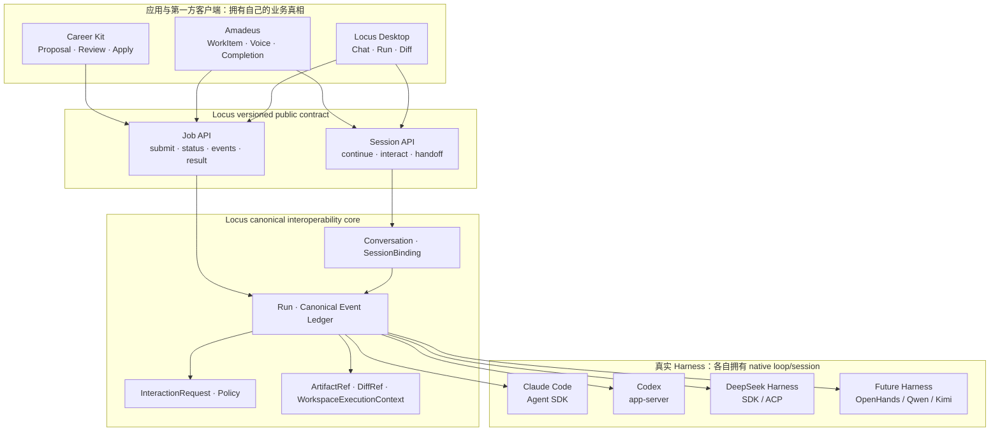

# Locus 产品方向与 Harness 战略

> **状态：RATIFIED 2026-08-25 — Locus canonical 产品方向。**
>
> 调研基线：2026-08-25。
>
> 本文用于确定产品中心、Harness 边界、外部消费者与 6–12 个月路线。它已经仓库
> Owner 确认，但不是任何具体实现的 OpenSpec 批准；每个架构切片仍须单独提案、审查
> 和验证。

## 0. 确认结论

建议将 Locus 的唯一产品中心定为：

> **Locus 是本地优先、开源、可嵌入应用的 Agent Runtime Interoperability Layer。**
> 它让用户或应用只接入一次，即可运行、观察、审批、恢复并显式交接多个真实
> Agent harness，同时保留每个 harness 的原生会话和能力语义。

中文可解释为：

> **跨 Agent Harness 的执行、会话与应用接入层。**

“meta-harness”或“harness of harnesses”可以帮助内部理解，但不建议作为正式产品名称，
因为 Locus 近期不应承诺自己拥有一个通用模型 Agent loop。

对上一份战略 Handoff 中 A–E 命题的收敛建议：

- A「Agent Runtime Portability Layer」是唯一产品中心；
- E「Application-embedded Agent Workspace」是交付方式；
- C「HandoffEnvelope」是旗舰能力；
- B「连续认知工作空间」只作为 Locus Desktop 的第一方体验，不成为下游业务数据 owner；
- D「内置 Locus Agent」至少在近期暂缓；若以后需要，优先评估复用成熟开源 harness，
  而不是从零实现 loop。

Locus 不是另一个 Codex、DeepSeek Harness 或 OpenHands，也不是通用 AI OS、模型网关、
业务 workflow engine、Doctor/兼容矩阵产品或跨 Workspace 冲突产品。

## 1. 为什么必须重新说明 Harness

### 1.1 Harness 是什么

在本文中，Agent harness 指模型外围的完整执行系统，通常包含：

- Agent loop：`model -> tool call -> result -> model`；
- conversation/thread、turn、context 和 compaction；
- tools、MCP、skills、hooks；
- shell、filesystem、workspace 和 sandbox；
- permission、approval、question 和 cancellation；
- streaming events、persistence、resume、fork 和 observability；
- CLI、SDK、app-server、ACP 或其他宿主接口。

因此必须分开以下对象：

| 层 | 示例 | 拥有什么 |
| --- | --- | --- |
| Model | DeepSeek-V3/R1、GPT、Claude model | 推理、生成、tool-call 格式 |
| Model Provider | DeepSeek API、OpenAI API、Anthropic API、Ollama | endpoint、鉴权、限流、模型目录 |
| Agent Harness / Engine | Codex、Claude Code、DeepSeek Harness、OpenHands | loop、session、tools、permissions、runtime behavior |
| Runtime Adapter | Locus Codex adapter、Claude adapter、未来 DSH adapter | 启动和翻译一个真实 harness |
| Locus | 多 harness 的 binding、公共 lifecycle、交互、Handoff 和 app API | 跨 harness 的稳定边界 |
| Domain App | Career Kit、Amadeus | 业务数据、业务流程、最终写入和完成判断 |

把 DeepSeek API 配给 Codex 或 Claude Code，只是换了 Model Provider；它不会自动得到
DeepSeek Harness 自己的 session、tool 或 permission 语义。

### 1.2 Locus 当前是什么

Locus 当前已经深度接入 Claude Agent SDK 和 Codex app-server，同时拥有 Desktop Chat、
Project/Workspace/worktree、provider profiles、permission policy、durable jobs/events 和
Local Job API。

但它还不是一个完整的 provider-neutral harness：

- 没有统一的 Desktop/headless execution owner；
- 没有 durable `SessionBinding` 和 `InteractionRequest`；
- renderer live chunks 与 durable job events 仍不是一套 vocabulary；
- 没有跨 harness 的 continue、resume 和 handoff contract；
- `locus api` 当前是 CLI/JSON contract；
- `locus acp` 不是完整的官方 ACP session surface。

这意味着 Locus 更适合向“多 Harness 控制与会话层”演进，而不是重新发明底层 loop。

## 2. 两个真实消费者给出的产品证据

### 2.1 Career Application Kit：批处理消费者

Career Kit 已有真实实现，而不只是计划：

- 固定使用 `locus.local-job.v1`；
- 通过 `consumer.id = "career-kit"` 提交 `plan`、`metadata-only` 请求；
- 已用于 Profile extraction、JD correction、job evaluation、CV selection/tailoring；
- Locus 返回 reviewable proposal，Career Kit 自己的 review/apply write gate 才能修改业务状态；
- 历史 synthetic smoke 证明运行成功时 Career Kit 数据库 hash 不变。

证据：

- [Career Kit Locus adapter](../../../career-application-kit/app/electron/runtime/locus-adapter.cjs)
- [Career Kit runtime contract](../../../career-application-kit/openspec/specs/locus-runtime-adapter/spec.md)
- [Career Kit smoke evidence](../../../career-application-kit/openspec/changes/archive/2026-06-15-add-career-profile-locus-extraction-mvp/smoke-evidence.md)

Career Kit 需要：bounded job、structured result、provenance、fail-closed 和 graceful
degradation；它不需要 Locus 接管职业申请领域状态。

### 2.2 Amadeus：交互式消费者

Amadeus 由另一个 Owner 管理。根据本仓库 Owner 提供的事实，它已经接入 Locus；公开
README 也声明 `Amadeus -> Locus Local Job API -> Claude Code/Codex` 的关系。

- [Amadeus 的 Locus 集成关系](https://github.com/Lucas1479/Amadeus/blob/b54588a047c16d3206cfe3075a5bbb8222bd6d82/README.md#L97-L108)
- [Amadeus 公开源码状态](https://github.com/Lucas1479/Amadeus/blob/b54588a047c16d3206cfe3075a5bbb8222bd6d82/README.md#L26-L27)

公开仓库没有可构建源码，因此目前能确认 consumer contract，不能独立审计内部实现。

Amadeus 自己拥有 voice、embodiment、`WorkItem`、`RunAttempt`、Completion Evaluator、
Task Dock 和业务 artifact registry。它需要 Locus 提供：立即返回 run id、实时事件、
permission/question、cancel、reconnect、continue/resume、diff/artifact 和稳定结果。

### 2.3 两个消费者的共同交集

```text
Career Kit: batch + typed proposal + human apply
Amadeus:    async + stream + interaction + reconnect
                          |
                          v
Locus: binding + run + event + interaction + artifact + capability
```

它们没有共同的业务 `WorkItem`。因此 Locus 不应该建立通用 Career/Amadeus 业务模型；
它应该拥有两者共同依赖的 Agent execution/session contract。

这里的“消费者证据”只用于发现公共 contract 必须覆盖的真实场景，不表示 Locus 要替
Career Kit 或 Amadeus 维护业务依赖矩阵。Locus 负责与具体业务无关的接入手册、Schema、
版本/迁移规则、示例和 conformance fixtures；各 consumer 自己负责 adapter、领域对象映射、
E2E 测试与升级验收。除非双方另行承诺 first-party supported integration，consumer Owner
的确认不构成 Locus 的默认 release gate。

## 3. Harness 调研结论

### 3.1 OpenAI Codex：学习 rich native protocol，不复制 loop

[OpenAI Codex](https://github.com/openai/codex) 是 Apache-2.0 开源的完整 coding-agent
harness。Locus 已经选择了正确的深度接入面：`codex app-server`。

Codex 最值得学习的部分：

1. **一个内核，多种入口。** CLI、SDK、app-server 复用同一 session/turn/tool core。
2. **Thread -> Turn -> Item。** `turn/start` 后按 `item/started -> delta* ->
   item/completed` 流出事件；completed 是 item 的权威结果。
3. **双向异步协议。** 客户端既消费事件，也响应 command/file/network approval、
   user input 和动态工具请求。
4. **原生 session 生命周期。** `thread/start`、`thread/resume`、`thread/fork`、
   `turn/steer`、`turn/interrupt` 有不同语义。
5. **Approval 与 sandbox 分轴。** 用户或 policy 是否同意，不等于执行环境技术上允许什么。
6. **Schema generation 与 experimental gate。** 协议类型生成 schema；实验能力必须由
   client capability 显式 opt in。
7. **薄 SDK。** 阻塞式调用只是对同一 JSONL 事件流的 convenience wrapper，不建立第二套
   lifecycle engine。

一手资料：

- [Codex app-server README](https://github.com/openai/codex/blob/main/codex-rs/app-server/README.md)
- [Codex session protocol（SQ/EQ）](https://github.com/openai/codex/blob/main/codex-rs/protocol/src/protocol.rs)
- [Codex app-server approval flow](https://github.com/openai/codex/blob/main/codex-rs/app-server/README.md#approvals)

Locus 不应 fork Codex Rust core，也不应把 Codex 巨大的内部 event union 直接变成 Locus
公共 API。Locus public contract 应保持一个小而稳定的 common core，把额外原生信息放入
有 namespace、版本和脱敏规则的 extension。

### 3.2 DeepSeek Harness：最重要的相邻项目

[DeepSeek Harness](https://github.com/deepseek-ai/deepseek-harness) 是 DeepSeek 官方开发、
MIT 许可的完整 Agent Harness。它当前明确处于 developer preview，并警告会发生
compatibility-breaking changes。

它已经包含：

- 基于 Cordis 的可替换 plugin/service graph；
- provider-neutral agent loop；
- append-only、event-sourced Session log；
- system prompt、tool registry、guarded execution pipeline；
- persistence、compaction、skills、MCP、subagents、jobs、sandbox；
- Web、headless、Python/TypeScript SDK、JSON-RPC 和 automation-only ACP；
- Claude Code 与 Codex subagent providers。

最值得学习的架构纪律：

1. **`SessionEvent` 是 append-only source of truth。** Model history、resume、fork、
   telemetry 和 UI projection 从日志派生。
2. **Model-visible means logged。** 任何进入下一次模型请求的事实都必须可从日志重建。
3. **Durable 与 live event 分域。** Session facts 可恢复；agent/capability events 用于
   在途拦截，不伪装成持久事实。
4. **Capability seam。** Service Definition、Provider、Consumer 分开；不支持的能力在
   admission 前 fail loud。
5. **Tool pipeline。** `pre-execute -> guards -> execute -> post-execute ->
   authoritative result`，一次调用只有一个权威结果。
6. **Compaction 不删除历史。** 它改变 model-facing projection，并保留来源与替换关系。

一手资料：

- [DeepSeek Harness architecture](https://github.com/deepseek-ai/deepseek-harness/blob/master/docs/architecture.md)
- [Core and agent loop](https://github.com/deepseek-ai/deepseek-harness/blob/master/docs/subsystems/core.md)
- [Event-sourced session](https://github.com/deepseek-ai/deepseek-harness/blob/master/packages/core/session/README.md)
- [Tool registry and execution pipeline](https://github.com/deepseek-ai/deepseek-harness/blob/master/packages/core/tools/README.md)
- [Human interaction plane](https://github.com/deepseek-ai/deepseek-harness/blob/master/packages/interaction/README.md)

#### 它与 Locus 的关键差别

DeepSeek Harness 自己拥有通用 LLM loop，并把 Codex/Claude Code 当作 subagent。
但其当前官方 provider 明确采用一次性、压缩式集成：

- Codex 每次创建 ephemeral thread；
- Claude Code 每次使用 non-persisted product session；
- 两者都只收到 self-contained text task；
- 不继承父 conversation；
- 只返回最终文本或安全诊断；
- 原生 thread/session id 不进入父 Session；
- 原生 reasoning、tool progress、interaction 和 rich events 不构成公共结果。

证据：

- [DeepSeek Harness Codex provider](https://github.com/deepseek-ai/deepseek-harness/blob/master/packages/subagent/subagent-codex/README.md)
- [DeepSeek Harness Claude Code provider](https://github.com/deepseek-ai/deepseek-harness/blob/master/packages/subagent/subagent-claude-code/README.md)

这说明 Locus 的差异化不能是“也能调用 Codex/Claude”，而应是：

> 保留真实 Agent 的 native session、实时事件、权限交互、continue/resume 和 provenance，
> 并在多个 native sessions 之间建立显式 Handoff。

#### SDK 与 ACP 的当前边界

DeepSeek Harness JSON-RPC SDK 会立即返回 `MessageId`，并流出完整 durable
`session.event` 和 `session.status`；这是优先研究的接入面。但当前官方文档仍列出：

- 没有 per-session close 或 prompt cancel；
- 没有因果明确的 per-prompt result；
- `MessageId` 表示 inbox admission，不等于某个 assistant output/turn outcome；
- runtime 关闭才是整体 teardown 边界。

[SDK server contract](https://github.com/deepseek-ai/deepseek-harness/blob/master/packages/sdk/server/README.md)

其 ACP 是诚实标注的 automation-only 子集，支持 fresh session、prompt、cancel、committed
message 和 one-shot permission，但不支持 load/list/resume/delete/fork，也不输出 live
reasoning/tool activity/usage。

[DeepSeek Harness ACP](https://github.com/deepseek-ai/deepseek-harness/blob/master/packages/acp/acp/README.md)

因此 ACP 应是 Locus 的互操作 adapter，而不是 Locus 内部 canonical domain。

### 3.3 OpenHands：不要低估“自研开放 loop”的重复度

[OpenHands Software Agent SDK](https://docs.openhands.dev/sdk/index) 已经提供 coding-specific、
provider-neutral 的 Agent loop、typed actions/observations、Conversation、tools、workspace、
persistence、security、MCP 及 REST Agent Server。

其本地与远端执行共享同一 Conversation API，只替换 Workspace 实现；Agent Server 通过
HTTP/WebSocket 提供远程执行和 event streaming。

- [OpenHands SDK architecture](https://docs.openhands.dev/sdk/arch/sdk)
- [OpenHands Agent Server / remote workspace](https://docs.openhands.dev/sdk/guides/agent-server/overview)
- [OpenHands Docker runtime](https://docs.openhands.dev/openhands/usage/architecture/runtime)

Locus 应学习 Workspace execution abstraction、local/remote 同构和 sandbox 生命周期；
不应再造另一个同类通用 Python Agent SDK、Docker runtime 或 benchmark platform。

### 3.4 其他项目只学习专长

| 项目 | 值得学习 | 不应成为 Locus 的实现地基 |
| --- | --- | --- |
| SWE-agent / mini-SWE-agent | Agent-Computer Interface、简洁 tool feedback、trajectory 和评测 | 不是交互 session/app embedding 平台 |
| Aider | repo map、edit format、lint/test feedback、Git UX | Python scripting API 不承诺稳定；不要内部耦合 |
| Cline | approval UX、checkpoint、provider catalog、IDE 集成 | 不复制其 IDE Task/domain 与 provider breadth |
| OpenAI Agents SDK | manager-as-tool 与 handoff 的语义区分、trace/span | 其单运行时 handoff 不等于跨 vendor native session handoff |

## 4. Locus 的目标架构



### 4.1 Locus 一等对象

- `Conversation`：Locus 层的连续工作上下文；不等于任一 vendor transcript。
- `SessionBinding`：Locus Conversation 与一个 native harness session 的显式绑定。
- `Run`：一次 turn 或 batch execution attempt。
- `RunEvent`：有序、可重放、已脱敏的 Locus lifecycle/observability 事实。
- `InteractionRequest`：permission、question、auth、scope 等待决议的持久对象。
- `ArtifactRef` / `DiffRef`：带来源和完整性信息的运行产物引用。
- `HandoffEnvelope`：从一个 native session 向另一个新 session 交接的可检查上下文。
- `WorkspaceExecutionContext`：authoritative cwd、registered root、worktree/base commit、
  setup readiness 和 isolation/lease 信息。

Native harness 的原生 transcript、tool result 和 session state 仍由 native harness 拥有。
Locus 持有 binding 和 integration ledger，不伪装成可以重建 vendor 的内部模型状态。

### 4.2 公共契约：small common core + capability extensions

公共层不应退化成 `run(prompt) -> text`，也不应把每个 vendor 的全部内部类型永久复制出来。

Small common core 至少表达：

- lifecycle：start、submit、status、cancel/interrupt、terminal result；
- identity：conversation、session binding、run、event cursor；
- stream：started、delta、completed 和 durable replay；
- interaction：requested、resolved、expired；
- result：artifact、diff、structured output、failure semantics；
- capability/version negotiation。

Runtime-specific extension 应满足：

- namespace + schema version；
- 明确 stable / experimental maturity；
- 脱敏后才能持久化或暴露给 renderer/consumer；
- consumer 不认识 extension 时仍能依赖 common lifecycle；
- 不能把 unknown 当 supported。

### 4.3 必须分开的动作

| 动作 | 含义 |
| --- | --- |
| `reconnect` | 从 cursor 继续读取同一 Run 的 Locus event ledger |
| `retry` | 相同 JobSpec 创建新的 execution attempt |
| `continue` | 在同一个 native SessionBinding 中进入下一轮 |
| `resume` | native harness 中断后按其真实能力恢复；不支持就明确 degraded |
| `fork` | 从同一 harness 的稳定边界创建 native 分支 |
| `handoff` | 向另一个 harness 创建新的 native session，并传递可审查 envelope |

这些动作不能统一叫 `resume`。

## 5. 高内聚、低耦合的所有权规则

### 5.1 Harness owner

- native Agent loop；
- native transcript/session identity；
- 原生 tool、MCP、skill、hook 和 model replay state；
- native sandbox 和 permission mechanism；
- 原生事件及其版本。

### 5.2 Locus owner

- Runtime Adapter registry 和 capability negotiation；
- `SessionBinding`、Locus Run lifecycle 和 ordered event ledger；
- durable interaction lifecycle 与 Locus policy enforcement；
- native event 到 common event 的 loss-aware projection；
- app-facing Job/Session API；
- artifact/diff provenance；
- worktree、registered root、execution lease 和 Git safety；
- explicit `HandoffEnvelope`；
- provider profiles 和 Locus-owned secret storage。

### 5.3 Domain App owner

- Career Application、Amadeus WorkItem 等业务对象；
- 业务数据库和最终完成判断；
- review/apply/publish/submit write gate；
- voice、embodiment、领域 UI 和业务 artifact taxonomy。

### 5.4 工程硬规则

1. Desktop、CLI、Local Job API 和未来 transport 只能调用同一 application/core service。
2. Runtime adapter 只做 native protocol、lifecycle 和 projection，不拥有业务 workflow。
3. 下游不读取 Locus SQLite、不 import Locus 源码、不解析 vendor raw stream、不接触 secret。
4. 一个 invariant 只有一个 canonical owner；新 owner 落地时同一 change 删除旧 helper/call site。
5. 临时双路径必须有 migration gate、删除日期、测试和 deprecation owner。
6. Approval metadata 不等于 sandbox enforcement；无法证明 enforcement 时必须 fail closed。
7. 公共 SDK 是薄 wrapper；blocking API 折叠同一 async stream，不建立第二状态机。

## 6. Locus 应学习、复用与避免重造什么

| 领域 | 学习/复用 | Locus 自己拥有 | 避免重造 |
| --- | --- | --- | --- |
| Agent loop | Codex/Claude/DSH/OpenHands 的官方 runtime | adapter contract、binding、handoff | 通用 model-tool loop |
| Session | DSH event sourcing、Codex Thread/Turn/Item | 跨 harness Conversation + SessionBinding | vendor transcript 重放器 |
| Events | typed schema、started/delta/completed | durable cursor/replay、common + extension | 三套 Desktop/headless/API vocabulary |
| Interaction | Codex server request、DSH approval seam | durable InteractionRequest 和 app answer path | renderer 内存 Map 作为唯一真相 |
| Tools | DSH pipeline、SWE-agent ACI | capability/policy projection | 第二套通用 tool registry |
| Context | DSH compaction provenance、Aider repo map | HandoffEnvelope、artifact/diff refs | 通用 memory/compaction 平台 |
| Sandbox | native sandbox、OpenHands Workspace | registered root/worktree/lease 与粗粒度 policy | 一次性复刻所有 OS sandbox |
| Protocol | official SDK/app-server/ACP | versioned Job/Session API | 把私有协议命名成完整 ACP |
| Evaluation | native fixtures、mini-SWE-agent trajectories | Runtime Adapter conformance | 把 benchmark/Doctor 变成产品中心 |

## 7. DeepSeek Harness 的建议接入策略

### 7.1 近期：研究对象和 experimental Runtime

建议把 DeepSeek Harness 定为第三个候选 Runtime，但先做 isolated compatibility spike，
不直接进入产品稳定承诺。

建议顺序：

1. pin npm/repository revision；
2. 优先研究 JSON-RPC SDK 的完整 `session.event`；
3. 同时验证 ACP automation subset；
4. 在 disposable workspace 运行，不共享 Locus production DB；
5. 记录 start、stream、permission、cancel、restart、continue、result 和 process teardown；
6. 只在 capability gate 通过后增加 `deepseek-harness` experimental RuntimeDescriptor。

Go/no-go 门槛：

- 可以固定并识别精确版本；
- submit 后立即获得可关联 identity；
- permission 无 UI 时 fail closed；
- cancel/teardown 能证明整棵进程退出；
- event 和 result 有可恢复、可解释的因果边界；
- restart 后的 session 行为不伪装成 supported；
- Windows/macOS 边界如实声明；
- 升级不会要求 Locus import DSH 内部 package path。

### 7.2 暂不建议：in-process vendoring

DeepSeek Harness 仍是 developer preview，session format 和 wire 都没有广泛兼容承诺。
近期不应：

- 把 Cordis 引入为 Locus 内部框架；
- 直接依赖 DSH internal packages；
- 复制其 Web UI/plugin center；
- 让 DSH Session 取代 Locus 的跨 harness binding；
- 同时保留现有 core 和一套 DSH-backed 新 core。

若 Owner 将来批准 built-in Locus Agent，才单独比较：

1. out-of-process DSH runtime；
2. 受支持的 DSH SDK/composition；
3. OpenHands SDK；
4. 自研最小 loop。

默认顺序应是协议集成优先于进程封装，进程封装优先于代码 vendoring。

## 8. 建议的四周学习与验证计划

这是一条内部 research/conformance 线，不是新的 Doctor 产品。

### 第 1 周：Codex native semantics

- 读 app-server lifecycle、Thread/Turn/Item 和 approval flow；
- 记录一次 start -> turn -> tool -> approval -> completed；
- 验证 resume、fork、interrupt 和 schema generation；
- 输出 Codex golden event fixture。

### 第 2 周：DeepSeek Harness

- 读 architecture、session、tools、interaction、SDK、ACP；
- 跑 pinned JSON-RPC SDK composition；
- 检查 JSONL SessionEvent、MessageId、idle、cancel/teardown 和 restart；
- 对比 DSH Codex/Claude subagent 与 Locus 当前 rich adapter。

### 第 3 周：OpenHands 与 ACI

- 运行一个 LocalWorkspace 和一个隔离 Workspace；
- 验证 Conversation API 是否真的保持 transport-neutral；
- 用 mini-SWE-agent/SWE-agent 比较简洁 ACI 与工具反馈；
- 只提炼 workspace/tool/evaluation 原则，不引入其业务层。

### 第 4 周：Locus contract prototype

- 写 transport-neutral TypeScript types，不接生产路由；
- 建 `RuntimeDescriptor` capability matrix；
- 把四种 native trace 映射为 common core + native extension；
- 用参考 Career Kit 场景的 consumer-neutral fixture 验 batch/structured-output；
- 用参考 Amadeus 场景的 consumer-neutral fixture 验 async/stream/interaction/reconnect；
- 形成正式 OpenSpec 输入和 go/no-go evidence。

## 9. 6–12 个月确认路线

| 阶段 | 交付 | 主要验收 |
| --- | --- | --- |
| 0. Owner ratification（已完成） | 确认第 11 节；升级 canonical direction；旧定位标记 superseded | 仓库只有一个产品中心 |
| 1. Foundation Stabilization | 治理新路线依赖的 canonical owner、已确认双路径、缺失 guard 与关键职责热区 | 不做全仓库重写；建立可持续 clean-floor ratchet |
| 2. Harness conformance spike | Codex、Claude、DSH、OpenHands native trace 和 capability matrix | 不靠猜测设计公共契约 |
| 3. Job Kernel v1.1 | async submit、immediate id、canonical events、idempotency、artifact refs | 公共 batch/structured-output conformance 通过；不要求 consumer 改领域 ownership |
| 4. Interactive Runs | durable InteractionRequest、cancel、cursor reconnect、thin local SDK | 公共 async/stream/interaction/reconnect conformance 通过；consumer 不解析 vendor raw stream |
| 5. Portable Sessions | Conversation、SessionBinding、continue/resume/fork semantics | Desktop 与 API 使用同一 owner |
| 6. Explicit Handoff | 可预览、删改、确认的 HandoffEnvelope | Claude <-> Codex 真实 repo dogfood |
| 7. Third Runtime | pinned DeepSeek Harness experimental adapter；成熟后再升级 | 新 Runtime 不修改 renderer switch/core state machine |

现有 Local Job API v1 在另一个 approved Consumer Impact 决定前继续作为有效 public contract，
但不构成永久兼容承诺。任何 breaking change 都按 C7 由 Owner 逐 change 选择直接采用新标准、
发布新版本、临时薄 facade、延期或拒绝。同步 `runs create` 应改成同一 async submit + wait core
的 wrapper，而不是保留第二套执行路径。

`F1=A` 作为横切交付线执行，不把 Runtime 版本管理塞进上述业务阶段：

1. 在任何下一次 Runtime bump 前完成 single-source release manifest、实际版本 gate，并防止
   Windows/package/应用声明再次漂移；
2. Harness conformance fixture 稳定后，先用 Codex 验证 side-by-side managed update、
   explicit activation 与 rollback；
3. Portable Session/adapter protocol 稳定后，再把 Claude SDK client 与匹配 executable
   封装成独立 versioned Runtime bundle；
4. 上游 release 只产生候选版本，不自动产生 Locus release，也不自动进入 Stable channel。

`C9.1=A、C9.2=A` 作为横切验收线执行：Locus 自己发布 consumer-neutral conformance，Career Kit、
Amadeus 默认不成为 release veto；macOS 与 Windows Desktop/Runtime Distribution 是首批 Tier-1
stable packaged gates，Linux Electron Desktop 保持 experimental/non-blocking。未来 Linux
RuntimeHost/headless 可在同一 core 上用独立 packaged evidence 晋升 Tier-1，不要求同时承诺
Linux Desktop，也不为平台复制业务路径。

## 10. 成功指标与停止条件

### 成功指标

- Career Kit 升级 Locus minor version 时不修改领域 ownership；
- Amadeus 能 immediate submit、stream、answer interaction、cancel 和 reconnect；
- Locus Desktop 使用同一个 session/run core，不再有特殊 lifecycle；
- 新 Runtime 只增加 descriptor、adapter、projection 和 conformance fixture；
- downstream 无 vendor-specific branch、无 raw secret、无 Locus DB access；
- native session id、capability 和 unsupported/degraded 状态诚实可查；
- Handoff 创建新 native session，不伪造跨 harness resume。
- 经认证的 Codex Runtime 可不发布 Desktop 而独立安装、激活和回退；
- Claude Runtime 以匹配 bundle 更新，不把固定 SDK 与任意 latest executable 混用；
- 每个 Run/SessionBinding 能追溯实际 runtime version、source 与兼容性证据。

### 停止条件

出现以下任一情况，应暂停扩张并重新决策：

- 为接第三个 Runtime 必须复制一整套 renderer transport；
- common API 退化成只有文本，无法表达 Amadeus 的 interaction/stream；
- Locus 开始拥有 Career/Amadeus 的业务对象；
- DSH/OpenHands 已稳定提供完全满足两个 consumer 的跨 harness contract，而 Locus 没有额外价值；
- Owner 仍不主动使用 Locus 的 handoff/session 体验；
- 新 core 与 Desktop/headless 旧路径长期双跑。

## 11. Owner 已确认的决策

以下问题没有代码可以替 Owner 决定。这里同时保留备选项、推荐理由与最终决定，防止以后
只看到结论而丢失取舍依据。

最终决定（2026-08-25）：`D1=A`、`D2=A`、`D3=A`、`D4=A`、`D5=A→B`、
`D6=A`、`D7=A`、`D8=A`、`F1=A`。产品方向与 Runtime 交付方向均已由 Owner 确认。

### D1. 唯一产品中心

- **A（推荐）：** 跨 Harness 的 runtime/session interoperability 与 app embedding。
- B：Locus 自己成为 provider-neutral 通用 Agent Harness。

> **Owner 决定（2026-08-25）：A。** Locus 的唯一产品中心是跨 Harness 的
> runtime/session interoperability 与 app embedding；Locus 不以自研通用 Agent
> Harness 为产品中心。

### D2. 未来 12 个月是否拥有内置 Locus Agent loop

- **A（推荐）：** 不拥有；先把真实 Agent 的 Session/Interaction/Handoff 做完整。
- B：做 experimental DSH-backed Locus Agent。
- C：自研独立 loop。

> **Owner 决定（2026-08-25）：A。** Locus 坚持适配层方向，站在成熟 Harness 的肩膀上，
> 未来 12 个月不自研 Agent loop；优先完成真实 Agent 的 Session、Interaction 与
> Handoff。该时间边界是路线优先级，不是永久禁止。

### D3. DeepSeek Harness 的关系

- **A（推荐）：** 先作为 pinned、out-of-process、experimental Runtime 做 compatibility spike。
- B：直接嵌入 DSH packages，作为 Locus 内核。
- C：只学习，不计划接入。

> **Owner 决定（2026-08-25）：A。** DeepSeek Harness 与 Codex、Claude Code
> 保持平级，采用官方协议或客户端边界作为独立 Runtime 接入；它不能成为 Locus
> 内核。先以固定、可回滚的实验版本完成进程外 compatibility spike，再决定稳定支持。

### D4. Chat 顶层对象

- **A（推荐）：** 一个 Locus Chat/Conversation 可以绑定多个 native Agent sessions，切换必须显式 Handoff。
- B：一个 Chat 永远只绑定一个 native Agent session，跨 Agent 必须新建 Chat。

> **Owner 决定（2026-08-25）：A。** Chat 代表用户工作的连续性，可以包含多个彼此
> 独立的 native SessionBinding；跨 Engine 必须经过显式、可检查的 Handoff。Locus
> 不宣称不同 Harness 共享隐藏记忆、transcript 或原生 session state。

### D5. Public API 的形态

- **A（推荐）：** 保留 Job API，并新增 Session API；采用 small common core + versioned native extensions。
- B：直接做完整 Workspace/Conversation API 与 embedded UI。
- C：只保留 batch Job API。

> **Owner 决定（2026-08-25）：分阶段 `A→B`。** 第一优先级先完成共享同一 Run、
> Event、Interaction 与 SessionBinding 核心的 Job API 和 Session API；核心稳定后，
> 再提供可选的 Workspace/Conversation embedded UI。后置 UI 必须只消费前置公共 API，
> 不能绕过它直接访问 Runtime、Locus 数据库或建立第二套 lifecycle。

### D6. Agent 选择权

- **A（推荐）：** 用户显式选择/切换；Locus 可以建议，不自动偷偷换 Agent。
- B：允许 policy 自动路由和自动 Handoff，只在事后显示。

> **Owner 决定（2026-08-25）：A，且为硬约束。** 用户或调用应用拥有 Engine
> 选择权。Locus 可以建议，也可以在明确、有边界、可撤销的预授权策略内自动路由，
> 但禁止未授权切换和只在事后披露。每次路由与跨 Engine Handoff 都必须可见、可审计，
> 并记录授权来源。

### D7. 术语

- **A（推荐）：** 用户界面使用 `Engine` 表示 Codex/Claude Code/DSH；API 使用 `runtimeId`；
  `Agent` 保留给 Locus persona。
- B：用户界面把 Codex/Claude/DSH 都称为 `Agent`，另给 persona 改名。

> **Owner 决定（2026-08-25）：A。** 保持术语分层清晰：用户界面的 `Engine`
> 表示 Codex、Claude Code、DeepSeek Harness 等执行产品；公共 API 使用 `runtimeId`；
> `Agent` 延续已批准词汇，表示可复用的 persona（instructions + allowed tools），不表示
> 一个额外的 Locus Agent loop。

### D8. Locus 是否拥有跨应用 Goal/Task

- **A（推荐）：** 不拥有；只在 HandoffEnvelope 中保存有来源的 goal/decision snapshot。
- B：建立 Locus 通用 Goal/Task/Dependency domain，供 Career Kit、Amadeus 共用。

> **Owner 决定（2026-08-25）：A。** Career Kit、Amadeus 等 Domain App 继续拥有
> Goal/Task、业务状态和最终完成判断；Locus 只拥有 Conversation、SessionBinding、
> Run、Event、Interaction 与 Handoff 等执行事实，并可保存 opaque external reference
> 及有来源、不可冒充业务真相的 goal/decision snapshot。

### F1. 上游 Runtime 版本与 Locus 发布是否真正解耦

只读核查结论：Owner 记得的“解耦”确实存在，但它与 Runtime 交付解耦不是同一件事。

已经完成的是：

- 系统或全局 CLI 与 Locus 隔离；用户自行更新 Codex/Claude 不会突然替换 Locus 的
  bundled runtime；
- Provider、Model、Auth source 与 Engine 解耦；
- Locus 公共 Run/Event/Capability contract 与 Codex app-server、Claude SDK 等内部协议解耦；
- remote model catalog 可以在不重发 Desktop 的情况下更新模型目录。

尚未完成的是：

- Codex/Claude executable 没有 production external-path 选择或独立 Runtime updater；
- 没有 side-by-side version、Stable/Canary channel、兼容范围、协议协商、激活指针或
  last-known-good rollback；
- 新 Codex Runtime 要交付给用户，仍需改 pin、重建并发布 Locus Desktop；
- Claude SDK client 编进 Desktop，且官方 package metadata 将 SDK `0.3.177` 对应到
  Claude Code `2.1.177`。因此只外置 Claude executable、再让固定 SDK 配任意 latest
  executable，不构成安全解耦；
- 当前 Windows workflow、package scripts 与应用声明已临时对齐 Claude Code `2.1.177` 与
  Codex `0.139.0`，消除了已知的直接版本漂移；但版本仍分散在多个文件，仓库尚无
  single-source manifest 或打包后实际 `--version` release gate，未来仍可能再次漂移。

准确表述是：

> Locus 已通过 known-good pin 与上游发布节奏隔离，因此上游每次更新不要求 Locus
> 立即跟进；但 Locus 尚不能在不发布 Desktop 的情况下独立、安全地升级 Runtime。

#### F1-A（Owner 已确认）：受认证的独立 Runtime 交付

保留安装包内 immutable bundled known-good 作为最终 fallback，同时建立独立于 Desktop
版本的受管理 Runtime 通道。它不是“自动使用系统 latest”，而是
`发现候选 → 校验来源/摘要 → compatibility + conformance → 用户授权激活 → 可见回退`。

按风险分期；准确 lifecycle 与验收不变量由 interoperability contract 的 C8 约束：

1. **P0 版本真相：** 建立 single-source Runtime release manifest；package scripts、CI、
   Runtime Status 与测试共同读取；打包后核对实际 `--version`，防止已修复的直接漂移复发。
2. **P1 inactive 共同交付内核：** 建立每个 userData profile 唯一、但尚不参与 production
   selection 的 installation registry/resolver、
   signed catalog/trust rotation、side-by-side storage、按 execution profile 的 candidate
   certification/activation、active/previous/bundled pointer、pin、Host compatibility、回退与 GC
   规则；测试 harness 先使用，Runtime 的 production caller 在各自 cutover phase 才原子迁入。
3. **P2 Codex（C8-Codex=A）：** atomic payload 是准确的官方 Codex executable；继续由 Host
   内唯一 app-server protocol adapter 直接驱动 verified executable 的 stdio，不增加 Codex
   Worker；当前 `codex exec` batch surface 在独立迁移获批前仍按 normative specs 存在。候选必须
   生成/核对版本准确的 app-server schema并通过真实 lifecycle/approval/event/resume/MCP
   conformance；迁移前还要单独验证 exec batch eligibility。协议不兼容时保持 quarantine，等待
   Locus adapter 更新。P2 同一 change 原子切换 Codex app-server、exec、login/status 与相关 helper
   的 resolution 并删除全部 Codex 旧 path。
4. **P3 Claude（C8-Claude=A）：** atomic payload 是 `thin out-of-process Worker + exact official
   Agent SDK release + 该 SDK 官方配对的平台 Claude Code executable`。当前相同版本的 Worker
   bundle 先作为共同 registry 的 inactive candidate 完成 Desktop/headless parity，再原子 cutover
   全部 Claude production caller 并删除旧 SDK/CLI adapter/resolution 路径，最后开启独立 Runtime
   更新。
5. 每个 Run/SessionBinding 记录实际 runtimeInstallation、source、version、digest/schema 与
   conformance identity；Stable/Canary/manual policy 与回退必须可见、可审计，并遵循 D6 的
   用户授权原则。

Owner 在 2026-08-25 新确认：当前 headless 普通 batch 的 `codex exec` 按长期方向视为临时路径，
不能扩展成第二套 durable Run/Event/Interaction owner；目标是让 Desktop、headless 与未来
Session API 收敛到同一个 Codex app-server Run core。仓库核查未找到此前已经批准的删除计划，
现行 specs 仍明确保留 `codex exec` batch/fallback；因此当前 adapter selection 在新 proposal
批准前继续有效。batch projection、Consumer Impact、parity gate、旧 call-site 删除时点与
rollback 另行讨论和批准，不能借 Runtime delivery change 顺手改造。

结果：上游可以频繁发布，Locus 只在验证通过后提供 Runtime 更新；若新协议超出当前 adapter
能力，则继续使用旧 runtime，等 Locus 代码更新，而不是冒险强行升级。

#### F1-B（未选择）：继续随 Desktop 发布 Runtime

只完成 P0，继续把 Claude/Codex known-good versions 固定在安装包中。该方案最简单，
也不会被上游自动更新打断，但用户要获得新版 Runtime 仍必须等待下一版 Locus Desktop，
Runtime 不能独立切换或回滚。

无论选择 A 或 B，都不接受“静默使用 PATH 上的 latest”。未经验证的系统 CLI 不能替换
known-good runtime。

> **Owner 决定（2026-08-25）：A。** 上游 Runtime 的发布频率不能变成 Locus Desktop
> 的发版频率。Locus 保留 bundled known-good fallback，并建设经来源校验、兼容测试、
> 用户授权且可回退的独立 Runtime 交付能力；Locus 不承诺追随每个上游版本，也不静默
> 使用系统 latest。C8 后续确认把该方向细化为共同交付内核、Codex 直接 app-server 与
> Claude 原子 Worker bundle；这些细化不改变 F1=A。

## 12. Ratification 结果与 OpenSpec 顺序

本文 ratification 完成以下文档治理动作：

1. 本文成为 docs index 中的 canonical 产品方向；
2. `locus-workbench-focus*` 的 conflict-centered 定位标记为 superseded，但该标记本身不
   撤销已经批准或正在进行的 OpenSpec change；
3. `locus-architecture-strategy-handoff.zh-CN.md` 保留为事实底稿，不再充当路线入口。

Ratification 本身不创建或批准实现 change。建议按依赖拆分 OpenSpec：

1. 先完成一个有边界的 Foundation Stabilization change：只处理后续路线会依赖的 canonical
   owner、已确认双路径、缺失 architecture guard 与关键职责热区；
2. 再建立 Runtime 版本真相与 Harness conformance：
   - `refactor-single-runtime-release-manifest`
   - `add-harness-runtime-conformance`
3. 再拆公共执行与会话核心：
   - `add-local-job-api-async-submit`
   - `refactor-unified-runtime-route-catalog`
   - `refactor-canonical-run-event-ledger`
   - `add-durable-agent-interactions`
   - `add-durable-session-bindings`
   - `add-explicit-agent-handoff`
4. 在相应 conformance 与 adapter boundary 就绪后拆独立 Runtime 交付：
   - `add-managed-codex-runtime-delivery`
   - `add-versioned-claude-runtime-bundle`
5. 最后才扩展第三 Runtime：
   - `add-deepseek-harness-runtime`（仅在 spike 通过后）
6. 每个 change 明确 canonical owner、旧路径删除点、migration gate 和验证消费者。

## 13. 相关本地文档

- [Locus 战略重启与全架构 Handoff](../locus-architecture-strategy-handoff.zh-CN.md)
- [Canonical Entity Vocabulary](canonical-vocabulary.md)
- [Ownership Map](../OWNERSHIP_MAP.md)
- [Local Job API v1 Consumer Guide](../local-job-api-v1-consumer-guide.zh-CN.md)
- [Locus Workbench Focus（已取代的旧产品定位；保留作历史切片记录）](../locus-workbench-focus.zh-CN.md)
