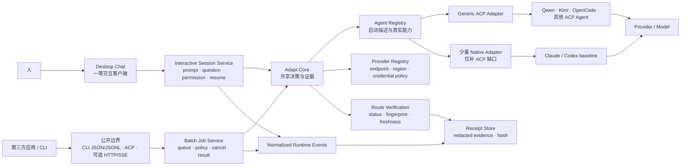

# Locus Adapt：开源方向调研与执行方案

> **历史状态说明（2026-08-20）：** 本文把 Doctor、兼容性矩阵与执行回执放在产品中心的 thesis，
> 已被用户明确否定。当前战略与完整架构 handoff 见
> [Locus 战略重启与全架构 Handoff](locus-architecture-strategy-handoff.zh-CN.md)。本文仅保留为
> 2026-08-15 的调研快照；其中 Agent / Provider / Model 分离、Chat-first 和共享核心等底层原则仍可参考，
> 但不得再引用为当前产品方向。

> **后续合同状态（2026-09-02）：** 经批准的 Foundation 1d consumer sweep 确认该实验性
> 自有 stdio surface 没有已知外部消费者，Owner 随后确定 current name 为
> `locus jobs-stdio`、协议版本为 `locus-jobs-stdio.v1`，且不保留旧命令 alias。下文相关
> 路径与状态按这一后续决定标注；这不追溯批准本文其余 2026-08-15 路线建议。

状态：**方向提案，不是当前已交付能力**

调研快照：2026-08-15

范围：开源产品方向、协议与现成方案复用、仓库边界、桌面角色、实施顺序和验收标准

明确不在范围内：模型成本比较、商业化与定价

> 在新的 OpenSpec change 获批且实现完成前，当前 specs、
> [Locus 工作台定位](locus-workbench-focus.zh-CN.md)和
> [Local Job API v1](local-job-api-v1-consumer-guide.zh-CN.md)仍是已交付事实。
> 本文不能被引用为“Locus 已经支持任意 Agent 或完整 ACP”的证据。

## 1. 决策结论

Locus 可以继续做。它不应靠不断复制 Codex、Claude Code 的通用 Chat 功能来竞争，也不要恢复
已经删除的 Qwen/Kun 专属 renderer/runtime 路径；但 Chat 必须继续作为 Desktop 的默认、一等交互面。

建议的新方向是：

> **Locus Adapt 是一个面向中国与全球 coding-agent 生态的开源 Agent 客户端与适配层：人通过
> 一等 Chat 使用 Agent，应用通过 Headless API 使用 Agent，二者共享 ACP 互操作、兼容性诊断、
> 权限决策、运行事件与执行回执核心。**

它给用户和应用开发者的承诺不是“所有 Agent 和模型完全等价”，而是：

> **接一次，能够选择不同 Agent 和 Provider；切换前知道这条路线是否真实验证、会降级什么；
> 运行后拿到可检查的事件和回执。**

这条方向值得做的原因不是市场空白，也不是拥有独家协议。ACP client、HTTP bridge、Agent GUI、
多 Provider coding agent 都已经存在。Locus 能建立的开源价值是把最容易被模糊的部分做诚实：

- 区分 Agent、Provider、Model 和凭证条款，不把它们混成一个“模型选择器”；
- 对中国区 endpoint、中文路径、工具调用、权限拒绝、取消和恢复做真实探测；
- 用 `verified / degraded / experimental / unsupported / stale` 表达兼容事实；
- 在正式 Chat 中承载多轮 session、追问、权限、工具进度、取消和恢复；
- 为应用提供持久 job、标准事件和脱敏 receipt，而不是只返回一段文本；
- 把不支持的能力 fail closed，不用最低公共子集制造“无损切换”的错觉。

如果只想得到“HTTP 调用 Claude/Codex/Qwen”，现成项目已经足够，Locus 没有必要存在。
只有当 compatibility Doctor 和 execution receipt 能帮助用户定位真实失败时，这个项目才形成自己的意义。

## 2. 产品边界

### 2.1 Locus Adapt 是什么

- 一个架构上 Headless/API-first、体验上 Chat-first 的本地优先 Agent 客户端与 bridge；
- 一个消费正式 ACP 的 client/proxy，而不是自创另一套通用 Agent 协议；
- 一个 Agent × Provider × Model × Region × OS × Version 的兼容性实验室；
- 一个 durable local job sidecar：持久化状态、事件、取消、结果与回执；
- 一个一等 Desktop Chat 客户端，用于交互式 session、权限接管、Runs、Doctor 和兼容矩阵；
- 一个不要求启动 Desktop 的 CLI/API 执行核心；
- 一个中国生态优先但不锁定中国模型的开源项目。

### 2.2 Locus Adapt 不是什么

- 不是面向消费者陪伴、通用知识问答或复制全部 vendor-native 功能的聊天产品；
- 不是新的模型网关，也不与 LiteLLM、OpenRouter 或各 Provider gateway 竞争；
- 不是“任意 Agent × 任意模型都能工作”的排列组合承诺；
- 不是自维护 20 个 CLI 的 PTY/JSONL adapter 集合；
- 不是替 Agent 接管 OAuth、订阅账号或伪造官方客户端身份；
- 不是远程 sandbox/cloud runner 的完整重建；
- 不是把当前桌面 Workbench 改个名字后继续原路线。

### 2.3 四个概念必须分开

| 概念 | 示例 | 谁拥有行为 |
|---|---|---|
| Agent / harness | Qwen Code、Kimi Code、Codex、Claude Code、OpenCode | Agent 自己的 loop、tools、session、permissions |
| Provider | DashScope、Moonshot、DeepSeek、SiliconFlow | endpoint、鉴权、限流、协议变体 |
| Model | `qwen3-coder-*`、`kimi-*`、`deepseek-chat` | 推理与 tool-call 能力 |
| Route | Agent + Provider + Model + region + version | Locus 只记录并验证这一具体组合 |

“支持 Qwen Code”不等于“Qwen Code 使用任何 OpenAI-compatible endpoint 都支持工具”；
“文本 prompt 成功”也不等于写文件、拒绝权限、取消和恢复都正常。

## 3. 现成方案：复用什么，不重做什么

以下判断优先使用官方仓库、官方文档和当前发布状态。星标或下载量没有被当作产品质量或需求证明。

| 项目 | 已解决的问题 | 许可/成熟度快照 | Locus 的决定 |
|---|---|---|---|
| [Agent Client Protocol](https://agentclientprotocol.com/get-started/introduction) 与 [TypeScript SDK](https://github.com/agentclientprotocol/typescript-sdk) | 应用/IDE 与 coding agent 之间的 session、prompt、tool、permission 协议 | Apache-2.0；正式协议与 SDK | **直接采用。** 升级到 stable SDK v1，不再扩展私有通用协议 |
| [ACP Registry](https://github.com/agentclientprotocol/registry) | Agent 发现、启动信息与协议探测 | Apache-2.0；当前 registry 已有数十个 Agent | **直接消费。** 不自建下载目录或另一套 Agent catalog |
| [acpx](https://github.com/openclaw/acpx) | headless ACP client、持久 session、queue、cancel、permission policy、JSON | MIT；README 仍标 alpha | **原型可 pin，生产隔离在 owned interface 后。** 不暴露其类型为 Locus 公共 API |
| [Rivet Sandbox Agent](https://github.com/rivet-dev/sandbox-agent) | Rust daemon、HTTP/SSE、TS SDK、Inspector、多 Agent、本地/远程 executor | Apache-2.0；0.x | **远程执行首选评估项。** 可贡献 Qwen/Kimi adapter；不重造 sandbox control plane |
| [AWS sample-acp-bridge](https://github.com/aws-samples/sample-acp-bridge) | ACP 到 HTTP/SSE、async job、进程池、Web UI、兼容测试 | MIT-0；sample | **学习 API/job/process-pool 测试。** 不采用其自动放行权限策略，不当生产依赖 |
| [OpenCode Server](https://opencode.ai/docs/server/) / [SDK](https://opencode.ai/docs/sdk/) | 完整 OpenAPI、SSE、session、provider、permission、ACP | MIT；成熟独立产品 | **作为外部 Agent、对照实现和测试对象。** 不把 OpenCode server 包进 Locus core |
| [Qwen Code](https://github.com/QwenLM/qwen-code) | 原生 `qwen --acp`、headless、SDK、多 Provider | Apache-2.0；ACP stable | **首批 Tier 1 Agent。** 只走原生 ACP，不恢复旧 renderer runtime |
| [Kimi Code](https://github.com/MoonshotAI/kimi-code) | 原生 `kimi acp`、headless JSONL、本地 REST/WS | MIT；活跃发布 | **首批 Tier 1 Agent。** ACP 为默认，专属 API 只在 ACP 缺能力时评估 |
| [DeepSeek Harness](https://github.com/deepseek-ai/deepseek-harness) | 官方开放 harness、headless profile、ACP automation demo | MIT；Developer Preview，明确可能 breaking | **仅 experimental。** 版本锁定并推动上游稳定 ACP，不内嵌内部 API |
| [AionUi](https://github.com/iOfficeAI/AionUi) | 多 ACP Agent 的完整桌面 GUI、permission 与会话 UX | Apache-2.0 | **学习 session、permission 与可靠性处理。** 保留一等 Chat，但不复制 broad cowork/协作范围 |
| [Open Interpreter](https://github.com/openinterpreter/openinterpreter) | 多 harness emulation、ACP、Codex exec 兼容与开放模型路径 | Apache-2.0；新的 Rust/Codex 路线 | **作为外部 Agent/对照 oracle。** 不重做 harness emulation |
| [agent-shell-py](https://pypi.org/project/agent-shell-py/) | 统一 execute/stream/health，并公开不同 Agent 的权限差异 | MIT | **学习 capability truth。** 不把无法逐调用限制的 Agent 宣称为等价 |
| [Lite Harness](https://github.com/LiteLLM-Labs/lite-harness) | Claude/Codex/Pi 的统一 Python API 实验 | Preview；未正式发包，仓库许可文件边界需谨慎 | **观察，不依赖、不复制。** |

结论：

1. **协议层已有答案：ACP。** Locus 不需要定义 `locus-agent-protocol-v2`。
2. **基础 bridge 也已有答案。** Locus 不应把 HTTP/SSE 包装本身当成差异化。
3. **桌面 GUI 已经拥挤。** Chat 不是差异化本身，但它仍是 Adapt 的第一方交互客户端和持续
   dogfood 公共核心的主要界面。
4. **仍不完整的是组合真实性。** ACP Registry 的 initialize/session 探测不能证明某个 Provider、Model、
   区域和 Agent 组合能安全完成真实工具任务。

## 4. 当前仓库能复用什么

当前分支已经有不错的“上半座桥”，不需要从零重写：

| 当前资产 | 复用方式 | 必须修正的边界 |
|---|---|---|
| `src/shared/local-job-api.ts` 与 `src/main/lib/headless/local-job-api.ts` | 保留 job/result/event 的公共合同与下游隔离 | 加入 route、capability truth、receipt，不让 transport 拥有业务规则 |
| `src/main/lib/headless/job-store.ts`、`job-runner.ts` | 保留 durable job、cancel、retry、event persistence | adapter 选择必须由共享 registry、AdaptCore 和 BatchJobService 决定 |
| `src/shared/chat-message.ts`、Chat hydration 与 `runtime-event-state.ts` | 保留正式 Chat 的消息、追问、权限与 guard UI 基础 | Chat transcript 不能成为第二份运行真相；pending interaction 不能只留在 renderer 内存 |
| `desktop-run-request.ts`、`desktop-runner.ts` 与现有 Chat transports | 保留交互式 session 的 verified preflight、stream 和审批语义 | 不新增 Qwen/Kimi 专属 renderer transport；所有 Agent 经统一 registry 和事件映射 |
| Provider profiles、presets、transforms 与 secure storage | 保留 DeepSeek、Qwen/DashScope、Kimi、GLM 等 endpoint 与 secret 基础 | Provider 不再静态声明 `targets: claude/codex`；改为独立对象和 route verification |
| 现有 Claude `-p` / Codex `exec` batch adapters | 作为基线或 ACP 未覆盖时的 native adapter | 不能继续是 hard-coded 唯一 selector；所有 adapter 经过同一 capability gate |
| `src/main/lib/headless/jobs-stdio.ts` | 保留为实验性的 Locus-owned job JSON-RPC surface | `locus-jobs-stdio.v1` 不是官方 ACP，也不得冒充 ACP 兼容 |
| Provider diagnostics UI、Workbench job trace、Debug 系统信息 | 抽成 Providers、Runs、Doctor 的显示层 | 诊断规则和 receipt owner 必须在共享 AdaptCore/main-process service，不得只存在 renderer/tRPC |
| 归档的 Qwen ACP 实验与测试模式 | 复用 allow/deny/cancel/orphan canary 的测试思想 | 不恢复旧 Qwen desktop runtime 或不安全的 permission/plan 映射 |

当前仓库把 `@agentclientprotocol/sdk` 固定在 `0.4.9`。新方向的第一个技术门槛不是增加 Agent，
而是完成到 stable v1 的迁移和行为回归，并移除/隔离重复的私有 ACP 语义。

### 必须先修的诚实性缺口

当前 Local Job API 的 capability manifest 主要描述 desktop runtime，batch adapter 的真实能力并未成为
独立 manifest。这样会出现“请求在入口被接受，但实际 headless adapter 不实现”的假支持。

Adapt 的硬规则是：

- capability 必须由具体 route + adapter + version 共同声明；
- `unknown` 不是 `supported`；
- request 在排队前 fail closed；
- permission、attachment、ask-user、resume 等能力不能从 desktop manifest 借用；
- 每次运行绑定当时的 manifest fingerprint，后续变化会令旧 receipt 变成 stale，而不是悄悄重解释。

## 5. 目标架构



### 5.1 Canonical owner

不能用一个万能 job 生命周期抹平交互式 Chat 和无人值守 batch 的差异。新增无 Electron、React、
tRPC 依赖的共享 `AdaptCore`，再让两个明确的执行面依赖它：

```ts
interface AdaptCore {
  listAgents(): Promise<AgentDescriptor[]>;
  listProviders(): Promise<ProviderDescriptor[]>;
  listRoutes(): Promise<RouteStatus[]>;
  resolveRoute(input: RouteInput): Promise<RouteDecision>;
  doctorRoute(input: DoctorInput): Promise<VerificationReceipt>;
}

interface InteractiveSessionService {
  createSession(input: SessionInput): Promise<SessionRecord>;
  prompt(sessionId: string, input: PromptInput): AsyncIterable<RunEvent>;
  answerInteraction(input: InteractionAnswer): Promise<void>;
  cancelTurn(sessionId: string): Promise<void>;
  resumeSession(input: ResumeInput): Promise<SessionRecord>;
}

interface BatchJobService {
  submitJob(input: JobInput): Promise<JobRecord>;
  streamEvents(jobId: string, after?: number): AsyncIterable<JobEvent>;
  cancel(jobId: string): Promise<JobRecord>;
  getReceipt(jobId: string): Promise<ExecutionReceipt>;
}
```

两个执行面共享 registry、route resolution、provider binding、capability truth、permission policy、
normalized events、redaction 和 receipts；但保留各自合理的生命周期：

```text
ChatSession → Turn → Run → NormalizedRuntimeEvent → Receipt
HeadlessJob ─────────→ Run → NormalizedRuntimeEvent → Receipt
```

Desktop Chat、CLI、ACP 和将来的 HTTP/SSE 都只是客户端或 transport。它们可以解析 envelope、
呈现交互，但不能各自实现 route 选择、capability gate、权限规则、状态迁移或 receipt 逻辑。

Agent 切换也必须如实表达：同一 Agent 内只有在协商能力允许时才原位切 Provider/Model；切换到
另一个 Agent 时应创建新的 native session，并明确传递 transcript/context，而不是假装不同 Agent
共享一个可恢复的 session ID。

Agent 发起的追问与权限请求统一投影为可持久化的 `InteractionRequest`，至少记录 `kind`、`state`、
`sessionId`、`turnId`、`runId`、原生请求标识、允许的响应和过期/取消结果。`question`、`permission`、
`auth`、`plan_exit` 是不同语义，不能为了统一 UI 永久压成一个布尔确认框。

- Interactive Session 可以把请求交给 Chat，断线后恢复未完成交互；
- Batch Job 只有在调用方明确提供 interaction channel/policy 时才可等待；
- 无可见交互通道时必须以 `interaction_required` fail closed，不能无限挂起或自动放行；
- renderer 只展示和提交答案，不拥有 pending interaction 的唯一状态。

### 5.2 不急于拆仓库

v0.1 先在当前仓库建立纯 core 边界，避免在方向尚未被真实使用前承担 monorepo/发布成本。

只有同时满足以下条件时才提取 `packages/locus-adapt-core` 和 `packages/locus-adapt-node`，或独立仓库：

- 至少两个外部应用需要 in-process import，而不是 CLI/ACP；
- 公共 schema 已经过两个版本的兼容演进；
- Electron/tRPC 依赖已经能由 architecture test 明确禁止；
- 抽取不会保留 old/new 两条业务路径。

## 6. Agent、Provider 与 Route 数据模型

### 6.1 Agent descriptor

```yaml
id: qwen-code
source: acp-registry
launch:
  command: qwen
  args: ["--acp"]
transport: acp
distribution: user-installed
license: Apache-2.0
auth_owner: agent
maturity: stable
capabilities:
  session_resume: unknown
  tool_read: probe_required
  tool_write: probe_required
  cancel: probe_required
```

加入一个正式 ACP Agent 的正常路径应是“descriptor + probe fixture + receipt”，不能要求修改
renderer switch、核心状态机或新增一套 transport。

### 6.2 Provider descriptor

```yaml
id: dashscope-cn
protocol: openai-compatible
region: cn-mainland
endpoint: https://dashscope.aliyuncs.com/compatible-mode/v1
credential_policy:
  api_key: allowed_headless
  coding_plan: interactive_only
quirks: []
```

Provider descriptor 只描述 endpoint、协议、凭证类别与已知限制；它不能宣称某个 Agent 一定兼容。

### 6.3 Route status

```yaml
agent: qwen-code@0.21.12
provider: dashscope-cn
model: <exact-model-id>
os: darwin-arm64
status: verified
verified_at: 2026-08-15T00:00:00Z
valid_until: 2026-09-14T00:00:00Z
receipt_sha256: <hash>
degraded_capabilities: []
```

状态定义：

- `verified`：当前精确组合通过所需 probes，且 receipt 未过期；
- `degraded`：基本运行成功，但至少一个声明能力不可用；
- `experimental`：Agent/adapter 本身不稳定，或只完成最小 probe；
- `unsupported`：已知失败或条款不允许该使用方式；
- `stale`：Agent、Provider、Model、OS、probe 或 policy fingerprint 已变化/过期；
- `untested`：没有证据，绝不能在 UI 中显示为绿色。

## 7. Doctor 与可验证回执

### 7.1 最小 probe 套件

每条 Tier 1 route 至少验证：

1. executable、版本和 ACP initialize；
2. auth readiness，但不读取或导出 secret；
3. 文本 prompt 与流式事件；
4. 只读工具调用；
5. 明确允许一次写入；
6. 明确拒绝一次写入，并验证 filesystem canary 未改变；
7. shell permission 的 allow/deny；
8. cancel 后终止且无 orphan process；
9. session resume（不支持则明确 degraded）；
10. Agent 主动追问的 question → answer 往返，以及断线后的 pending interaction 恢复；
11. permission 的 allow once / allow session / deny 映射，未支持的档位不得伪造；
12. tool progress 的稳定关联、完成/失败状态与事件顺序；
13. usage/event 完整性（缺失不伪造）；
14. 中文输入、Unicode 文件名和含空格路径；
15. 错误 model、错误 endpoint、CN/global region 混用的诊断；
16. secret 与原始 tool payload 的脱敏。

探测真实写入或执行命令时必须使用一次性 sandbox/临时仓库，不得在用户项目中直接运行 destructive probe。

### 7.2 Receipt 最小字段

```json
{
  "schemaVersion": "locus.adapt.receipt.v1",
  "kind": "route-verification",
  "agent": { "id": "qwen-code", "version": "0.21.12" },
  "provider": { "id": "dashscope-cn", "region": "cn-mainland" },
  "model": "<exact-model-id>",
  "host": { "os": "darwin", "arch": "arm64" },
  "probeVersion": "<git-sha>",
  "capabilities": {},
  "startedAt": "<timestamp>",
  "finishedAt": "<timestamp>",
  "evidenceHash": "sha256:<hash>",
  "redactions": ["credential", "user-path"],
  "status": "verified"
}
```

不记录成本。若 Agent 不提供 usage，写 `unsupported` 或 `missing`，而不是估算一个看似精确的值。

## 8. 中国生态与凭证政策

首批支持应围绕官方 Agent 和一般按量 API key，而不是绕过客户端条款：

| 凭证类型 | 默认政策 | 原因 |
|---|---|---|
| Provider 一般 API key | `allowed_headless`，由 secure storage 注入到受控子进程 | 通常面向程序化调用；仍需按各 Provider 当前条款核对 |
| Coding Plan 专用 key | `interactive_only`，除非官方明确允许自动化/API backend | 例如阿里云 Coding Plan 官方范围限定在指定的交互式 coding tools |
| Claude/Codex/Qwen/Kimi 订阅或 OAuth | `agent_owned` | 由官方 Agent 登录和使用；Locus 不导出 token、不代理订阅额度 |
| 未知/非官方 credential hack | `unsupported` | 不伪造 User-Agent、OAuth client 或官方工具身份 |

对闭源 CLI：

- 默认用户自行安装；
- Locus 只探测 executable 和版本；
- 没有明确再分发许可时不打包二进制；
- adapter 的协议许可和 Agent 二进制许可分别记录；
- provider/model 的“便宜”不是违反登录或订阅条款的理由。

## 9. 首批支持矩阵

不要从 20 Agent × 10 Provider × 3 OS 开始。首批只维护少量可重复验证的路线：

| Tier | Route | 角色 | 进入条件 |
|---|---|---|---|
| 1 | Qwen Code ACP + DashScope CN 一般 API | 中国区主路径 | 全 probe + macOS/Linux receipt |
| 1 | Qwen Code ACP + DeepSeek 一般 API | 跨 Provider 切换证明 | tools、deny、cancel、中文路径均通过 |
| 1 | Kimi Code ACP + Moonshot 一般 API | 第二个独立 Agent | 全 probe + receipt |
| Baseline | Codex / Claude 当前 native batch 路径 | 对照和现有用户兼容 | 明确各自真实 capability，不假装 ACP 等价 |
| Experimental | DeepSeek Harness | 观察官方 harness 演进 | pin version、单独 badge、允许 breaking |
| Community | GLM、SiliconFlow、Doubao、MiniMax 等 Provider/Agent 路线 | 社区扩展 | 外部 owner + fixture + redacted live receipt |

Tier 1 总量先不超过五条。无 owner 或 30–60 天没有新 receipt 的路线自动变成 `stale/unverified`。

## 10. 对外接口顺序

### v0.1：先扩展现有 CLI 合同

```bash
locus adapt agents list --json
locus adapt providers list --json
locus adapt routes list --json
locus adapt doctor --agent qwen-code --provider dashscope-cn --model <id> --jsonl
locus adapt run --agent qwen-code --provider deepseek --model <id> --request request.json --json
locus adapt events <job-id> --follow --jsonl
locus adapt receipt <job-id> --json
```

人工命令可以有易读输出，但机器接口始终 stdout 纯 JSON/JSONL、diagnostics 到 stderr。

### v0.2：正式 ACP surface

- 使用官方 ACP TypeScript SDK stable v1；
- Locus 作为 ACP client 管理外部 Agent；
- 若 Locus 自身作为一个组合 Agent 暴露给 IDE，使用正式 ACP server contract；
- 2026-09-02 后续 Owner 决策已将自有 surface 定名为 `locus-jobs-stdio.v1`，不保留命令
  alias；它继续与正式 ACP contract 分离，不以改名暗示 ACP 兼容。

### v0.3：按真实下游需求决定 HTTP/SSE

只有至少一个不能方便启动 CLI/ACP 的真实应用要求时才加 loopback HTTP/SSE。优先评估：

1. 复用/贡献 Rivet Sandbox Agent；
2. 借鉴 AWS sample bridge 的 process pool 与 compliance tests；
3. 保持 HTTP route 为 `BatchJobService` 的薄 transport。

不因为“看起来像平台”就先部署 daemon、云控制台或 hosted service。

## 11. Desktop：Chat 一等保留，外观复用，信息架构显式化

### 11.1 当前实机结论

2026-08-15 使用 `bun run dev` 在独立 dev profile 做了本机审计：

- 默认首页已经是 Chat composer，但空状态大面积留白，没有解释 route readiness 或下一步；
- 左侧主结构是 workspace/chat tree，Workbench 只是底部图标；
- Workbench 标题是“运行与历史”，并明确交互工作仍从 Chat 发起；
- Chat 输入区已经有 Engine 与 Model selector，证明它是最自然的 Agent 路线选择入口；
- Provider profiles 埋在 Settings → Models 的长页面；
- Debug 已有有价值的系统/数据库信息，但和 destructive developer controls 混在一起；
- Provider 表单已经包含 DeepSeek、Qwen/DashScope、Kimi、GLM、SiliconFlow 等 preset，
  是最接近 Adapt 的现有界面。

因此结论是：

> **保留 Chat 作为正常启动后的默认、一等交互面，同时保留当前深色视觉语言、
> project/chat sidebar、main/details 布局、Provider 卡片、状态 badge、trace 和详情面板；
> 把隐式页面状态、混合的 Agent/Provider/Model 选择和全局导航重构清楚。**

### 11.2 新桌面定位

> Locus Desktop is the first-party interactive client for Locus Adapt. Chat is its default,
> first-class session surface. The Desktop is not required to run the CLI, ACP bridge,
> conformance probes, or headless jobs.

这里的原则是：

```text
架构上 Headless/API-first；体验上 Chat-first。
```

核心 CLI/API 必须在不启动 Electron 的情况下完整工作；同时 Desktop Chat 必须完整承载多轮 session、
流式消息、plan、tool progress、permission、question、cancel、resume 和运行回执。Desktop 与第三方
应用依赖同一个共享 core，renderer 不得拥有另一套 adapter、route、permission 或 capability truth。

### 11.3 推荐导航

```text
首次使用
└─ Setup / Doctor：形成至少一条可用 Agent + Provider 路线

正常使用
├─ Chat（默认；恢复上次会话或显示 New Chat）
├─ Runs
├─ Connections
│  ├─ Agents
│  ├─ Providers
│  └─ Compatibility / Doctor
└─ Settings
   ├─ MCP / Skills / Plugins
   ├─ Personas / Prompts
   └─ Appearance / General
```

| 当前屏幕 | 未来处理 |
|---|---|
| Onboarding | 保留两栏/状态 rail 视觉，改成 Agent detection → Provider → Doctor → Chat；只要求至少一条路线可用 |
| Chat / New Chat | 完整保留并成为默认、一等 Session UI；输入区明确分开 Persona（可选）/ Agent / Provider / Model |
| Workbench | 拆出并改名 `Runs`，保留 job/event/result/cancel/trace，移出 PR/conflict 主线 |
| Settings → Models | 移入 `Connections → Providers`；Agent、Provider、Model 三个维度分开 |
| Settings → Agents | 改名 `Personas`，因为当前管理的是 prompt/persona，不是 runtime adapter |
| Debug | 拆为用户可见 `Doctor` 和独立 Developer Tools；destructive reset 不出现在 Doctor |
| Projects/Worktrees/Diff/PR | 继续作为 Chat/session 的项目上下文能力，不成为全局 Adapt owner |
| Kanban | 降为可选项目视图，不能取代 Chat 的默认 fallback |
| MCP/Skills/Commands/Plugins | 放进 Advanced 或具体 Agent 的 capability 页面，不宣称全局等价 |

### 11.4 桌面实施顺序

1. 全程保持现有 Claude/Codex Chat 可用，不用重写 UI 作为架构收敛前提；
2. 把隐式的 `null = chat/new-chat/kanban` 页面状态改为显式 `chat / runs / connections / settings`；
3. 将现有 Chat 改为 registry 驱动，并把 Agent、Provider、Model selector 拆开；
4. 用现有 Provider Profile UI 形成 `Connections → Providers`；
5. 从 Workbench 抽出 Runs，再增加 Agents 与 Compatibility / Doctor；
6. 不在当前未提交的 cross-workspace conflict WIP 上直接重写 Workbench。

## 12. 分阶段执行路线

### Phase 0：冻结旧主线并获批架构转向

- 决定当前 `codex/remove-experimental-runtimes` 与 dirty conflict WIP 的去留；
- 新建独立 OpenSpec change，不能把转向混进现有 conflict 或 headless readiness change；
- 明确旧 Workbench 功能是保留为 legacy、迁移还是删除；
- 明确 Chat 保持默认、一等交互面，不能在迁移中退化为 Playground 或只读 viewer；
- 写出 canonical owner、migration flag、删除日期和 architecture guard。

验收：proposal 明确影响 specs、迁移顺序、不可承诺边界；没有开始恢复 Qwen renderer route。

### Phase 1：协议与核心收敛

- 升级 `@agentclientprotocol/sdk` 0.4.9 → stable v1；
- 建立无 Electron/tRPC 的 `AdaptCore`，以及语义分离的 Interactive Session / Batch Job services；
- 建立 Agent/Provider/Route descriptors；
- 用一个 generic ACP adapter 接 Qwen 与 Kimi；
- 现有 Claude/Codex adapter 通过同一 registry 与 capability gate；
- 先把现有 Claude/Codex Chat 迁到 registry/route 决策，保持视觉和交互无回归；
- old/new selector 不并存。

验收：新增第二个 ACP Agent 不改 core switch 或 renderer 条件分支；Claude/Codex Chat 仍支持流式输出、
追问、权限和取消；unit + live ACP allow/deny/cancel canary 通过。

### Phase 2：Doctor 与 receipts

- 实现 disposable probe workspace；
- 实现 route verification、freshness fingerprint 与 redacted receipt；
- 完成三条 Tier 1 route；
- 输出机器可读 JSON Schema；
- 将 credential policy fail closed。

验收：三条 route 的 text/tool/deny/cancel/Unicode/invalid-endpoint probes 有新鲜 receipt；
拒绝写入时 filesystem canary 保持不变。

### Phase 3：公开 headless surface

- 发布 `locus adapt list/doctor/run/events/receipt`；
- 中英文 quickstart 与最小 consumer sample；
- 与 acpx、OpenCode server、AWS sample bridge 对同一任务做行为对照；
- 记录 Locus 多解决了哪些诊断，没解决什么。

验收：至少两个外部 sample app 不 import Locus 源码即可接入；重启后 job/event/receipt 仍可读取。

### Phase 4：Desktop first-party Chat client

- 将 Chat 显式定义为默认 `AppView`，切换 Runs/Connections/Settings 不清空当前会话；
- Providers、Agents、Compatibility、Runs、Doctor 和 Chat 全部消费共享 core；
- Chat 展示 Persona（可选）/ Agent / Provider / Model，并显示 route verification 状态；
- 完整呈现 permission、question、tool progress、cancel、resume 和 receipt；
- destructive developer controls 与用户 Doctor 分离。

验收：关闭 Desktop 后 CLI/API 不受影响；正常启动仍进入 Chat；Desktop 没有第二套
route/capability/permission 判断；Chat turn 与 headless job 都能绑定同一套 normalized event 和 receipt 证据。

### Phase 5：社区兼容实验室

- 贡献模板固定为 descriptor + probe fixture + redacted receipt + owner；
- CI 只跑静态/模拟 probes，真实 provider probe 按维护预算定期运行；
- 30–60 天无 owner/receipt 自动 stale；
- 能上游修复的问题优先提交 ACP Registry、Agent 或 Provider，不堆本地永久 quirk。

验收：至少三个外部 route owner；至少一个真实兼容问题被上游接受或修复。

## 13. 六周开源验真标准

这不是商业 KPI，也不看模型成本。六周后继续投入需要同时看到大部分事实：

- 作者本人每周真实使用，累计至少 20 个非演示任务，其中至少一半通过 Desktop Chat 完成；
- 三条 Tier 1 route 有新鲜 live receipts；
- Qwen 与 Kimi 各完成至少一次中文多轮 Chat，并覆盖追问或权限、取消和恢复；
- 至少 10 个非作者安装；
- 至少 2 个下游应用通过公共 CLI/ACP 接入；
- 至少 3 个外部贡献、route owner 或可复现实例；
- Doctor 实际定位至少 5 个“普通 wrapper 只会报失败”的兼容问题；
- 新增 ACP Agent 不需要 pair-specific core patch；
- 维护 Tier 1 matrix 不超过作者每周一天。

出现以下情况则主动收缩：

- 作者自己仍不使用；
- 用户直接用 acpx/OpenCode/Rivet 即可，Locus 的 Doctor/receipt 没增加决策价值；
- 每加入一个 Agent 都要新增专用 session、permission、tool parser；
- issue 主要是安装客服，没有可复现 compatibility data；
- 没有外部 route owner，matrix 完全依赖一人；
- Desktop 重构再次吞掉共享 AdaptCore，或反过来为了 Headless 把 Chat 降级成演示壳。

收缩不等于失败。可以保留 probes、receipts 和中国路线数据，并把修复上游到 ACP、Qwen、Kimi、
OpenCode 或 Rivet；这仍是有价值的开源贡献。

## 14. OpenSpec 影响与下一步

这是产品和架构转向，必须新建单独 change。建议 change id：

```text
refactor-locus-adapt-core
```

至少需要 delta 的现有 specs：

- `headless-agent-jobs`
- `local-job-api`
- `agent-protocol-interfaces`
- `agent-runtime-capabilities`
- `agent-provider-profiles`
- `provider-diagnostics`
- `provider-routing-ux`
- `settings-information-architecture`
- `first-run-onboarding`
- `agent-workbench`
- `workspace-navigation`

建议新增 specs：

- `agent-adapter-registry`
- `provider-route-compatibility`
- `adapt-interactive-sessions`
- `adapt-conformance-probes`
- `adapt-verification-receipts`
- `adapt-desktop-chat`

Proposal 必须明确：

- 当前 Workbench 定位文档何时被替换；
- Locus-owned `locus-jobs-stdio.v1` 与未来正式 ACP surface 如何保持版本和语义隔离；
- Claude/Codex native adapters 的保留条件；
- capability manifest 的 canonical owner；
- Chat 保持默认、一等交互面，以及 Interactive Session 与 Batch Job 的共享/分离边界；
- runtime session binding、pending interaction 持久化和跨 Agent 继续会话的明确语义；
- Agent/Provider/Route schema 与 secret 边界；
- 当前 cross-workspace conflict WIP 的处理，不让两个产品主线同时扩张；
- 每条 legacy path 的 migration flag、删除日期和 architecture guard。

在该 proposal 被确认前，下一步不是改 Sidebar，也不是加第四个 Agent，而是把 Phase 0 的迁移和
canonical ownership 说清楚。

## 15. 主要资料

- [ACP Introduction](https://agentclientprotocol.com/get-started/introduction)
- [ACP TypeScript SDK](https://github.com/agentclientprotocol/typescript-sdk)
- [ACP Registry](https://github.com/agentclientprotocol/registry)
- [acpx](https://github.com/openclaw/acpx)
- [Rivet Sandbox Agent](https://github.com/rivet-dev/sandbox-agent)
- [AWS sample-acp-bridge](https://github.com/aws-samples/sample-acp-bridge)
- [OpenCode Server](https://opencode.ai/docs/server/)
- [OpenCode SDK](https://opencode.ai/docs/sdk/)
- [Qwen Code](https://github.com/QwenLM/qwen-code)
- [Kimi Code](https://github.com/MoonshotAI/kimi-code)
- [DeepSeek Harness](https://github.com/deepseek-ai/deepseek-harness)
- [AionUi](https://github.com/iOfficeAI/AionUi)
- [Open Interpreter](https://github.com/openinterpreter/openinterpreter)
- [Alibaba Cloud Coding Plan](https://help.aliyun.com/en/model-studio/coding-plan)
- [Locus Local Job API v1](local-job-api-v1-consumer-guide.zh-CN.md)
- [Locus Ownership Map](OWNERSHIP_MAP.md)
