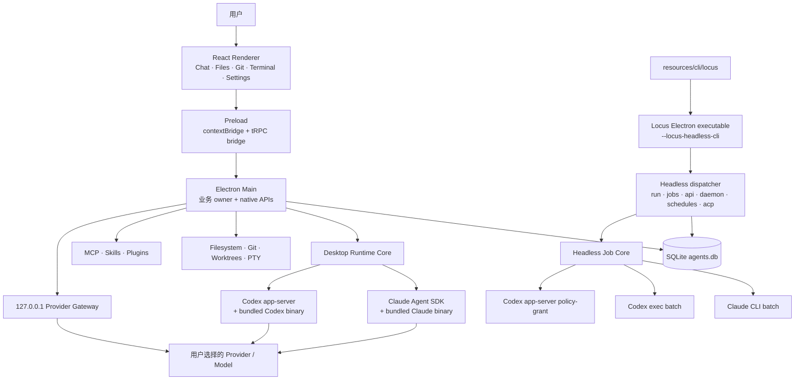
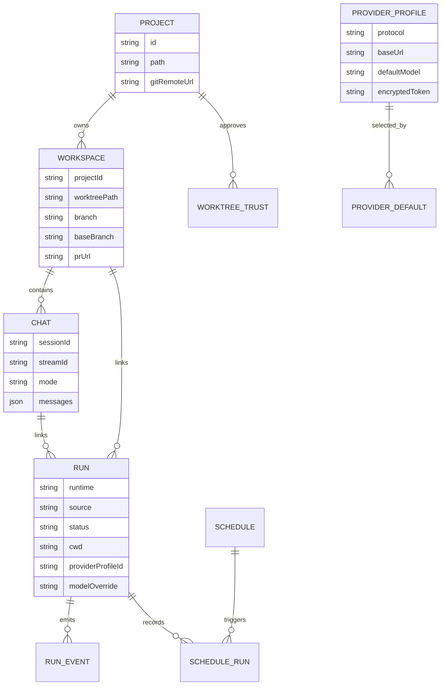
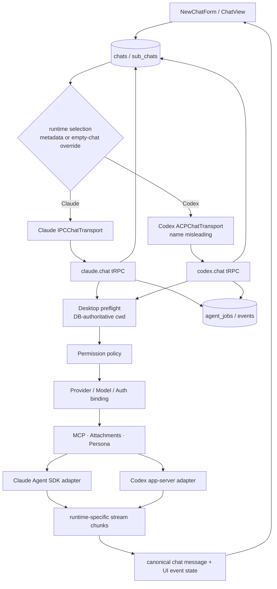
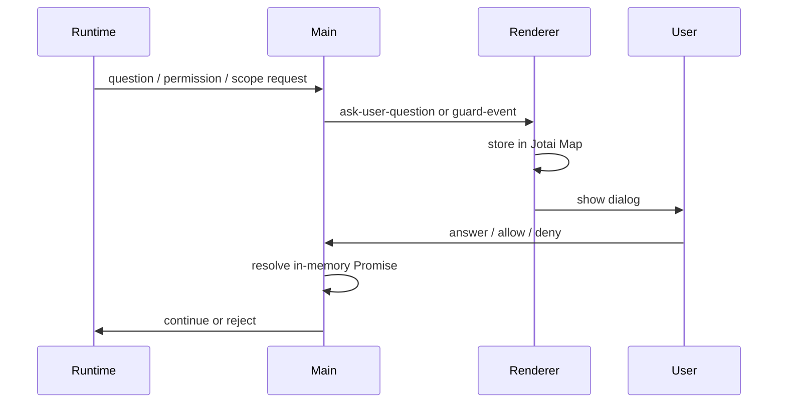
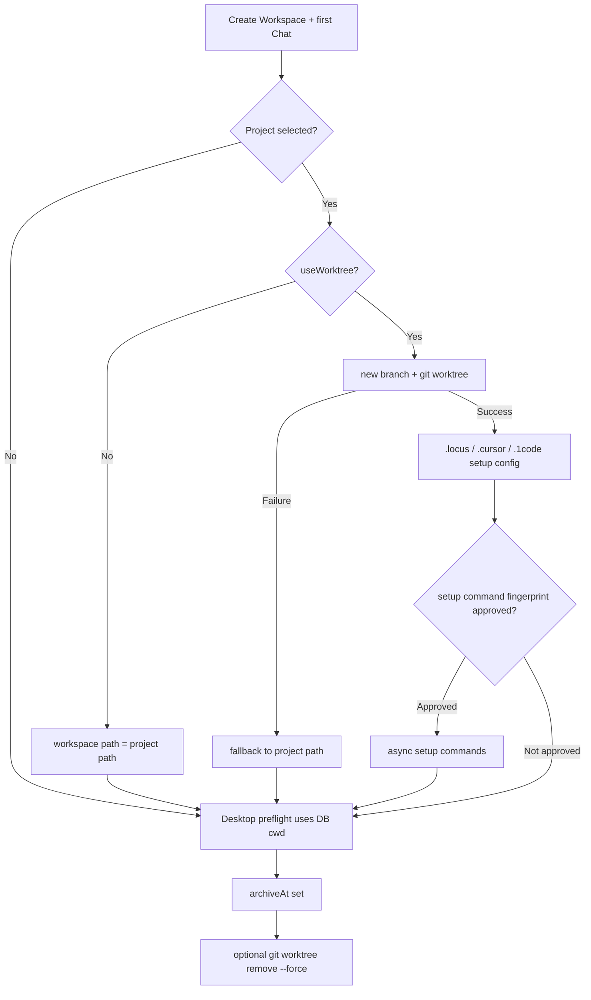
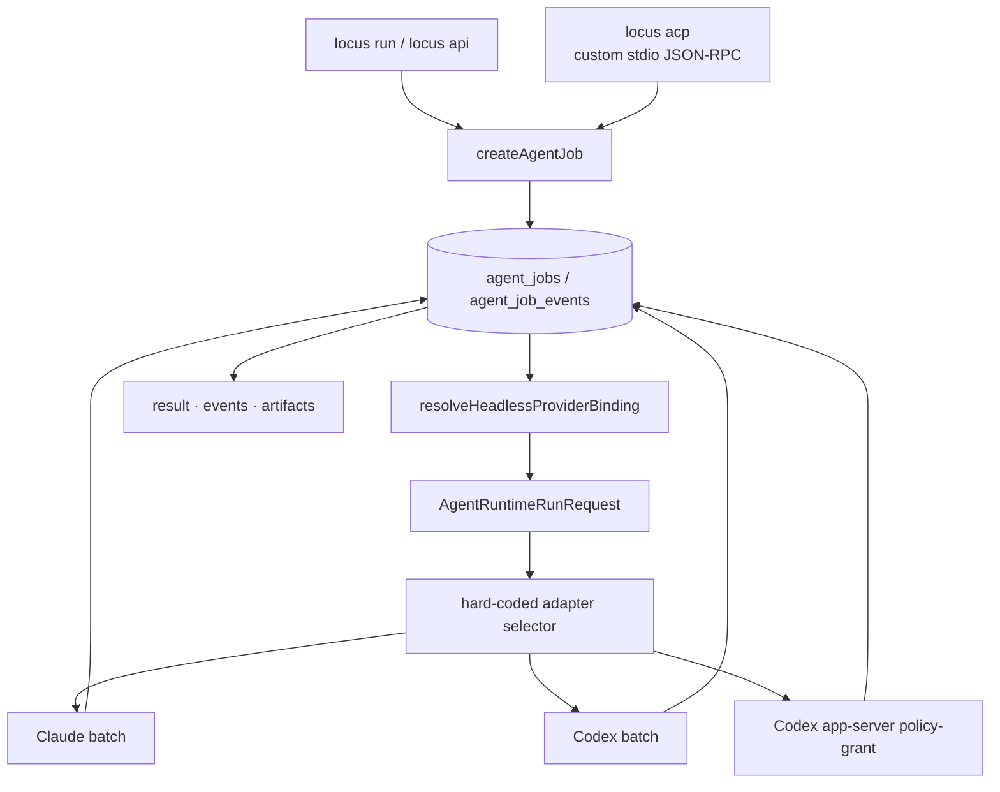
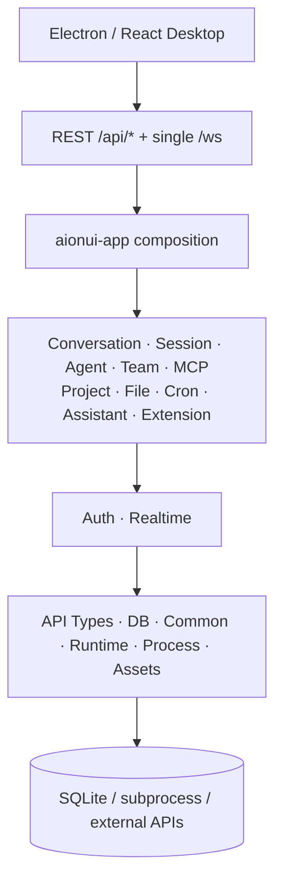

# Locus 战略重启与全架构 Handoff

状态：**供下一位 AI / 架构顾问继续深挖的事实底稿，不是已批准路线、OpenSpec 或实现承诺**

事实快照：2026-08-20（Pacific/Auckland）

仓库：`lupanpan1030/agent-code-for-me`，产品名 Locus

主要外部参照：AionUi / AionCore / aionrs、Agent Client Protocol、国产 Agent 与模型生态

---

## 0. 这份文档怎么用

这份 handoff 有三个目的：

1. 把 Locus 当前真实架构完整摊开，避免下一轮讨论继续把已经存在、只存在于 WIP、仍是提案和完全不存在的能力混在一起。
2. 把 AionUi 已经做到的部分、可以学习或复用的部分，以及不能照抄的边界讲清楚。
3. 让下一位 AI 在事实基础上提出真正大胆的方向，而不是再次把 Locus 收缩成测试、审阅、Doctor、兼容矩阵或 receipt 工具。

阅读事实时采用以下优先级：

```text
当前 checkout 的已提交源码
  > openspec/specs 中的 current truth
  > 当前工作树的未提交 WIP
  > openspec/changes 中的 proposal
  > ideas / strategy 文档中的愿景
```

本文会显式标注这几种状态。任何未来架构落地都必须另建或更新 OpenSpec，不能把本文直接当成实施授权。

---

## 1. 用户对方向的明确纠正

### 1.1 不再把这些当作 Locus 的产品中心

用户已经明确否定以下叙事：

- 测试完整性、mutation、negative probe 或 merge gate；
- Doctor、兼容性探测、验证矩阵、receipt 和 attestation；
- 多 worktree 冲突检测或“变更控制层”；
- 又一个 PR review / evidence 产品；
- 用保守的小市场 wedge 替代真正的产品想象；
- 为了商业化而把愿景压缩成一个勉强可卖的工具。

这些能力可以作为工程保障、调试工具或附加功能存在，但不能再回答“Locus 为什么存在”。

### 1.2 当前不可妥协的意图

- **Chat 必须是一等正式体验。** 它不是 smoke playground，也不是 API 的临时 Demo。
- **Locus 可以完全开源。** 当前不以付费、定价或商业护城河为目标函数。
- **中国 AI 必须是一等公民。** 包括国产模型 Provider，也包括 Qwen Code、Kimi Code、DeepSeek Harness 一类真正拥有 loop/session/tool 语义的 Agent。
- **应用只适配一次。** 第三方应用不应该分别维护 Claude Code、Codex、Qwen、Kimi 的全部接入逻辑。
- **用户应能有意识地选择或切换 Agent。** 不能只是在 UI 中换一个 model ID，也不能假装不同 Agent 共用同一个原生 session。
- **方向需要原创性和突破性。** “多接几个 Provider”“再做一个 Agent GUI”“再包一层 HTTP”都不够。

### 1.3 最重要的产品事实

仓库作者目前几乎不使用 Locus。作者真正日常使用的是原生 Codex 和 Claude Code，并且它们已经解决了 Locus 最初想解决的大量问题。

这不是情绪噪声，而是最重要的产品信号：

> 下一版 Locus 必须创造一个作者自己会主动打开、原生 Codex/Claude Code 单独使用时得不到的体验。

因此不能再用“仓库里已有很多功能”替代产品价值，也不能仅靠完成一份路线图证明方向成立。

---

## 2. 一页结论

今天的 Locus 不是空壳。它已经拥有：

- 一套完整的 Electron / React Desktop Chat；
- Claude Agent SDK 与 Codex app-server 的深度原生接入；
- Project、Workspace、Chat、worktree、Git、diff、terminal、PR 等本地 coding workspace 能力；
- Provider Profile、国产模型 endpoint、协议转换与本地 scoped gateway；
- MCP、Skills、Plugins、Locus Agent persona；
- 持久化 job、event、daemon、schedule、CLI JSON contract；
- main-process secret storage、local-only guard 和 runtime capability truth。

但它还没有一个统一的、可对外复用的“多 Agent 核心”：

- runtime 只有 Claude Code / Codex 两个硬编码成员；
- Desktop 与 Headless 各有相似但不同的执行生命周期；
- Provider、Model、Runtime、Persona 和 Session 的绑定分散在 DB、消息 metadata、renderer localStorage 与内存 Map 中；
- `locus api` 是 CLI/JSON 契约，不是 HTTP API 或 SDK；
- `locus acp` 是自定义 job JSON-RPC，不是标准 ACP session 实现；
- Agent Builder 目前只是 prompt persona，不是多 Agent 编排器；
- 没有跨 Agent 的 durable `SessionBinding`、`InteractionRequest` 或 handoff 模型。

AionUi 已经把“桌面 Chat + 30+ Provider + 多外部 Agent + MCP + Team + Office + Cron + WebUI/渠道”做得很宽。仅仅追赶这些功能没有原创价值。

下一轮真正值得挑战的问题是：

> **Locus 能否拥有一个跨 Agent 的连续工作空间？同一个人的目标、上下文、任务、附件、产物和交互历史由 Locus 持有，Claude、Codex、Qwen、Kimi 等只是可以被选择、组合或交接的执行引擎；同一核心还可被第三方应用通过稳定会话 API 使用。**

这比“统一模型配置”更深，也比“headless adapter”更接近原创产品。它仍只是候选命题，不是本文预设的答案。

---

## 3. 当前仓库快照与真实性边界

### 3.1 Git 状态

| 项目 | 快照 |
|---|---|
| 当前分支 | `codex/remove-experimental-runtimes` |
| 当前 HEAD | `a934efeff828f681b91724076ff53d6e0af78012` |
| 本地 `main` | `df72d425ea9c7e404a568a4c93c26f3792074ad0` |
| `origin/main` | `fb797b6a9bee4eae5c099280549a328ea3cdfd6f` |
| 相对 `origin/main` | 当前 HEAD 包含 `origin/main`，并领先 19 个提交 |
| 相对本地 `main` | 当前 HEAD 领先 8 个提交 |
| 当前 package | `locus@0.0.81`，`private: true` |

当前分支已提交的主要方向变化：

- 删除 Qwen 与 Kun 实验 runtime；
- 将 runtime 集合重新封闭为 Claude Code / Codex；
- 加入远程 model catalog 与 custom model pass-through；
- 起草 cross-workspace conflict proposal。

### 3.2 当前工作树很脏

当前有大量用户/并行工作留下的未提交修改，主要集中在：

- cross-workspace conflicts；
- `chats.baseCommit`；
- path/hunk/merge-tree 风险；
- Workbench conflict UI；
- Drizzle migration 与相关测试。

这些修改不属于当前 HEAD，不能写成已交付能力。尤其当前磁盘上的
[`schema/index.ts`](../src/main/lib/db/schema/index.ts) 已经出现未提交的 `baseCommit` 字段；HEAD 中的 `chats` 表还没有它。

### 3.3 活跃 OpenSpec

| Change | 本地任务状态 | 性质 |
|---|---:|---|
| `add-cross-workspace-conflicts` | 43/43，但仍 dirty、未 archive | 当前 WIP，不是稳定产品事实 |
| `add-headless-provider-binding` | 20/22 | 支撑能力 |
| `add-local-job-api-runtime-readiness` | 9/10 | 支撑能力 |
| `update-trpc-capability-boundary` | 25/33 | 架构债务清理 |
| `add-remote-model-catalog` | 20/20，未 archive | 当前分支已提交能力 |
| `add-agent-native-projection-writes` | 0/10 | deferred |
| `add-policy-grant-scope-enforcement` | 0/14 | deferred |

不要因为 checklist 已勾完，就把未 archive、未合并、未发布的 change 写成用户已拥有的功能。

---

## 4. 先统一 Locus 的名词

代码历史里最容易造成错误判断的，是 `Agent`、`Provider`、`Chat` 和 `Runtime` 的多重含义。

| 用户词 | 当前产品含义 | 当前代码对象 | 不能混同为 |
|---|---|---|---|
| Project | 用户选择的本地项目根目录 | `projects` | Workspace |
| Workspace | 一份工作目录/可选 worktree + branch | `chats` | Chat、Agent |
| Chat | Workspace 内的一次对话/session 容器 | `sub_chats` | Workspace |
| Quick chat | 不绑定 Project 的 Workspace/Chat 入口 | project-less `chats` | 云端聊天 |
| Runtime / Engine | 真正运行 Agent loop 的 harness | `claude-code`、`codex` | Provider、Model |
| Provider Profile | endpoint、协议、凭证、默认 model | `agent_provider_profiles` | Agent runtime |
| Model | Runtime/Provider 实际调用的模型 | model catalog / profile model | Agent |
| Locus Agent | prompt persona + tool guidance | `app_agents` | 独立 worker/runtime |
| Run | 一次持久化执行记录 | `agent_jobs` | Chat |
| Session | 当前只有原生 `sessionId` 与 transcript 的松散组合 | `sub_chats.sessionId` 等 | 已完成的跨 Agent session abstraction |

当前 [`AgentChatProvider`](../src/shared/agent-chat-provider.ts) 这个名字实际上表示 Claude Code / Codex runtime 选择，而不是模型 Provider。未来若重构，应先修正概念模型，避免继续扩大这个命名债务。

---

## 5. 仓库结构总览

```text
agent-code-for-me/
├── src/main/                         Electron main process
│   ├── index.ts                      Desktop / headless 双入口、应用生命周期
│   ├── windows/                      BrowserWindow、CSP、navigation、multi-window
│   └── lib/
│       ├── db/schema/                Drizzle SQLite schema source of truth
│       ├── trpc/routers/             renderer IPC API / 临时 runtime owners
│       ├── agent-runtime/            desktop preflight、policy、request、events
│       ├── claude/                   Claude SDK adapter 与会话辅助服务
│       ├── codex/                    Codex app-server、auth、provider binding
│       ├── headless/                 CLI jobs、daemon、schedule、batch adapters
│       ├── provider-profiles/        profile storage、presets、loopback gateway
│       ├── model-catalog/            remote/static model catalog
│       ├── runtime-mcp-config/       Claude/Codex MCP 配置 owner
│       ├── mcp-registry/             MCP 发现、安装、setup、verification state
│       ├── runtime-capability-projection/
│       ├── app-agents/               Locus persona 与 registry
│       ├── agent-builder/            persona/native/plugin 聚合 read model
│       ├── skills/                    skill registry/install/projection
│       ├── plugins/                   plugin marketplace/runtime activation
│       ├── git/                       repo、worktree、diff、watcher、GitHub
│       ├── agent-workbench/           Workspace / Run 聚合状态
│       └── terminal/voice/files/...   本地能力
├── src/preload/                       context-isolated Electron bridge
├── src/renderer/                      React 19 UI
│   ├── features/agents/               Chat、input、messages、diff、Workbench
│   ├── features/layout/               Desktop layout
│   ├── features/settings/             Settings IA
│   ├── features/sidebar/              Project/Workspace navigation
│   ├── features/terminal/             Terminal UI
│   └── lib/atoms + stores             Jotai/Zustand/React Query state
├── src/shared/                        main/renderer 共用 contracts 与 normalizers
├── resources/bin/                     bundled Claude/Codex binaries
├── resources/cli/                     `locus` / compatibility launcher
├── resources/skill-registry/          bundled skill registry manifest
├── drizzle/                           migrations
├── openspec/specs/                    current normative truth
├── openspec/changes/                  pending architecture/product changes
├── docs/                              strategy、consumer guide、ownership
└── tests/                              Bun tests与 architecture guards
```

技术栈：Electron 39、React 19、TypeScript、tRPC 11、Drizzle + better-sqlite3、Jotai、Zustand、React Query、Claude Agent SDK、bundled Claude Code / Codex、MCP SDK，以及一个旧版 ACP SDK 依赖。

---

## 6. 进程与部署拓扑



### 6.1 Desktop 和 headless 使用同一个应用二进制

[`src/main/index.ts`](../src/main/index.ts) 在 Electron ready 前识别 `--locus-headless-cli`：

- headless 分支不创建 BrowserWindow，也不走 desktop single-instance lock；
- 初始化同一份 SQLite；
- 执行 headless dispatcher；
- flush stdout/stderr 后退出 Electron process。

[`resources/cli/locus`](../resources/cli/locus) 只是 packaged executable 的 launcher，不是一个可独立安装的 Node SDK 或常驻 HTTP daemon。

### 6.2 Desktop transport

[`src/main/windows/main.ts`](../src/main/windows/main.ts) 创建 BrowserWindow、安装 CSP/navigation guard，并通过 `trpc-electron` 注册 main ↔ renderer 的类型化 IPC。

[`src/preload/index.ts`](../src/preload/index.ts) 保持相对薄，暴露：

- tRPC bridge；
- window / clipboard / notification / native dialog；
- chat ownership与多窗口；
- Git watcher、worktree setup events；
- MCP import preview；
- theme scanner。

业务规则原则上留在 main-process canonical owner，不应落到 preload 或 renderer。

---

## 7. Desktop UI 与状态架构

### 7.1 当前信息架构仍是 Chat-first

[`desktopViewAtom`](../src/renderer/features/agents/atoms/index.ts) 只有：

```ts
type DesktopView = "settings" | "workbench" | null
```

`null` 是默认 Chat 路径。[`AgentsContent`](../src/renderer/features/agents/ui/agents-content.tsx) 的实际分支为：

```text
Settings → SettingsContent
Workbench → AgentWorkbench
默认 → ChatView 或 NewChatForm
```

这意味着保留 Chat 不需要从零重建；它本来就是 Locus 当前最完整的产品表面。

### 7.2 UI 状态分成三类

| 状态类型 | 技术 | 例子 |
|---|---|---|
| Server/Main state | tRPC + React Query | projects、chats、provider profiles、MCP、jobs |
| UI atoms | Jotai / localStorage | 当前 workspace、model source、mode、sidebars、pending UI |
| Chat tab state | Zustand / localStorage | open/pinned/active SubChats、split/sidebar mode |

这种划分可用，但 runtime binding 也被放进 renderer state，导致业务真相分裂。

### 7.3 当前 UI 复杂度热点

- [`active-chat.tsx`](../src/renderer/features/agents/main/active-chat.tsx)：7,258 行；
- [`codex.ts`](../src/main/lib/trpc/routers/codex.ts)：1,300 行；
- [`plugins.ts`](../src/main/lib/trpc/routers/plugins.ts)：1,608 行。

Chat tab、transport、provider inference、queue、diff、notifications、plan、MCP 和 approval 仍高度耦合。未来不应在这些大文件中继续用 `if runtime === ...` 扩张 Agent 数量。

---

## 8. SQLite 数据模型

[`src/main/lib/db/schema/index.ts`](../src/main/lib/db/schema/index.ts) 是持久化 source of truth。
数据库由 main process 初始化在 `{userData}/data/agents.db`；当前启用 WAL、foreign keys 与
5 秒 `busy_timeout`，并在业务服务启动前执行 Drizzle migrations。Desktop 与 headless 共用这一份数据库。



### 8.1 表与职责

| 表 | 作用 | 关键限制 |
|---|---|---|
| `projects` | 本地路径、remote metadata、icon | 一个 path 唯一 |
| `chats` | 用户可见 Workspace、worktree/branch、PR | 名称与产品词不一致；HEAD 无 base commit |
| `sub_chats` | 用户可见 Chat、messages JSON、mode、native sessionId | runtime/provider/model 未作为正式 binding |
| `worktree_setup_trust_decisions` | setup command fingerprint approval | 只管 setup command |
| `mcp_command_trust_decisions` | MCP command fingerprint approval | 不是 live interaction store |
| `claude_code_credentials` | 旧单账户 token | deprecated compatibility |
| `anthropic_accounts/settings` | Claude 多账户与 active account | runtime-specific |
| `claude_provider_config` | 旧单一 Claude provider config | 与通用 profiles 并存 |
| `local_api_provider_configs` | title/commit/voice helper API | 独立 utility plane |
| `agent_provider_profiles/defaults` | 通用 endpoint、协议、secret、用途 default | target 仍围绕 Claude/Codex/helpers/local |
| `app_agents` | persona prompt 与 tool guidance | 不是 runtime worker |
| `agent_jobs/events` | Desktop/Headless run 与事件 | 与 Chat lifecycle 尚未统一 |
| `agent_schedules/runs` | interval schedule 与执行记录 | 本地 daemon 驱动 |

### 8.2 当前缺失的核心模型

如果未来目标真的是 Adapt / portability / continuous workspace，当前最关键的缺口不是再加表面 adapter，而是没有以下一等对象：

```text
Conversation
  └─ SessionBinding
       ├─ runtimeAdapterId
       ├─ providerProfileId
       ├─ modelId
       ├─ nativeSessionId
       ├─ capabilitySnapshot
       └─ sessionEpoch
            └─ Turn
                 └─ Run
                      └─ InteractionRequest
```

当前状态实际是：

```text
SubChat(messages JSON + one sessionId + one streamId)
  + renderer localStorage model/runtime selection
  + message metadata provider inference
  + main active-session Map
  + main pending-approval Map
  + separate agent_jobs rows
```

---

## 9. Desktop Chat 端到端运行流



### 9.1 选择与持久化

- 新建 Chat 时可选择 Claude Code / Codex、mode、model、provider profile、attachments。
- SubChat 没有 `runtimeId` 字段；已有消息时从 `message.metadata.provider` 推断，缺失时默认 Claude。
- 只有空 Chat 可在 renderer 内切换 runtime；有历史后不允许原地换。
- per-Chat Claude/Codex model source、model ID、thinking level 主要保存在 renderer localStorage atoms。
- 因此数据库不能直接回答“这个 Chat 当前绑定了哪个 runtime/provider/model/native session”。

### 9.2 Preflight 是现有最好的共享边界之一

[`preflight.ts`](../src/main/lib/agent-runtime/preflight.ts) 负责：

- 验证 Project / Workspace / Chat 归属；
- 以 `chat.worktreePath || project.path` 决定 authoritative cwd；
- 拒绝 renderer 伪造或漂移 cwd；
- 解析 provider、MCP、attachments 与 local-only context。

[`desktop-run-request.ts`](../src/main/lib/agent-runtime/desktop-run-request.ts) 已经能承载 run identity、context、provider binding、MCP、attachments、session、trace 和 cancellation。

这是未来统一 core 最值得保留的接口形状之一。

### 9.3 Claude path

临时 canonical owner 仍是 [`trpc/routers/claude.ts`](../src/main/lib/trpc/routers/claude.ts)，主要流程为：

1. 创建 stream/run envelope；
2. preflight、scope contract 与 permission policy；
3. 读取历史与 resume/fork 信息；
4. 解析 provider/model/auth；
5. 物化 MCP snapshot；
6. 通过 `@anthropic-ai/claude-agent-sdk` 执行；
7. 持久化消息、native session ID 与 desktop job。

Claude 的 renderer abort 主要依赖 unsubscribe → main cleanup，不像 Codex 那样有清晰的 runId-scoped cancel RPC。

### 9.4 Codex path

临时 canonical owner 是 [`trpc/routers/codex.ts`](../src/main/lib/trpc/routers/codex.ts)，它在一个大 router 中完成：

- active stream replacement；
- preflight/scope/permission；
- ChatGPT login、app-managed key 或 provider profile；
- model selection；
- user/assistant message persistence；
- MCP snapshot；
- desktop job；
- Codex app-server adapter；
- approval、cancel、cleanup。

[`acp-chat-transport.ts`](../src/renderer/features/agents/lib/acp-chat-transport.ts) 的名字容易误导：当前它是 `provider: "codex"` 的 Codex app-server tRPC transport，不是通用标准 ACP 多 Agent transport。

### 9.5 Interaction / approval 的真实状态



当前断点：

- pending interaction 不持久化；
- main crash、renderer reload 或 process restart 会丢失；
- question、command approval、file approval、scope expansion 等语义被压成相近 envelope；
- renderer live chunks 与 durable job events 使用两套 event vocabulary。

这使得“应用接一次并完整接管交互”目前还做不到。

---

## 10. Runtime、Agent、Provider 和 Model

### 10.1 Runtime truth

[`src/shared/agent-runtime-capabilities.ts`](../src/shared/agent-runtime-capabilities.ts) 是 canonical runtime truth：

```ts
CONTRACT_RUNTIME_IDS = ["claude-code", "codex"]
EXPERIMENTAL_RUNTIME_IDS = []
```

它定义 plan、guard、AskUser、rollback、MCP、attachments、usage、plugins、commands、workflows、App Agents 等 capability 状态。

但这个 registry 目前是静态 manifest，不是动态可安装的 external Agent registry。

### 10.2 两个 desktop adapter

| Runtime | Desktop | Headless | 重要差异 |
|---|---|---|---|
| Claude Code | Claude Agent SDK + bundled Claude binary | Claude CLI batch | 交互与 batch 生命周期不同 |
| Codex | Codex app-server | `codex exec`，另有 app-server policy-grant wrapper | desktop 与 headless wrapper 不同 |

[`desktop-runner.ts`](../src/main/lib/agent-runtime/desktop-runner.ts) 已有按 runtime/source 注册 adapter 的 factory 形状，但主要 orchestration 仍在 Claude/Codex router 内，尚未形成真正可由第三方扩展的中心 registry。

### 10.3 Provider Profile

当前共有 14 个 preset，包括：

- 中国：DeepSeek、Qwen/DashScope、Kimi/Moonshot、Zhipu/GLM、SiliconFlow、Volcengine Ark、Baidu Qianfan、Tencent Hunyuan；
- 通用：OpenAI-compatible、Anthropic-compatible、LiteLLM；
- 本地：Ollama、LM Studio、vLLM/LocalAI。

参见 [`provider-profiles/presets.ts`](../src/main/lib/provider-profiles/presets.ts)。

Profile 支持：

- `anthropic` / `openai-chat` / `openai-responses`；
- bearer / x-api-key / none；
- custom headers；
- default model；
- encrypted token；
- Claude / Codex / helpers / local target；
- streaming/tools/vision 等能力声明。

### 10.4 Scoped local gateway

[`provider-profiles/gateway.ts`](../src/main/lib/provider-profiles/gateway.ts) 在 `127.0.0.1` 建立短期 scoped gateway：

- 将 Claude 的 Anthropic Messages 请求转换到 OpenAI Chat/Responses；
- 将 Codex Responses 请求转换到目标 Provider；
- 用短期 token 避免把真实 Provider secret 直接传入 renderer；
- run 完成后可撤销 binding。

这已经是接国产 model endpoint 的真实基础。

但必须明确：

```text
Claude Code loop + DeepSeek model endpoint
  ≠ DeepSeek Harness

Codex loop + Qwen model endpoint
  ≠ Qwen Code Agent
```

Provider / Model compatibility 不能替代 Agent / harness integration。

### 10.5 当前 route binding 的 split-brain

- renderer 会做 runtime、model source、profile 与 auth fallback 选择；
- main 会再次解析和校验；
- headless 又有独立的 `resolveHeadlessProviderBinding`；
- binding 没有作为 Session 的持久对象冻结。

如果未来做统一 core，需要一个明确 owner，例如：

```ts
type SessionBinding = {
  personaId?: string;
  runtimeAdapterId: string;
  providerProfileId?: string;
  modelId: string;
  authRef: string;
  nativeSessionId?: string;
  capabilitySnapshot: object;
  sessionEpoch: number;
};
```

Renderer 只能表达选择意图，不能拥有 secret resolution 和 fallback truth。

---

## 11. Persona、MCP、Skills 与 Plugins

### 11.1 Locus Agent 其实是 Persona

[`app-agents/prompt.ts`](../src/main/lib/app-agents/prompt.ts) 的行为是：

1. 从 prompt 解析 `@[agent:name]`；
2. 从 DB 读取 persona；
3. 把 description、prompt、tools guidance prepend 到用户 prompt。

`tools` / `disallowedTools` 当前主要转成“prefer / avoid”的自然语言，而不是 hard capability enforcement。

[`agent-builder/read-model.ts`](../src/main/lib/agent-builder/read-model.ts) 也明确把 Locus Agent 对 Claude/Codex 的使用标为 `prompt-only`。

所以更诚实的名字是：

> Persona Library / Prompt Agent Profiles

它不是 Multi-Agent Orchestrator。

### 11.2 Agent Builder

Agent Builder 聚合：

- Locus-owned persona；
- Claude native discovered agents；
- plugin-provided agents；
- 尚未实现的 Codex native agent surface。

它保留 source、owner、mutability、projection mode 和 runtime status，这是好的 read model，但它没有 lead/worker delegation 或跨 engine mailbox。

### 11.3 MCP

[`runtime-mcp-config/`](../src/main/lib/runtime-mcp-config) 是 durable owner，分别处理 Claude 与 Codex 的：

- list / read / write；
- OAuth / auth state；
- add/update/remove；
- startup/session snapshot；
- command fingerprint trust。

[`mcp-registry/`](../src/main/lib/mcp-registry) 负责发现、安装预览、setup、secrets、verification state。

断点是 Claude/Codex 原生格式仍不同，live elicitation/interaction 没有统一 durable owner。

### 11.4 Skills 与 capability projection

[`runtime-capability-projection/service.ts`](../src/main/lib/runtime-capability-projection/service.ts) 已经提供 `kind + runtimeId` → projection adapter 的真实扩展 seam。

Skills registry 支持安装、更新、回滚，并投影到 runtime home。这个抽象可以保留，但当前实现仍和 Electron、文件系统路径、Claude/Codex home 紧密耦合。

### 11.5 Plugins

Plugin 子系统已经包含：

- store pin；
- marketplace action；
- developer loader / trust；
- review scan；
- safe mode；
- runtime-native activation；
- controlled UI state。

它是一个非常宽的功能面。下一轮架构不应把 Plugin Center 继续扩张当作主路线；应只保留新核心真正需要的 extension manifest / adapter seam。

---

## 12. Project、Workspace、worktree 与 Git



### 12.1 创建与 fallback

- Chat/Workspace 和初始 SubChat 先落 DB，再解析 worktree；
- `useWorktree=false` 直接使用 project path；
- worktree 创建失败也会 fallback 到 project path；
- HEAD 仍把新 worktree 放在 legacy `~/.21st/worktrees/...`；
- 新 setup config 写 `.locus/worktree.json`，但仍读取 `.cursor` / `.1code` 兼容配置。

### 12.2 Setup trust

[`worktree-setup-trust.ts`](../src/main/lib/git/worktree-setup-trust.ts) 对 project/config/commands/platform 做 fingerprint，只有明确批准后才运行 repo-provided setup commands。

这是 Locus 现有架构中一个清晰、可保留的安全边界。

### 12.3 Git 产品面

当前已存在：

- repo status/diff、unified/split diff；
- stage/unstage/revert；
- branch/worktree；
- terminal；
- GitHub workflow context、PR 创建/状态相关 surface；
- file watcher 与 unseen changes；
- Workspace/Run 聚合 Workbench。

### 12.4 生命周期断点

- setup 是异步的，Workspace 创建成功不代表依赖 setup 已完成；
- archive 先写 `archivedAt`，worktree deletion 可后台执行；
- restore 不一定重建已删除 worktree；
- permanent delete 即使 cleanup 失败也可继续删 DB row；
- `git worktree remove --force` 不删除生成 branch；
-准确 base commit 仍只是 dirty WIP。

因此 Git/worktree 是 Locus 相对 AionUi 的现成强项，但还不能被描述成完整 durable workspace engine。

---

## 13. Headless、Local Job API、daemon 与 schedule



### 13.1 已有能力

- durable job states；
- monotonic job events；
- cancel / retry；
- heartbeat / stale recovery；
- queue daemon 与 process lock；
- local interval schedules；
- provider profile/model binding；
- artifact path/result envelope；
- agent 与 completion 两类 job。

这些是有价值的内部基础设施，不需要删除。

### 13.2 `Local Job API` 的真实含义

当前不是 HTTP server。

`locus api` 是 machine-readable CLI group：

```text
locus api runtimes list --json
locus api runs create --request ... --json
locus api runs status ... --json
locus api runs events ... --jsonl
locus api runs result ... --json
locus api runs cancel ... --json
locus api runs retry ... --json
```

`runs create` 读取文件/stdin，并在该命令生命周期中执行 job 后输出 JSON。其他操作也是 CLI 子命令。

所以当前最准确的话是：

> Locus 有持久化 Headless Job core 与 CLI/JSON contract；它还没有第三方应用可长期连接的 HTTP/SSE server、正式 SDK 或交互式 session API。

### 13.3 `locus acp` 的真实含义

[`headless/acp-stdio.ts`](../src/main/lib/headless/acp-stdio.ts) 定义的是自有协议：

```text
protocol: locus-acp-stdio.v1
methods: initialize / job.run / job.cancel / shutdown
```

它不是标准 ACP 的 `session/new`、`session/prompt`、permission、load/resume 等完整语义。

仓库依赖 `@agentclientprotocol/sdk@0.4.9` 也不等于产品已经实现 ACP v1。官方 ACP 当前已经是 v1 latest、v2 draft；未来若采用，应消费官方协议，而不是给私有 job protocol 改名。

### 13.4 Desktop / Headless 尚未真正统一

两边都有 request、provider、permission、adapter、events，但：

- Desktop Claude = Agent SDK，Headless Claude = CLI batch；
- Desktop Codex = app-server，Headless 通常 = `codex exec`；
- Desktop 可 interactive AskUser，Headless interactive profile 会拒绝；
- event vocabulary 不同；
- lifecycle owner 不同。

这也是“应用只适配一次”当前无法兑现的核心原因。

---

## 14. 安全、本地优先与网络边界

### 14.1 当前正面边界

- Provider secret 由 main process owner 读取与解密；renderer 只拿 metadata、ID、status、`hasToken` 和 redacted header。
- Electron 使用 context isolation、preload bridge、CSP 与 navigation guard。
- Desktop preflight 以 DB 决定 cwd，不信任 renderer 的 raw path。
- MCP/setup command 有 fingerprint-bound trust。
- Runtime/job events 有 redaction owner。
- local-only mode 默认阻断 dormant hosted compatibility path。

### 14.2 不能夸大的边界

- Locus 不是 OS sandbox；
- `BrowserWindow` 当前虽然启用 `contextIsolation`、关闭 `nodeIntegration` 并保留 `webSecurity`，但
  `sandbox` 为 `false`、`webviewTag` 为 `true`；这是可信本地桌面应用边界，不是隔离执行环境；
- 当前 tRPC procedures 是面向可信 renderer 的 public procedures，context 主要提供 window getter；
  preload 暴露面也不只 tRPC。因此现有 IPC 不能原样对外宣称为第三方 public API；
- Runtime、terminal、MCP、Git 和 filesystem tools 可影响本机；
- local-first 不等于 offline；用户选中的 Provider、GitHub、MCP、voice 服务仍会收到相关数据；
- pending approval 目前主要在内存；
- provider gateway 是协议转换/secret boundary，不是安全隔离容器；
- public installers 的签名、notarization 和 Windows real-machine acceptance 不能仅从 source build 推断。

---

## 15. Build、资源与发布

[`package.json`](../package.json) 当前定义：

- Electron-vite build；
- electron-builder macOS / Windows / Linux packaging；
- bundled Claude `2.1.177`；
- bundled Codex `0.139.0`；
- Drizzle migrations；
- bundled CLI 与 skill registry；
- better-sqlite3、node-pty、Claude SDK ASAR unpack；
- macOS hardened runtime。

当前 README 也明确承认：

- 没有完整 macOS notarization step；
- unsigned/ad-hoc internal builds 不等于 broad public installer readiness；
- Windows source/shim tests 不等于 packaged Windows real-machine acceptance。

项目许可证为 Apache-2.0；它是 21st-dev/1code 的 fork，仍有若干 `1code`、`.21st`、旧 app data path 和 compatibility CLI residue。

---

## 16. Canonical ownership map

未来做架构变化前必须读 [`docs/OWNERSHIP_MAP.md`](OWNERSHIP_MAP.md)。当前主要 owner 如下：

| 能力 | Canonical owner | 当前状态 |
|---|---|---|
| Runtime/capability truth | `src/shared/agent-runtime-capabilities.ts` | 硬编码 Claude/Codex |
| Chat message model | `src/shared/chat-message.ts` | 可复用 shared contract |
| Message hydration | `src/shared/chat-message-normalizer.ts` | transcript read boundary |
| Desktop preflight | `src/main/lib/agent-runtime/preflight.ts` | DB-authoritative context |
| Desktop request | `desktop-run-request.ts` | 好的统一形状 |
| Desktop adapter factory | `desktop-runner.ts` | 形状存在，中心 registry 未完成 |
| Runtime permission | `permission-policy.ts` | 共享 policy，native mapping 分散 |
| Claude desktop temporary owner | `trpc/routers/claude.ts` | 仍是 route-level owner |
| Codex desktop temporary owner | `trpc/routers/codex.ts` | 仍是大 route-level owner |
| Renderer live interaction state | `runtime-event-state.ts` | 内存/Jotai，不 durable |
| Runtime events/redaction | `runtime-events.ts` / `redaction.ts` | 与 Chat chunks 尚未合一 |
| Provider secret/storage | `provider-profiles/storage.ts` | main-only |
| Provider protocol gateway | `provider-profiles/gateway.ts` | 成熟复用点 |
| Headless binding | `headless/provider-binding.ts` | 目前较完整的 route binding |
| Headless runtime | `headless/agent-runtime.ts` | batch semantics only |
| Headless selector | `headless/adapter-selector.ts` | hard-coded adapters |
| Persona | `app-agents/` | prompt-only |
| Agent Builder | `agent-builder/` | aggregation/projection only |
| MCP | `runtime-mcp-config/` | Claude/Codex native implementations |
| Capability projection | `runtime-capability-projection/` | 可扩展 adapter seam |
| Worktree setup trust | `git/worktree-setup-trust.ts` | 清晰且可复用 |

架构规则：transport 只能解析 envelope；durable business rules 必须进入 owner。任何新 core 不能与旧路径长期双写/双跑，除非有明确 migration gate、删除日期和 guard。

---

## 17. 当前能力状态总表

| 能力 | 当前状态 | 备注 |
|---|---|---|
| Desktop Chat | 已实现 | 默认/一等 UI |
| Claude Code Chat | 已实现 | Agent SDK，deep native integration |
| Codex Chat | 已实现 | app-server integration |
| Project/Workspace/Chat | 已实现 | 代码/产品名仍有历史差异 |
| worktree/Git/diff/terminal | 已实现 | lifecycle 仍有断点 |
| Provider Profiles | 已实现 | 14 presets，国产 Provider 已有基础 |
| Provider protocol gateway | 已实现 | Claude/Codex route translation |
| Remote model catalog | 当前分支已提交 | 尚不能等同 released main |
| Locus Agent persona | 已实现 | prompt-only |
| Agent Builder | 已实现 read model | 不是 orchestrator |
| MCP settings/registry | 已实现 | runtime-native差异仍存在 |
| Skills/plugins | 已实现较宽功能面 | 不应继续作为主线扩张 |
| Durable jobs/events | 已实现 | internal infrastructure |
| daemon/schedules | 已实现 local version | 非 hosted/OS service |
| Local Job API | CLI/JSON contract | 不是 HTTP/SDK |
| `locus acp` | experimental custom stdio | 不是标准 ACP |
| Qwen/Kimi/DeepSeek Agent runtime | 当前 checkout 未实现 | Provider preset 不等于 Agent |
| Dynamic external Agent registry | 未实现 | runtime IDs 静态 |
| Unified interactive session API | 未实现 | Desktop/Headless 分裂 |
| Cross-Agent handoff | 未实现 | 值得探索的原创层 |
| Durable InteractionRequest | 未实现 | 当前 pending state 在内存 |
| Built-in provider-neutral Locus Agent | 未实现 | 可评估复用 aionrs |
| HTTP/SSE/WS local core | 未实现 | 不能把 tRPC IPC 当公开 API |
| SDK/package for app integration | 未实现 | package 仍 private |
| Cross-workspace conflict engine | dirty WIP | 不能写成稳定已交付 |

---

## 18. 最重要的架构矛盾与债务

### 18.1 产品中心反复移动

近期文档和分支先后把中心放在：

```text
local AI workbench
→ safe parallel coding / cross-workspace conflict
→ Local Job API / runtime hub
→ China-first Adapt / Doctor / receipt
```

大量底层能力因而存在，但没有一个稳定的顶层产品对象。下一轮必须先回答“Locus 究竟拥有哪一层”，不能再从 feature list 反推定位。

### 18.2 Session binding 不存在

runtime、provider、model、auth、native session、capabilities 分散在多个位置。没有这个对象，就没有真正的 portability，也无法让 Chat 与 API 对同一个 session 说真话。

### 18.3 Interaction 不持久

question、permission、auth、scope expansion 目前无法在断线/重启后恢复。对第三方应用而言，这意味着无法可靠接管 human-in-the-loop。

### 18.4 Desktop 与 Headless 双核心

两边外形相似但 lifecycle 不同。继续为 Qwen/Kimi 添加专属 renderer transport 与 batch adapter，会把组合复杂度再次推高。

### 18.5 Provider routing split-brain

renderer、desktop main 和 headless 各自参与 route resolution。没有一次性冻结的 session binding，也没有一种确定的 fallback truth。

### 18.6 两套 event vocabulary

renderer chunks 与 durable job events 不同，无法自然成为公共 SDK 的稳定 stream。

### 18.7 Agent Builder 名称超过能力

Persona 被叫作 Agent，aggregation UI 被叫作 Builder，容易制造“已有多 Agent 编排”的错觉。

### 18.8 Public API 仍只是接口形状

Desktop adapter factory、Headless selector、Local Job API、`locus acp` 都有不错的形状，但都还不是稳定、第三方可注册、可持续维护的 Agent platform contract。

---

## 19. AionUi：当前最重要的对照项目

本节基于 2026-08-20 的官方源码快照：

- [AionUi `fec0492`](https://github.com/iOfficeAI/AionUi/commit/fec04921bcdfa20b7e965a5610de2c3ed004b1b1)，package `2.1.59`；
- [AionCore `e6e91cc`](https://github.com/iOfficeAI/AionCore/commit/e6e91ccc94419a2c63d933a5299ec4dcc604590e)，workspace `0.1.70`；
- 用户指定的 [AionUi 大模型配置中文页](https://github.com/iOfficeAI/AionUi/wiki/LLM-Configuration-Chinese)。

### 19.1 AionUi 已经做到了什么

AionUi 当前是一个宽广的开源 Cowork 产品：

- Electron / React Desktop Chat；
- 内置 provider-neutral `aionrs` Agent；
- Claude Code、Codex、Qwen Code、Kimi、OpenCode、Gemini 等大量外部 Agent；
- 28+/30+ 模型 Provider 配置；
- MCP、Assistant、Skills、Extension；
- Team leader/teammate、mailbox、task board；
- Office 文件与 preview；
- Cron；
- WebUI 与 Telegram/Lark/DingTalk/WeChat 等渠道；
- Rust AionCore local backend。

仅仅做“Locus 也能配置 DashScope、Moonshot、DeepSeek”，没有差异化。

### 19.2 AionUi 的真实概念模型

| 概念 | AionUi 含义 | 边界 |
|---|---|---|
| Provider | API key、Base URL、协议、模型目录 | 主要服务内置 aionrs |
| Model | Provider 下具体模型与 per-model protocol | 不是 Agent |
| Backend Agent | aionrs、Claude、Codex、Qwen、Kimi 等执行引擎 | 外部 Agent 保留自己的 auth/model/tools |
| Assistant | Rules、Skills、头像、名称组合 | 不自动赋予 runtime 能力 |
| Conversation | 持久会话，绑定一个 Agent、目录和选择 | 并行靠多个 conversation |

官方中文配置页明确写：每个 Agent 都有自己独立的可用模型列表，并按会话记住选择。

AionUi 源码里的 model mapper 进一步区分：

```text
内置 aionrs Agent
  → AionUi Provider / Model

外部 Claude/Codex/Qwen/Kimi Agent
  → ACP/compat adapter
  → Agent 自己的模型与认证
```

所以 AionUi 也没有让所有 Agent 无损共享同一套 Provider/Model 路由。

### 19.3 AionCore 技术架构



[AionCore 架构文档](https://github.com/iOfficeAI/AionCore/blob/main/ARCHITECTURE.zh-CN.md) 当前列出 24 个 Rust crate，采用：

- composition → domain → capability → foundation；
- 单一 `aionui-api-types` public contract；
- thin HTTP handler → service → repository；
- 单 `/ws` event bus；
- dependency injection；
- canonical session event 与 capability negotiation。

这是 Locus 最值得学习的工程部分。

### 19.4 AionUi 仍在过渡

- Electron legacy SQLite 与 AionCore 新 backend 仍有迁移双路径；
- 零 Electron `@aionui/web-host` 当前仍标 skeleton；
- extension 示例和 runtime 存在，但公开 schema/SDK 仍在形成；
- Provider secret 虽加密落盘，当前 AionCore `ProviderResponse` 仍会在 API 上返回解密后的完整 key，这个边界不应复制；
- Team Mode 的 agents 共享同一 folder，不是 worktree-isolated integration engine。

所以不能简单地把 AionCore 当作已经稳定的通用 SDK 直接替换 Locus。

---

## 20. Locus 与 AionUi 的逐层对比

| 层 | Locus | AionUi | 客观结论 |
|---|---|---|---|
| 产品形态 | coding-first local workbench | broad Cowork platform | AionUi 更宽；Locus 可更专注 |
| Chat | 深 Claude/Codex Chat | 多 Agent 统一 Chat shell | 两者都有一等 Chat |
| Built-in Agent | 无 | embedded aionrs | Locus 当前依赖外部 harness |
| External Agent | Claude/Codex 硬编码 | dozens ACP/compat agents | AionUi 明显领先 |
| 中国 Provider | 8 个主要 preset | 30+ 总平台、多 key | 数量不是 Locus 差异 |
| 中国 Agent | 当前无 | Qwen/Kimi/CodeBuddy/MiMo 等 | AionUi 已覆盖 |
| Provider routing | scoped gateway 改写 Claude/Codex route | 主要驱动 built-in aionrs | 两者抽象不同 |
| Session | SubChat + native sessionId + scattered state | unified session crate，conversation binds agent | AionCore 更接近公共 core |
| Public API | CLI/JSON job contract | Rust REST/WS backend | AionCore 更领先 |
| Worktree/Git | Project/Workspace/worktree/diff/PR 较深 | file/project/Git，但 Team 共用 folder | Locus 的现有相对强项 |
| MCP/Skills/Plugins | 很宽且 runtime-specific | 很宽且 manifest-driven | 都不是自然差异化 |
| Team orchestration | 无真正 worker/team | Leader/teammate/mailbox/task board | AionUi 已有 |
| Cross-Agent handoff | 无 | 会话绑定单 Agent，未形成通用 portable handoff | 可能的探索空间 |
| App embedding | 无稳定 SDK/session API | backend 存在，但第三方 platform SDK仍形成中 | 可能的探索空间 |
| Secret boundary | renderer 不拿 plaintext profile secret | migration API 返回 plaintext key | Locus 当前边界更严格 |

---

## 21. 可以学习、复用或上游合作的现成方案

### 21.1 强烈建议直接消费

| 方案 | 能解决什么 | Locus 不要重做什么 |
|---|---|---|
| [Agent Client Protocol](https://agentclientprotocol.com/get-started/introduction) | editor/client 与 coding Agent 的 session/prompt/tool/permission 标准 | 不自创另一套通用 Agent protocol |
| [ACP Registry](https://github.com/agentclientprotocol/registry) | Agent metadata、distribution、auth handshake registry | 不自建重复的 Agent catalog |
| 官方 Qwen/Kimi ACP | 国产 Agent 原生接入 | 不恢复专属 renderer transport |

ACP 当前 v1 是 latest，v2 仍为 draft。Locus 若采用，应让协议版本与自有 public contract 隔离，避免上游变化直接污染核心 domain model。

### 21.2 值得评估复用

| 方案 | 可复用点 | 风险/边界 |
|---|---|---|
| [aionrs](https://github.com/iOfficeAI/aionrs) | provider-neutral built-in Agent loop、tools、MCP、session、subagents、skills | 若直接采用，必须回答 Locus 与 AionUi 的差异 |
| [AionCore](https://github.com/iOfficeAI/AionCore) | REST/WS backend、canonical session reducer、capabilities、repository/service 分层 | 正在快速迁移；root Apache license 与 Cargo workspace `MIT` metadata 不一致，vendoring 前需澄清 |
| [acpx](https://github.com/openclaw/acpx) | headless ACP client、stateful session、queue/cancel | alpha；可放在 owned interface 后，不应成为公共类型 |
| [Rivet Sandbox Agent](https://github.com/rivet-dev/sandbox-agent) | Rust daemon、HTTP/SSE、TS SDK、多 coding agents、Inspector | 更偏 sandbox executor；不要重复其 control plane |
| [OpenCode Server/SDK](https://opencode.ai/docs/server/) | session、SSE、permissions、provider、OpenAPI | 可作 external Agent 或实现参照，不应吞进 core |
| [AWS sample-acp-bridge](https://github.com/aws-samples/sample-acp-bridge) | ACP → HTTP/SSE、async job、process pool 示例 | sample 质量与权限默认值不宜直接生产采用 |

### 21.3 中国 Agent 的建议身份

| 对象 | 应被视为 | 集成原则 |
|---|---|---|
| Qwen Code | Agent/harness | 原生 ACP，Agent 自己拥有 auth/session/tool behavior |
| Kimi Code | Agent/harness | 原生 ACP 或官方 API，保留 native session |
| DeepSeek Harness | Agent/harness，Developer Preview | experimental、版本锁定、避免依赖内部 API |
| DeepSeek API | Provider/model | 可经 Provider Profile/gateway |
| GLM、MiniMax、Doubao、SiliconFlow 等 API | Provider/model | 不伪装成独立 Agent |

### 21.4 可以从 AionUi 学习

1. `Provider → Model` 与 `Agent → Assistant → Conversation` 的概念分层。
2. 一个 native session 明确绑定一个 Agent。
3. PATH 自动发现 + custom command/args。
4. canonical event + reducer + capability negotiation。
5. REST/WS core 与 Desktop Chat 分离。
6. manifest-driven Agent / Skill / MCP / extension。
7. Chat UI 根据 capability 隐藏或降级，而不是假装 parity。

### 21.5 不应照搬

- 再造 Office、Cron、渠道、Team 等全套 broad Cowork 功能；
- 把 Provider 数量当核心价值；
- 把外部 Agent 与 built-in Agent 的 model plane 对用户描述成完全统一；
- 返回 plaintext secret 给 renderer/client；
- 直接复制 AionUi 巨大 Electron surface；
- 把 AionUi 的品牌、图标或商标视为 Apache 授权的一部分。

AionUi、AionCore、aionrs 的仓库根许可证均显示 Apache-2.0；但实际复制前仍需核对每个 crate/package、资产、依赖和当前 metadata，并保留 NOTICE/版权、标记修改。

---

## 22. 为什么上一份 Locus Adapt 文档已被否定

[`locus-adapt-open-source-direction.zh-CN.md`](locus-adapt-open-source-direction.zh-CN.md) 的历史价值是：

- 明确区分 Agent / Provider / Model；
- 保住了 Chat-first；
- 识别了 ACP、现成 bridge 与中国生态；
- 指出了 Desktop/Headless 不应双写业务逻辑。

但它把 Locus 的意义放在：

```text
Doctor + route verification + compatibility status + receipt
```

用户现在明确否定这个产品中心。原因并不是“工程可靠性不重要”，而是：

> 这些只能证明接入是否正常，不能创造一个用户真正想要的新产品体验。

因此上一份文档只应保留为 2026-08-15 的调研快照，不再代表未来产品 thesis。

仍可保留的底层原则：

- Agent / Provider / Model 分离；
- Chat 一等；
- Desktop 与 public API 共用 business core；
- 不伪造跨 Agent native session；
- secrets 留在 main/core。

---

## 23. 真正值得下一位 AI 挑战的原创命题

以下不是路线决定，而是要求下一位 AI 深入推演的战略空间。不要再提前用“小市场不确定”把它们裁掉。

### 命题 A：Agent Runtime Portability Layer

核心不是“统一 execute()”，而是统一完整交互会话：

```text
Application / Desktop Chat
  → Conversation API
  → SessionBinding
  → Runtime Adapter
  → Native Agent session
```

公共层需要表达：

- create/load/resume session；
- prompt / stream；
- content blocks 与 attachments；
- plan、tool progress、diff；
- question、permission、auth、scope request；
- cancel；
- native capabilities；
- explicit handoff。

真正的原创点不是 adapter，而是：

> 应用接一次之后，仍能保留不同 Agent 的真实语义，而不是退化成最低公共文本接口。

### 命题 B：跨 Agent 的连续认知工作空间

Locus 不把 Chat 绑定成某个 vendor 的 transcript，而是拥有更高一层的长期工作对象：

```text
Locus Workspace
  ├─ Goal / plan / decisions
  ├─ Conversations
  ├─ Tasks and dependencies
  ├─ Files / artifacts / Git state
  ├─ Memory / rules / skills
  └─ Native Agent sessions
       ├─ Qwen exploration session
       ├─ Codex implementation session
       └─ Claude reasoning session
```

用户面对的是一个连续的 Locus conversation；每一次 turn 可由不同 Agent 执行，但不会伪造 native session continuation。

这个方向使国产模型不只是“便宜替代品”，而能成为一等角色：

- Qwen/Kimi 做大范围探索、中文资料、重复性执行；
- Codex 做深度代码修改；
- Claude 做复杂推理或长文；
- 用户可以指定，也可以让上层策略建议；
- 所有交接都通过显式 context/handoff，而不是偷偷换模型。

这可能是比 AionUi 的“多个独立 conversation”更深的一层。

### 命题 C：显式 `HandoffEnvelope`

跨 Agent 切换不能写成：

```text
把 native sessionId 从 Claude 填给 Codex
```

而应成为产品可见、可编辑的语义交接：

```text
Source native session
  → messages + workspace + attachments + rules
  → current goal + decisions + open questions + task state
  → changed files / artifacts
  → HandoffEnvelope
  → target Agent starts a new native session
```

用户可以看到“交给下一个 Agent 的是什么”，删除不想传递的内容，或补充要求。

这既是 API primitive，也是 Chat 中可感知的独特体验。

### 命题 D：内置 Locus Agent + 外部 specialist Agents

另一条更激进的路是让 Locus 拥有自己的默认 Agent loop：

```text
Locus native Agent
  → user-selected Chinese/global Provider
  → owns general conversation, memory and tools
  → calls Claude/Codex/Qwen/Kimi as specialist agents
```

可评估嵌入 aionrs，而不是从零写 loop。

优点：

- Locus 真正拥有 session 和连续上下文；
- 任意兼容 API key 都能先进入一个完整 Agent；
- 外部 vendor Agent 变成增强能力，而非产品唯一地基。

风险：

- 极易变成 AionUi 的缩小版；
- 自己拥有 loop 后，工具、权限、memory、compaction、MCP 的维护责任显著增加；
- 必须有一个 AionUi 没有的核心交互，例如 portable handoff / cognitive workspace。

### 命题 E：Application-embedded Agent Workspace

Headless/API 的大胆版本，不是后台跑一条 prompt，而是让任何本地应用嵌入完整 Agent workspace：

```text
Domain App
  ├─ 注册自己的 resources / tools / UI actions
  ├─ 请求或恢复 Locus Conversation
  ├─ 让用户选择 Agent/Provider
  ├─ 接收 canonical stream + interactions
  └─ 可打开 Locus Chat 接管复杂过程
```

例如文档应用、研究应用、个人知识库、IDE 或自动化工具都只实现一次 Locus contract。

Locus Desktop Chat 仍是第一方完整客户端；第三方 app 可以使用 SDK 或嵌入式 Session Console，而不是只能消费最终文本。

---

## 24. 一个可能的“魔法时刻”

下一位 AI 应围绕真实体验设计方向，而不是围绕模块清单。

候选场景：

1. 用户打开一个真实 repo，在 Locus 发出一个长期目标。
2. 先用 Qwen/Kimi 对代码和中文资料做广泛探索。
3. Chat 中用户点击“交给 Codex 实现”。
4. Locus 展示一份可编辑 handoff：目标、已知事实、相关文件、未决问题、当前 Git 状态。
5. Codex 在自己的 native session 中继续；过程仍出现在同一个 Locus Workspace。
6. 用户随时把某个部分交给 Claude 深入推理，再把结果带回。
7. 第三方应用也能通过同一 Conversation API 创建、观察和接管这个过程。

如果这个场景成立，Locus 的价值不是“支持三个 Agent”，而是：

> **让多个本来互不理解的 Agent 成为同一个长期工作的可替换、可组合参与者。**

这是否足够原创、是否真正好用，仍需下一轮深入反驳和设计。

---

## 25. 下一轮必须做出的核心决定

下一位 AI 不应直接写代码，而应先迫使项目选择以下 owner：

### 决定 1：Locus 到底拥有哪一层

只能有一个主答案：

- Desktop Cowork UI；
- Agent portability/session layer；
- shared cognitive workspace；
- native Locus Agent loop；
- application-embedded agent substrate。

其他层可以存在，但不能同时都作为产品中心。

### 决定 2：是否采用 built-in Agent

比较三种方案：

1. ACP-only client：Locus 不拥有 loop；
2. embed aionrs：Locus 有默认 provider-neutral Agent；
3. fork/adopt AionCore：Locus 复用更完整 backend。

### 决定 3：Chat 的顶层对象是什么

- 一个 Chat = 一个 native Agent session；还是
- 一个 Locus Conversation = 多个有显式 handoff 的 native sessions。

这是原创方向最关键的数据模型决定。

### 决定 4：public API 暴露什么

- job API；
- session API；
- conversation/workspace API；
- embedded UI component；
- ACP client / ACP proxy。

如果只暴露 `run(prompt) -> text`，不会形成突破。

### 决定 5：当前哪些能力保留、冻结、删除

需要逐项处理：

- deep Claude/Codex integrations；
- Provider Gateway；
- worktree/Git；
- jobs/daemon/schedules；
- Workbench；
- Plugin Center；
- Skills/MCP；
- persona/Agent Builder；
- cross-workspace conflict WIP。

不能在新架构旁边永久保留全部旧路径。

---

## 26. 给下一位 AI 的任务要求

下一位 AI 应输出至少三套真正不同、非保守的方案：

1. **重度复用方案**：尽量采用 AionCore/aionrs/ACP，Locus 只拥有独特上层。
2. **轻协议方案**：不采用 AionCore，只消费 ACP，并从现有 Locus 重构 session/API core。
3. **原创 core 方案**：围绕 cognitive workspace / handoff / app embedding 建立新的核心抽象。

每套方案必须回答：

- 一句话产品；
- 用户为什么会主动使用；
- 五分钟内能看到的独特体验；
- Locus 拥有的 canonical object；
- 与 AionUi、Cindy、Codex App、Claude Code 的根本差异；
- 国产模型与国产 Agent 在其中的真实角色；
- Chat 的地位；
- API/SDK 的边界；
- 复用哪些现成仓库，为什么；
- 哪些现有 Locus 代码保留、替换或删除；
- 最危险的概念错误；
- 需要哪一个 OpenSpec 才能开始实现。

禁止把以下内容再次当成主答案：

- Doctor；
- compatibility matrix；
- receipt / attestation；
- test integrity；
- PR review；
- merge/conflict gate；
- Provider 数量；
- generic HTTP wrapper；
- 又一个 broad desktop Agent GUI。

它们只能作为附属工程能力出现。

---

## 27. 可直接复制给下一位 AI 的 Prompt

```text
你正在接手 Locus 的战略与架构重启。请先完整阅读：

1. docs/locus-architecture-strategy-handoff.zh-CN.md
2. docs/OWNERSHIP_MAP.md
3. openspec/AGENTS.md
4. 当前 src/main/lib/agent-runtime、headless、provider-profiles、
   src/renderer/features/agents 与 DB schema

不要从已有 feature list 推断方向。作者目前几乎不使用 Locus，因为 Codex 和 Claude Code
已经把最初痛点解决得更好。作者希望保持一等 Chat、完全开源、中国 AI 一等公民，并让应用
只适配一次就能使用不同 Agent。作者明确拒绝把测试、Doctor、兼容矩阵、receipt、PR review、
merge/conflict gate 当作产品中心。

AionUi 已经有 broad Cowork GUI、内置 aionrs、30+ Provider、多 ACP Agent、Team、MCP、Office、
Cron、WebUI。不要建议 Locus 复制它的功能清单。请研究 AionUi/AionCore/aionrs 的当前源码，
并严格区分 Provider/Model、Agent/Runtime、Assistant/Persona、Conversation/Session。

请提出至少三套大胆且彼此不同的方向：

- 一套重度复用 AionCore/aionrs；
- 一套只消费 ACP、基于现有 Locus 重构；
- 一套围绕跨 Agent 连续工作空间、HandoffEnvelope 或 app-embedded agent workspace 的原创 core。

每套方向必须给出：一句话产品、五分钟魔法体验、canonical object/data model、Chat 设计、
API/SDK contract、国产 Agent 的角色、AionUi/Cindy/Codex/Claude 的差异、现有代码保留/替换/删除，
以及一个清晰的架构迁移顺序。请主动反驳 handoff 中的假设，最后必须做出明确推荐，不能只列选项。

在方向选定前不要实现代码，也不要创建多个并存 business path。若进入实施，先按 OpenSpec 建立
一个明确 canonical owner、migration gate 与 deletion plan 的架构 change。
```

---

## 28. 一手资料索引

### Locus

- [README](../README.md)
- [OpenSpec project context](../openspec/project.md)
- [Architecture Ownership Map](OWNERSHIP_MAP.md)
- [Runtime capability truth](../src/shared/agent-runtime-capabilities.ts)
- [DB schema](../src/main/lib/db/schema/index.ts)
- [Desktop preflight](../src/main/lib/agent-runtime/preflight.ts)
- [Desktop run request](../src/main/lib/agent-runtime/desktop-run-request.ts)
- [Claude desktop owner](../src/main/lib/trpc/routers/claude.ts)
- [Codex desktop owner](../src/main/lib/trpc/routers/codex.ts)
- [Headless adapter selector](../src/main/lib/headless/adapter-selector.ts)
- [Local Job API contract](../src/shared/local-job-api.ts)
- [Custom stdio job protocol](../src/main/lib/headless/acp-stdio.ts)
- [Provider presets](../src/main/lib/provider-profiles/presets.ts)
- [Provider gateway](../src/main/lib/provider-profiles/gateway.ts)
- [Agent persona prompt](../src/main/lib/app-agents/prompt.ts)
- [Agent Builder read model](../src/main/lib/agent-builder/read-model.ts)
- [Runtime capability projection](../src/main/lib/runtime-capability-projection/service.ts)
- [Chat content router](../src/renderer/features/agents/ui/agents-content.tsx)
- [Chat main component](../src/renderer/features/agents/main/active-chat.tsx)

### AionUi ecosystem

- [AionUi repository](https://github.com/iOfficeAI/AionUi)
- [AionUi 中文模型配置](https://github.com/iOfficeAI/AionUi/wiki/LLM-Configuration-Chinese)
- [AionUi ACP Setup](https://github.com/iOfficeAI/AionUi/wiki/ACP-Setup)
- [AionUi v2.1 / AionCore split](https://github.com/iOfficeAI/AionUi/discussions/2987)
- [AionCore](https://github.com/iOfficeAI/AionCore)
- [AionCore 中文架构](https://github.com/iOfficeAI/AionCore/blob/main/ARCHITECTURE.zh-CN.md)
- [aionrs](https://github.com/iOfficeAI/aionrs)

### Protocols and reusable components

- [Agent Client Protocol](https://agentclientprotocol.com/get-started/introduction)
- [ACP Registry](https://github.com/agentclientprotocol/registry)
- [acpx](https://github.com/openclaw/acpx)
- [Rivet Sandbox Agent](https://github.com/rivet-dev/sandbox-agent)
- [OpenCode Server](https://opencode.ai/docs/server/)
- [Qwen Code](https://github.com/QwenLM/qwen-code)
- [Kimi Code](https://github.com/MoonshotAI/kimi-code)
- [DeepSeek Harness](https://github.com/deepseek-ai/deepseek-harness)
- [AWS sample ACP bridge](https://github.com/aws-samples/sample-acp-bridge)

---

## 29. 最后的交接句

不要再问“Locus 还能补哪个别人没做的小功能”。

下一轮应该问：

> **当 Claude、Codex、Qwen、Kimi 都已经非常强时，Locus 能否拥有它们之间目前不存在的那一层——一个由用户掌控、可嵌入应用、能够跨 Agent 延续目标与工作状态的连续空间？**

如果答案是能，就围绕这个核心重新选择架构；如果答案是否，就应该诚实停止继续堆叠 workbench 功能，而不是回到测试、审阅或兼容矩阵寻找意义。
